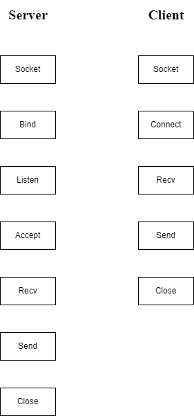
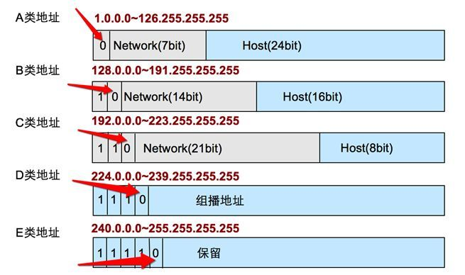

# POSIX网络API解析

POSIX表示可移植操作系统接口（Portable Operating System Interface of UNIX，缩写为 POSIX ），POSIX标准定义了操作系统应该为应用程序提供的接口标准。

POSIX标准意在期望获得源代码级别的软件可移植性。换句话说，为一个POSIX兼容的操作系统编写的程序，应该可以在任何其它的POSIX操作系统（即使是来自另一个厂商）上编译执行。


## API总览




## 地址族与数据序列


### 分配给套接字的IP地址与端口号


#### 网络地址

* IPv4：4字节地址族
* IPv6：16字节地址族

IPv4标准的4字节IP地址分为网络地址和主机（指计算机）地址，且分为A，B，C，D，E等类型。




#### 网络地址分类与主机地址边界


* A类地址的首字节范围：0~127
* B类地址的首字节范围：128~191
* C类地址的首字节范围：192~223


还有如下表述方式


* A类地址的首位以0开始
* B类地址的前2位以10开始
* C类地址的前3位以110开始


#### 用于区分套接字的端口号


虽然端口号不能重复，但TCP套接字和UDP套接字不会公用端口号，所以允许重复。


#### 地址信息的表示

##### 表示IPv4的结构体

```c
struct sockaddr_in
{
  	sa_family_t 	sin_family; // 地址族（Address Family）
    uint16_t 		sin_port;	// 16位TCP/UDP端口号
    struct in_addr	sin_addr;	// 32位IP地址
    char			sin_zero[8];// 不使用
};
```

其中该结构体中包含了一个用来存放32位IP地址的结构体in_addr

```c
struct in_addr
{
    in_addr_t		s_addr;	// 32位IPv4地址
};
```

<center>POSIX中定义的数据类型</center>

<center><div style = "color:green">sys/types.h</div></center>

| 数据类型名称 | 数据类型说明                         |
| ------------ | ------------------------------------ |
| int8_t       | signed 8-bit int                     |
| uint8_t      | unsigned 8-bit int (unsigned char)   |
| int16_t      | signed 16-bit int                    |
| uint16_t     | unsigned 16-bit int (unsigned short) |
| int32_t      | signed 32-bit int                    |
| uint32__t    | unsigned 32-bit int(unsigned long)   |

<center><div style = "color:green">sys/socket.h</div></center>

| 数据类型名称 | 数据类型说明           |
| ------------ | ---------------------- |
| sa_family_t  | 地址族(address family) |
| socklen_t    | 长度(length of struct) |

<center><div style = "color:green">netinet/in.h</div></center>

| 数据类型名称 | 数据类型说明           |
| ------------ | ---------------------- |
| in_addr_t    | IP地址，声明为uint32_t |
| in_port_t    | 端口号，声明为uint16_t |


###### 成员sin_family

每种协议族使用的地址族均不同。

<center>地址族</center>

| 地址族（Address Family） | 含义                             |
| ------------------------ | -------------------------------- |
| AF_INET                  | IPv4网络协议中使用的地址族       |
| AF_INET6                 | IPv6网络协议中使用的地址族       |
| AF_LOCAL                 | 本地通信中含有的UNIX协议的地址族 |


###### 成员sin_port

该成员保存16位端口号，重点在于，它以网络字节保存


###### 成员sin_addr

该成员保存32位地址信息，且也以网络字节保存。其中in_addr只需要当作32位整数型即可


###### 成员sin_zero

主要作用只是为了是结构体sockaddr_in大小与sockaddr结构体保持一致，必需填充为0


##### 结构体sockaddr

```c
struct sockaddr
{
	sa_family_t		sin_family;	// 地址族（Address Family）
    char			sa_data[14];// 地址信息
};
```

此结构成员sa_data保存的地址信息中需要包含IP地址和端口号，剩余部分应该填充0


## 函数参数分析


### 基于Linux的文件操作


#### 打开文件

```c
int open(const char* path, int flag)
    // 成功时返回文件描述符，失败时返回-1
```

* path：文件名的字符串地址
* flag：文件打开模式信息

<center>文件打开模式</center>

| 打开模式 | 含义             |
| -------- | ---------------- |
| O_CREAT  | 必要时创建文件   |
| O_TRUNC  | 删除全部现有数据 |
| O_APPEND | 维持现有数据     |
| O_RDONLY | 只读打开         |
| O_WRONLY | 只写打开         |
| ORDWR    | 读写打开         |


#### 关闭文件

```c
int close(int fd)
    // 成功时返回0，失败时返回-1
```

* fd：需要关闭的文件或套接字的文件描述符

此函数不仅可以关闭文件，还可以关闭套接字（Linux操作系统不区分文件与套接字）


#### 将数据写入文件

```c
ssize_t write(int fd, const void* buf, size_t nbytes)
    // 成功时返回写入的字节数，失败时返回-1
```

* fd：显示数据传输对象的文件描述符
* buf：保存要传输数据的缓冲地址值
* nbytes：要传输数据的字节数

注：size_t是通过typedef声明的unsigned int类型， 对ssize_t来说是代表signed int类型（在`sys/type.h`头文件一般有typedef声明定义）


* #### 读取文件中的数据

```c
ssize_t read(int fd, void* buf, size_t nbytes)
    //成功是返回接受的字节数（但遇到文件结尾则返回0），失败时返回-1
```

* fd：显示数据接受对象的文件描述符
* buf：要保存几首护具的缓冲地址值
* nbytes：要接受数据的最大字节数


### 套接字协议


#### socket

调用socket()会创建一个套接字(socket)对象---由文件描述符（fd）和TCP Control Block（TCB）。TCB控制块主要包括关系信息有网络的五元组(remote IP, remote PORT, local IP, local PORT, protocol)

```c
int socket(int domain, int type, int protocol)
    // 成功时返回文件描述符，失败时返回--1
```

* domain：套接字中使用的协议族（Protocol Family）信息
* type：套接字数据传输类型信息
* protocol：计算机间通信中使用的协议信息


##### 协议族（Protocol Family）

<center>头文件sys/socket.h中声明的协议族</center>

| 名称      | 协议族               |
| --------- | -------------------- |
| PF_INET   | IPv4互联网协议族     |
| PF_INET6  | IPv6互联网协议族     |
| PF_LOCAL  | 本地通信的UNIX协议族 |
| PF_PACKET | 底层套接字的协议族   |
| PF_IPX    | IPX Novell协议族     |


##### 套接字类型（Type）

主要介绍2种具有代表性的数据运输方式


###### 面向连接的套接字（SOCK_STREAM）

* 传输过程中数据不会消失
* 按序传输数据
* 传输的数据不存在数据边界（Boundary）：在面向连接的套接字种，read函数和write函数的调用次数并无太大意义，所以说面向连接的套接字不存在数据边界。


###### 面向消息的套接字（SOCK_DGRAM）

* 强调快速传输而非传输顺序
* 传输的数据可能丢失也可能损毁
* 传输的数据又数据边界
* 限制每次传输的数据大小


##### 协议的最终选择

数据传输方式相同，但协议不同。此时需要通过第三个参数具体指定协议信息

常用的协议有，IPPROTO_TCP、IPPTOTO_UDP、IPPROTO_SCTP、IPPROTO_TIPC等，它们分别对应TCP传输协议、UDP传输协议、STCP传输协议、TIPC传输协议