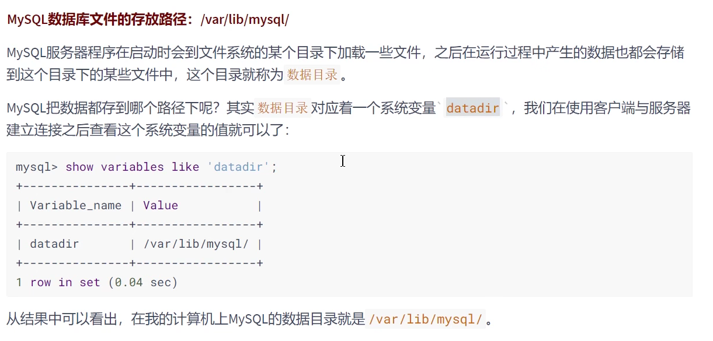
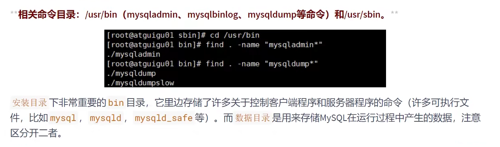
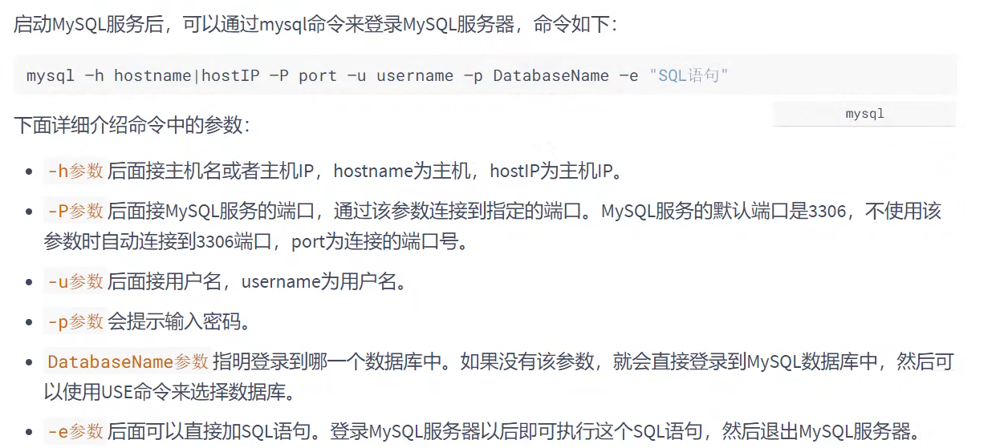
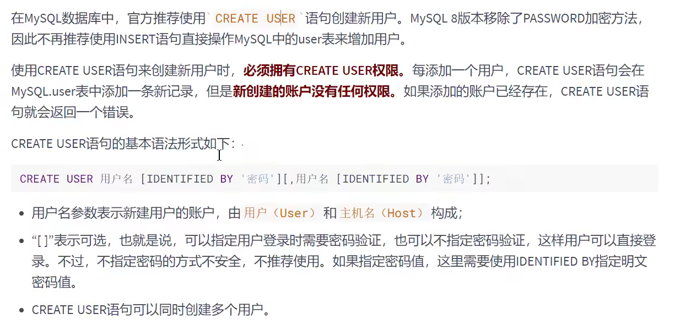
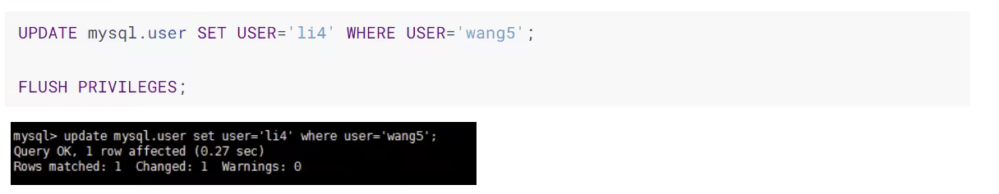
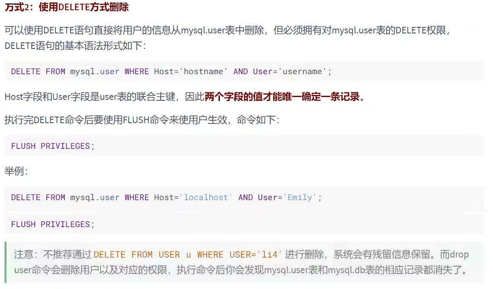
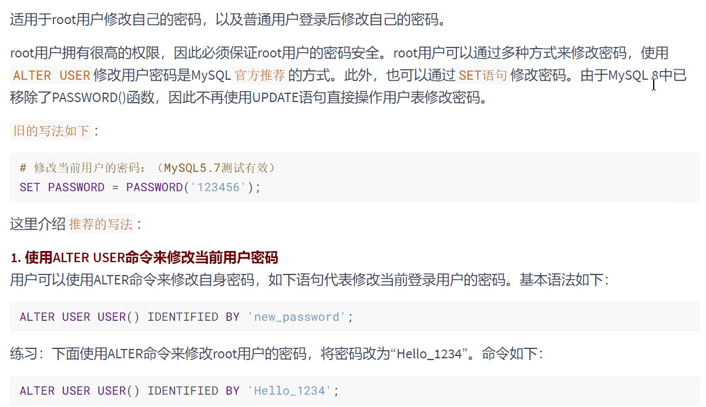
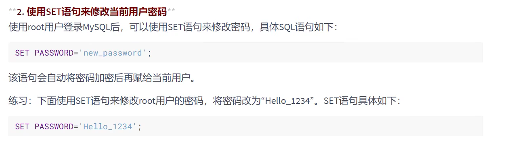

# MySQL 进阶知识


## MySQL的数据目录

```shell
find / -name mysql
```

### MySQL8地主要目录结构



### 相关命令目录



### 配置文件目录


## 用户与权限管理


### 用户管理


### 登录MySQL服务器




### 创建用户



### 修改用户




### 删除用户

	




### 设置当前用户密码




