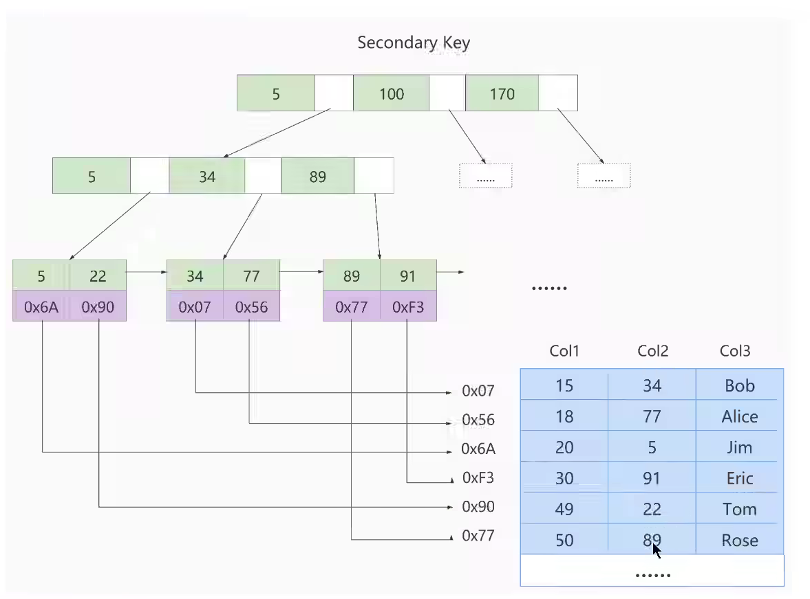
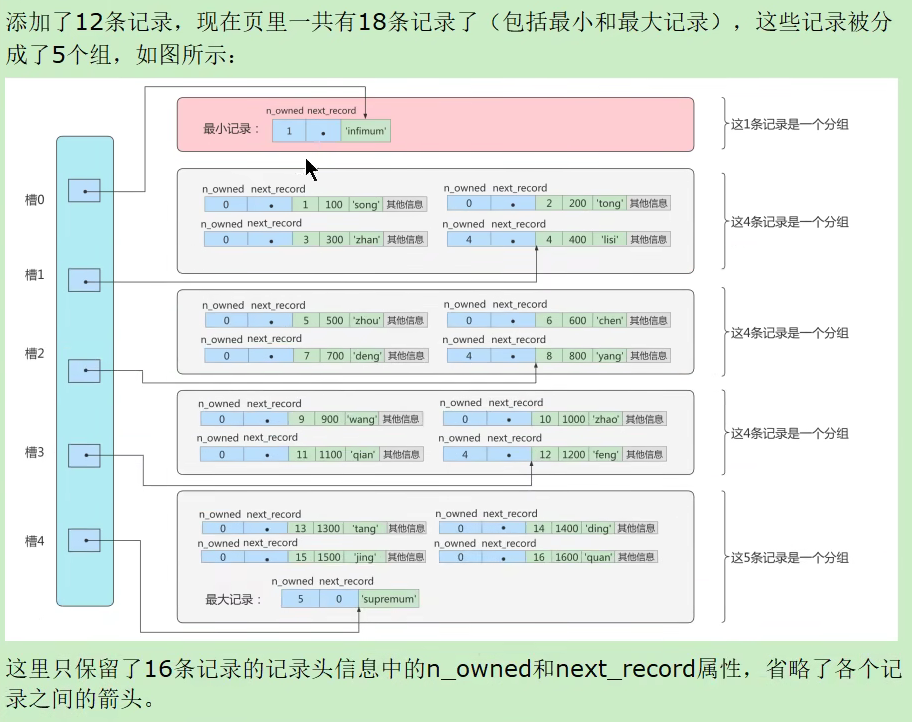
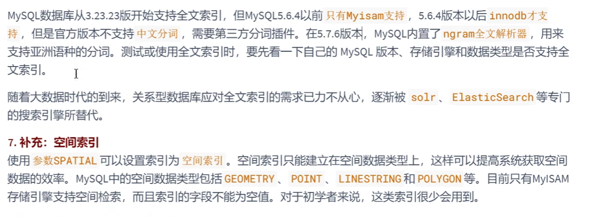
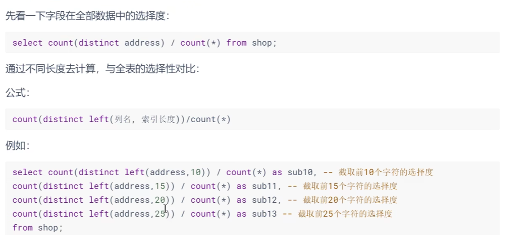
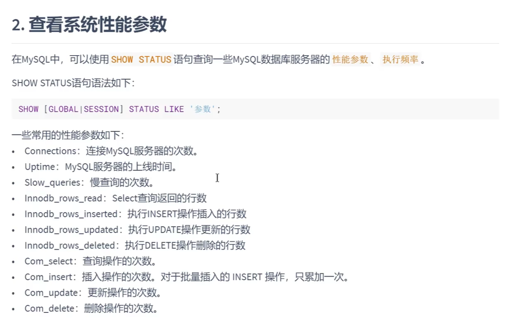
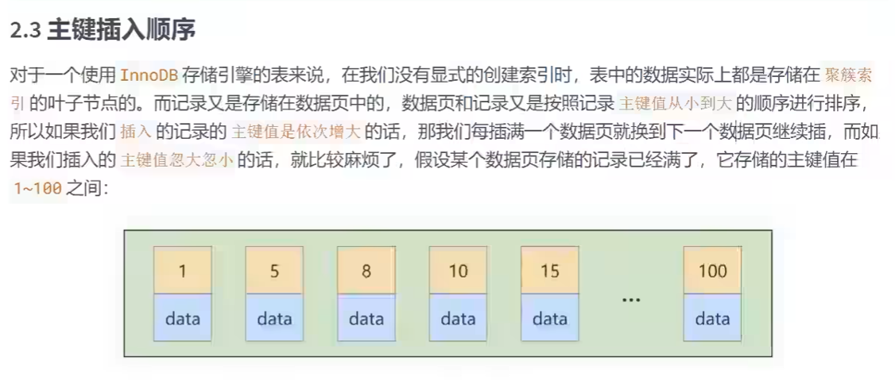
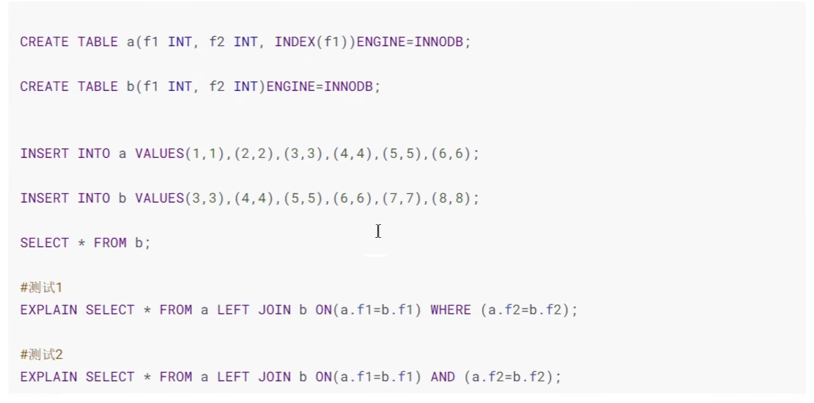
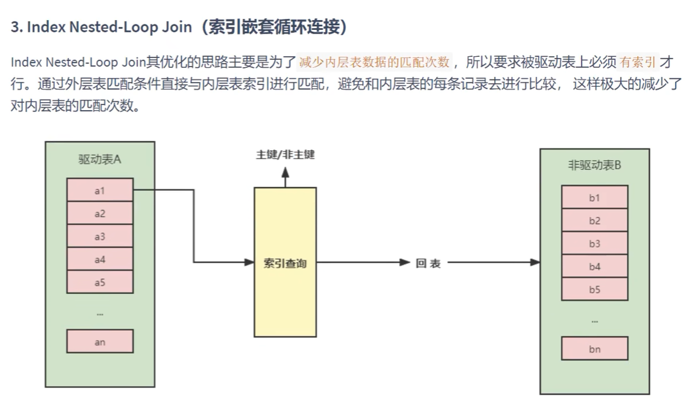
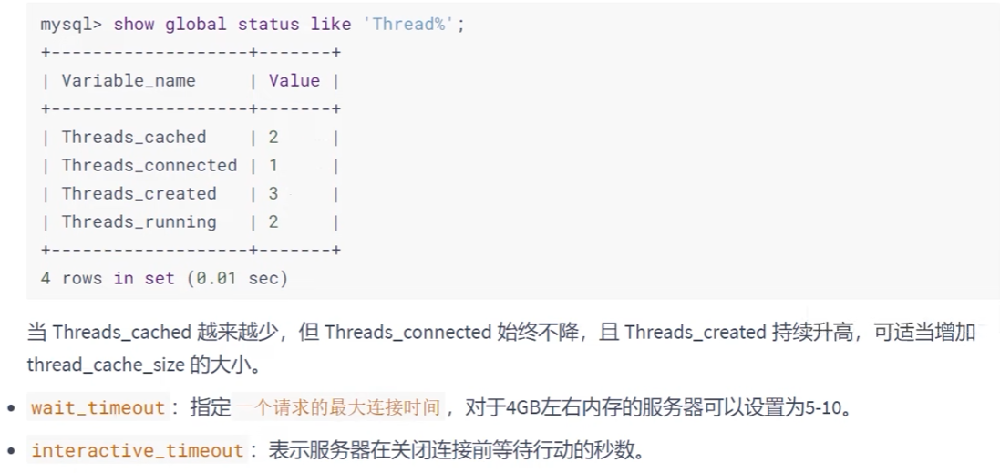
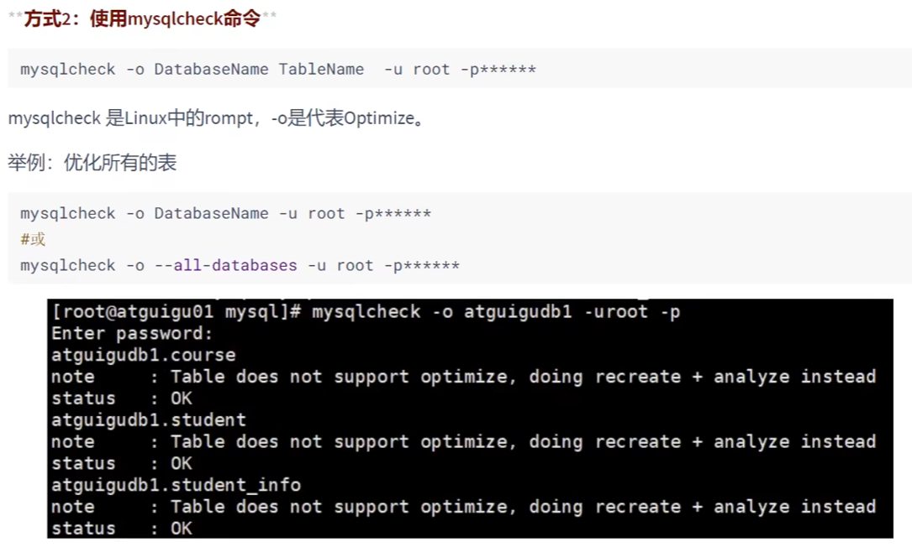

# MySQL 进阶知识


## MySQL的数据目录

```shell
find / -name mysql
```

### MySQL8地主要目录结构


### 相关命令目录


### 配置文件目录


## 用户与权限管理


### 用户管理


### 登录MySQL服务器


### 创建用户


### 修改用户


### 删除用户

	


### 设置当前用户密码


### 修改其它用户密码


## 权限管理


### 授予权限的原则


### 授予权限


### 收回权限


## 角色管理

`角色是权限的集合`

### 创建角色


### 给角色赋予权限


### 查看角色的权限


### 回收角色的权限


### 给用户赋予角色


### 激活角色


### 撤销用户的角色


### 设置强制角色


## 逻辑架构


### 逻辑架构剖析

#### 服务器处理客户端请求


#### Connectors


#### 第一层：连接层


#### 第二层：服务层


#### 第三层：引擎层


#### 存储层


### SQL执行流程

#### MySQL中的 SQL 执行流程


## 存储引擎

### 1.  查看存储引擎

```mysql
show engines;
```

### 2. 设置系统默认的存储引擎


### 3. 引擎介绍

#### 3.1 InnoDB 引擎：具备外键支持功能的事务存储引擎


#### 3.2 MyISAM 引擎：主要的非事务处理存储引擎


## 索引的数据结构


### 优点


### 缺点


## InnoDB中索引的推演

### 索引之前的查找

```mysql
SELECT [列名列表] FROM 表名 WHERE 列名 = xxx;
```

### 在一个页中的查找


### 在很多页中查找


### 设计索引


#### 一个简单的索引设计方案


#### InnoDB中的索引方案


### 常见索引概念

索引按照物理实现方式，索引可以分为2种：聚簇（聚集）和非聚簇（非聚集）索引。我们也把非聚集索引成为二级索引或者辅助索引

#### 聚簇索引


#### 二级索引（辅助索引、非聚簇索引）


#### 联合索引


### InnoDB的B+树索引的注意事项

#### 根页面位置万年不变


#### 内节点中目录项记录的唯一性


#### 一个页面最少存储2条记录


### MyISAM中的索引方案


#### MyISAM索引的原理




#### MyISAM与InnoDB对比


### 索引的代价


## MySQL数据结构选择的合理性


### 全表遍历

略

### Hash结构


### 二叉搜索树


### AVL树


### B-Tree


### B+Tree


。。。略


### R树


## InnoDB数据存储结构

### 数据库的存储结构：页


#### 磁盘与内存交互基本单位：页


#### 页结构概述


#### 页的大小


#### 页的上层结构


### 页的内部结构


#### 第1部分：File Header（文件头部）和File Trailer（文件尾部）

##### File Header


##### File Trailer


#### 第2部分 记录部分


##### 记录头信息


##### Infimum + Supremum


#### 第3部分 页结构之页目录与页头

##### Page Directory





##### Page Header


###  InnoDB行格式


#### 指定行格式的语法


#### COMPACT行格式


##### 变长字段长度列表


##### NULL 值列表


##### 记录真实的数据


#### Dynamic和Compressed行格式

##### 行溢出


#### Redundant行格式

##### 字段长度偏移格式


##### 记录头信息


### 区、段与碎片区


#### 为什么要有区


#### 为什么要有段


#### 为什么要有碎片区


#### 区的分类


### 表空间


#### 独立表空间


#### 系统表空间


## 索引的创建与设计原则


### 索引的声明与使用


#### 索引的分类





#### 创建索引


#### 删除索引

```mysql
SHOW INDEX FROM book5;

# 方式1：ALTER TABLE ... DROP INDEX ...
ALTER TABLE book5
DROP INDEX idx_cmt;

# 方式2：DROP INDEX ... ON ...
DROP INDEX uk_idx_bname ON book5;

ALTER TABLE book5
DROP COLUMN book_name;
```


# MySQL8.0索引新特性

## 支持降序索引


## 隐藏索引


# 适合创建索引的情况





# 限制索引的数目


# 不适合创建索引的情况


# 性能分析工具的使用

在数据库调优中，目标是**响应时间更快，吞吐量更大**。利用宏观的监控工具和微观的日志分析可以帮助快速找到调优的思路和方式




## 分析查询语句：EXPLAIN


# 索引优化与查询优化


## 索引失效案例











# 范式


# 反范式化


# BCNF（巴斯范式）


# 第四范式


# 第五范式


# ER模型


# 设计原则


# 数据库调优


# 优化MySQL服务器





# 优化数据库结构





# 事务


