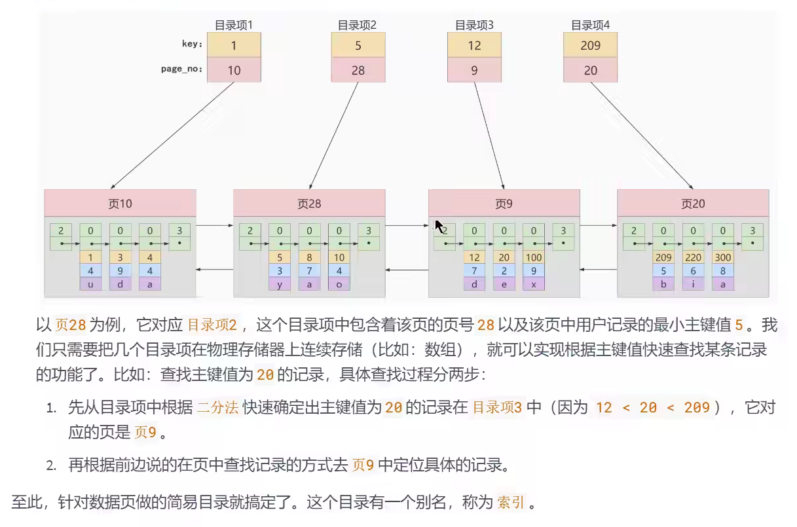

# MySQL 进阶知识


## MySQL的数据目录

```shell
find / -name mysql
```

### MySQL8地主要目录结构


### 相关命令目录


### 配置文件目录


## 用户与权限管理


### 用户管理


### 登录MySQL服务器


### 创建用户


### 修改用户


### 删除用户

	


### 设置当前用户密码


### 修改其它用户密码


## 权限管理


### 授予权限的原则


### 授予权限


### 收回权限


## 角色管理

`角色是权限的集合`

### 创建角色


### 给角色赋予权限


### 查看角色的权限


### 回收角色的权限


### 给用户赋予角色


### 激活角色


### 撤销用户的角色


### 设置强制角色


## 逻辑架构


### 逻辑架构剖析

#### 服务器处理客户端请求


#### Connectors


#### 第一层：连接层


#### 第二层：服务层


#### 第三层：引擎层


#### 存储层


### SQL执行流程

#### MySQL中的 SQL 执行流程


## 存储引擎

### 1.  查看存储引擎

```mysql
show engines;
```

### 2. 设置系统默认的存储引擎


### 3. 引擎介绍

#### 3.1 InnoDB 引擎：具备外键支持功能的事务存储引擎


#### 3.2 MyISAM 引擎：主要的非事务处理存储引擎


## 索引的数据结构


### 优点


### 缺点


## InnoDB中索引的推演

### 索引之前的查找

```mysql
SELECT [列名列表] FROM 表名 WHERE 列名 = xxx;
```

### 在一个页中的查找


### 在很多页中查找


### 设计索引


#### 一个简单的索引设计方案




#### InnoDB中的索引方案


### 常见索引概念

索引按照物理实现方式，索引可以分为2种：聚簇（聚集）和非聚簇（非聚集）索引。我们也把非聚集索引成为二级索引或者辅助索引

#### 聚簇索引


#### 二级索引（辅助索引、非聚簇索引）


