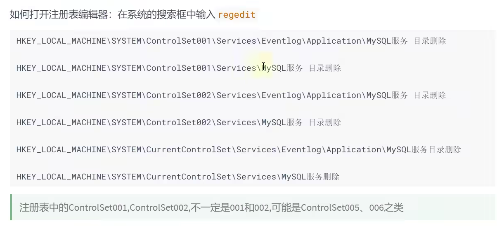

# MySQL基础知识


## 数据库概述

### 为什么要使用数据库

* 持久化：数据持久化意味着将内存中的数据保存到硬盘上加以“固化”。
* 持久化的主要作用是```将内存中的数据存储在关系型数据库中```，当然也可以存储在磁盘文件、`XML`数据文件中。

### 数据库相关概念

| ```OB：数据库(Database)```                                   |
| ------------------------------------------------------------ |
| 即存储数据的“仓库”，其本质是一个文件系统。它保存了一系列有组织的数据。 |

| ```DBMS：数据库管理系统(Database Management System)```       |
| ------------------------------------------------------------ |
| 是一种操纵和管理数据库的大型软件，用于建立、使用和维护数据库，对数据库进行统一管理和控制。用户通过数据库管理系统访问数据库中表内的数据。 |

| ```SQL：结构化查询语言(Structured Query Language)``` |
| ---------------------------------------------------- |
| 专门用来与数据库通信的语言                           |

### 数据库与数据库管理系统的关系

数据库管理系统（DBMS）可以管理多个数据库。


## RDBMS与非RDBMS

### RDBMS

#### 实质

* 这种类型的数据库是**最古老**的数据库类型，关系型数据库模型是把复杂的数据结构归结为简单的**二元关系**（即二维表格形式）。
* 关系型数据库以**行（row）**和**列（column）**的形式存储数据，以便于用户理解。这一系列的行和列被称为**表（table）**，一组表组成了一个**库（database）**。
* 表与表之间的数据记录有关系（relationship）。现实世界中的各种实体以及实体之间的谷中联系军用**关系模型**来表示。关系型数据库，就是建立在**关系模型**基础上的数据库。
* `SQL`就是关系型数据库的查询语言。

#### 优势

* 复杂查询

可以用SQL语句方便的在一个表以及多个表之间做非常复杂的数据查询。

* 事务支持

使得对于安全性能很高的数据访问要求得以实现。

### 非RDBMS

**非关系型数据库**，可看成传统关系型数据库的功能`阉割版本`，基于键值对存储数据，不需要经过SQL层的解析，**性能非常高**。同时，通过减少不常用的功能，进一步提高性能。

#### 有哪些非关系型数据库

* **键值型数据库**

键值型数据库通过**key-Value**键值的方式来存储数据，其中key和Value可以是简单的对象，也可以是复杂的对象。**key**作为唯一的标识符，优点是查找速度快，在这方面明显优于关系型数据库，缺点是无法像关系型数据库一样使用条件。键值型数据库典型的使用场景是缓存，例如，**Redis**。

* **文档型数据库**

此类数据库可存放并获取文档，可以是XML、JSON等格式。在数据库中文档作为处理信息的基本单位，一个文档就相当于一条记录。`MongoDB`是最流行的文档型数据库之一。

* **搜索引擎数据库**

搜索引擎数据库是应用在搜索引擎领域的数据存储形式，由于搜索引擎会爬取大量的数据，并以特定的格式进行存储，核心原理是**倒排索引**。（关系型数据库针对全文索引效率较低）如`Elasticsearch`。

* **列式数据库**

将数据按照列存储到数据库中，这样做的好处是可以大量降低系统的`I/O`，适合于分布式文件系统，不足在于功能相对有限。例如，`HBase`。

* **图形数据库**

图形数据库利用了图这种数据结构存储了实体（对象）之间的关系。


## 关系型数据库设计原则

* 关系型数据库的典型数据结构就是**数据表**，这些数据表的组成都是结构化（`Structed`）。
* 将数据放到表中，表再放到库中。
* 一个数据库中可以有多个表，每个表都有一个名字，用来标识自己。表名具有唯一性。
* 表具有一些特性，这些特性定义了数据在表中如何存储，类似`Java`和`Python`等中的类的设计。

### 表、记录、字段

* E-R（entity-relationship，实体-联系）模型中有三个主要概念是：`实体集`，`属性`，`联系集`。
* 一个实体集（`class`）对应于数据库中的一个表（`table`），一个实体（`instance`）则对应于数据库表中的一行（`row`），也称为一条记录（`record`）。一个属性（`attribute`）对应于数据库表中的一列（`column`），也称为一个字段（`field`）。

### 表的关联关系

* 表与表之间的数据记录有关系（`relationship`）。现实世界中的各种实体以及实体之间的各种联系均用关系模型来表示。
* 四种：一对一关联、一对多关联、多对多关联、自我引用。

#### 一对一关联（`one-to-one`）

* 在实际的开发中应用不多，因为一对一可以创建一张表。

* 举例：设计学生表：学号、姓名、手机号、班级、...
  * 拆为两个表：两个表的记录是一一对应关系。
  * 基础信息表（常用信息）：学号、姓名、手机号码、...
  * 档案信息表（不常用信息）：学号、身份证号码、家庭住址、...
* 两种建表原则：
  * 外键唯一：主表的主键和从表的外键（唯一），形成主外键关系，外键唯一。
  * 外键是主键：主表的主键和从表的主键，形成主外键关系。

#### 一对多关系（one-to-many）

* 常见实例场景：`客户表和订单表`，`分类表和商品表`，`部门表和员工表`。
* 举例：
  * 员工表：编号、姓名、...、所属部门。
  * 部门表：编号、名称、简介。
* 一对多建表原则：在从表（多方）创建一个字段，字段作为外键指向主表（一方）的主键。

#### 多对多关系（many-many）

要表示多对多关系，必须创建第三个表，该表通常称为`联接表`，它将多对多关系划分为两个一对多关系。将这两个表的主键都插入到第三个表中。

* 举例：学生-课程
  * 学生信息表：一行代表一个学生的信息（学号、姓名、手机号码、班级、系别、...）。
  * 课程信息表：一行代表一个课程的信息（课程编号、授课老师、简介、...）。
  * 选课信息表：一个学生可以选多门课，一门课可以被多个学生选择。

#### 自我引用

举例：

| 员工编号 | 姓名 | 部门编号 | 主管编号 |
| -------- | ---- | -------- | -------- |
| 101      | hh   | 1        | NULL     |
| 103      | ww   | 1        | 101      |
| 104      | kk   | 1        | 103      |
| 201      | dkjf | 2        | 101      |


## MySQL环境搭建（Windows）

### 1. MySQL的卸载

卸载之前，先停止`MySQL8.0`的服务。在任务管理器中可以停止其运行。

#### 软件的卸载

1. 方式一：通过控制面板卸载软件
2. 方式二：通过电脑管家等软件卸载
3. 方式三：通过安装包提供的卸载功能卸载
   * 选择下载的`mysql-installer-community-8.0.26.0.msi`文件
   * 选择要卸载的`MySQL`服务器程序，单击`Remove`即可卸载

#### 残余文件的清理

如果再次安装不成功，可以卸载后对残余文件进行清理后再安装

1. 服务目录：`MySQL`服务的安装目录
2. 数据目录：默认在`C:\ProgramData\MySQL`

如果自己单独指定过数据目录，就找到自己的数据目录进行删除即可

**请在写在前做好数据备份**

#### 清理注册表（选做）

如果前几步做了，再次安装还是失败，那么可以清理注册表。



### 2. MySQL的下载、安装、配置
