# 	MySQL基础知识


## 数据库概述

### 为什么要使用数据库

* 持久化：数据持久化意味着将内存中的数据保存到硬盘上加以“固化”。
* 持久化的主要作用是```将内存中的数据存储在关系型数据库中```，当然也可以存储在磁盘文件、`XML`数据文件中。

### 数据库相关概念

| ```OB：数据库(Database)```                                   |
| ------------------------------------------------------------ |
| 即存储数据的“仓库”，其本质是一个文件系统。它保存了一系列有组织的数据。 |

| ```DBMS：数据库管理系统(Database Management System)```       |
| ------------------------------------------------------------ |
| 是一种操纵和管理数据库的大型软件，用于建立、使用和维护数据库，对数据库进行统一管理和控制。用户通过数据库管理系统访问数据库中表内的数据。 |

| ```SQL：结构化查询语言(Structured Query Language)``` |
| ---------------------------------------------------- |
| 专门用来与数据库通信的语言                           |

### 数据库与数据库管理系统的关系

数据库管理系统（DBMS）可以管理多个数据库。


## RDBMS与非RDBMS

### RDBMS

#### 实质

* 这种类型的数据库是**最古老**的数据库类型，关系型数据库模型是把复杂的数据结构归结为简单的**二元关系**（即二维表格形式）。
* 关系型数据库以**行（row）**和**列（column）**的形式存储数据，以便于用户理解。这一系列的行和列被称为**表（table）**，一组表组成了一个**库（database）**。
* 表与表之间的数据记录有关系（relationship）。现实世界中的各种实体以及实体之间的谷中联系军用**关系模型**来表示。关系型数据库，就是建立在**关系模型**基础上的数据库。
* `SQL`就是关系型数据库的查询语言。

#### 优势

* 复杂查询

可以用SQL语句方便的在一个表以及多个表之间做非常复杂的数据查询。

* 事务支持

使得对于安全性能很高的数据访问要求得以实现。

### 非RDBMS

**非关系型数据库**，可看成传统关系型数据库的功能`阉割版本`，基于键值对存储数据，不需要经过SQL层的解析，**性能非常高**。同时，通过减少不常用的功能，进一步提高性能。

#### 有哪些非关系型数据库

* **键值型数据库**

键值型数据库通过**key-Value**键值的方式来存储数据，其中key和Value可以是简单的对象，也可以是复杂的对象。**key**作为唯一的标识符，优点是查找速度快，在这方面明显优于关系型数据库，缺点是无法像关系型数据库一样使用条件。键值型数据库典型的使用场景是缓存，例如，**Redis**。

* **文档型数据库**

此类数据库可存放并获取文档，可以是XML、JSON等格式。在数据库中文档作为处理信息的基本单位，一个文档就相当于一条记录。`MongoDB`是最流行的文档型数据库之一。

* **搜索引擎数据库**

搜索引擎数据库是应用在搜索引擎领域的数据存储形式，由于搜索引擎会爬取大量的数据，并以特定的格式进行存储，核心原理是**倒排索引**。（关系型数据库针对全文索引效率较低）如`Elasticsearch`。

* **列式数据库**

将数据按照列存储到数据库中，这样做的好处是可以大量降低系统的`I/O`，适合于分布式文件系统，不足在于功能相对有限。例如，`HBase`。

* **图形数据库**

图形数据库利用了图这种数据结构存储了实体（对象）之间的关系。


## 关系型数据库设计原则

* 关系型数据库的典型数据结构就是**数据表**，这些数据表的组成都是结构化（`Structed`）。
* 将数据放到表中，表再放到库中。
* 一个数据库中可以有多个表，每个表都有一个名字，用来标识自己。表名具有唯一性。
* 表具有一些特性，这些特性定义了数据在表中如何存储，类似`Java`和`Python`等中的类的设计。

### 表、记录、字段

* E-R（entity-relationship，实体-联系）模型中有三个主要概念是：`实体集`，`属性`，`联系集`。
* 一个实体集（`class`）对应于数据库中的一个表（`table`），一个实体（`instance`）则对应于数据库表中的一行（`row`），也称为一条记录（`record`）。一个属性（`attribute`）对应于数据库表中的一列（`column`），也称为一个字段（`field`）。

### 表的关联关系

* 表与表之间的数据记录有关系（`relationship`）。现实世界中的各种实体以及实体之间的各种联系均用关系模型来表示。
* 四种：一对一关联、一对多关联、多对多关联、自我引用。

#### 一对一关联（`one-to-one`）

* 在实际的开发中应用不多，因为一对一可以创建一张表。

* 举例：设计学生表：学号、姓名、手机号、班级、...
  * 拆为两个表：两个表的记录是一一对应关系。
  * 基础信息表（常用信息）：学号、姓名、手机号码、...
  * 档案信息表（不常用信息）：学号、身份证号码、家庭住址、...
* 两种建表原则：
  * 外键唯一：主表的主键和从表的外键（唯一），形成主外键关系，外键唯一。
  * 外键是主键：主表的主键和从表的主键，形成主外键关系。

#### 一对多关系（one-to-many）

* 常见实例场景：`客户表和订单表`，`分类表和商品表`，`部门表和员工表`。
* 举例：
  * 员工表：编号、姓名、...、所属部门。
  * 部门表：编号、名称、简介。
* 一对多建表原则：在从表（多方）创建一个字段，字段作为外键指向主表（一方）的主键。

#### 多对多关系（many-many）

要表示多对多关系，必须创建第三个表，该表通常称为`联接表`，它将多对多关系划分为两个一对多关系。将这两个表的主键都插入到第三个表中。

* 举例：学生-课程
  * 学生信息表：一行代表一个学生的信息（学号、姓名、手机号码、班级、系别、...）。
  * 课程信息表：一行代表一个课程的信息（课程编号、授课老师、简介、...）。
  * 选课信息表：一个学生可以选多门课，一门课可以被多个学生选择。

#### 自我引用

举例：

| 员工编号 | 姓名 | 部门编号 | 主管编号 |
| -------- | ---- | -------- | -------- |
| 101      | hh   | 1        | NULL     |
| 103      | ww   | 1        | 101      |
| 104      | kk   | 1        | 103      |
| 201      | dkjf | 2        | 101      |


## MySQL环境搭建（Windows）


### 1. MySQL的卸载

卸载之前，先停止`MySQL8.0`的服务。在任务管理器中可以停止其运行。

#### 软件的卸载

1. 方式一：通过控制面板卸载软件
2. 方式二：通过电脑管家等软件卸载
3. 方式三：通过安装包提供的卸载功能卸载
   * 选择下载的`mysql-installer-community-8.0.26.0.msi`文件
   * 选择要卸载的`MySQL`服务器程序，单击`Remove`即可卸载

#### 残余文件的清理

如果再次安装不成功，可以卸载后对残余文件进行清理后再安装

1. 服务目录：`MySQL`服务的安装目录
2. 数据目录：默认在`C:\ProgramData\MySQL`

如果自己单独指定过数据目录，就找到自己的数据目录进行删除即可

**请在写在前做好数据备份**

#### 清理注册表（选做）

如果前几步做了，再次安装还是失败，那么可以清理注册表。


### 2. MySQL的下载、安装、配置

#### 2.1 软件的下载

1. <a href="https://www.mysql.com">官网</a>
2. 在`DOWNLOAD`可以选择`community`下载（免费）
3. 在安装离线版后，选择下列选项
   1. **Custom**
   2. 
   3. 一路**Next**以及**Execute**
   4. 配置mysql端口用户密码等

#### 2.2 环境变量配置

将软件安装位置的bin目录添加到环境变量-系统变量-Path里。

#### 2.3 启动服务

* 可以在任务管理器进行设置

* 也可以在终端用脚本命令

  ```bash
  # 启动MySQL服务
  net start MySQL服务名
  
  # 停止MySQL服务
  net stop MySQL服务名
  ```

#### 2.4 登录

```shell
mysql -u root -p # (-P 可以指定端口号 -h 可以指定主机) 这样能访问一台主机下不同的mysql服务
```

然后输入密码（这样比较好）

### 3. MySQL简单入门以及字符集设置

```mysql
# 展示数据库
show databases;

# 创建数据库
create database databasename;

# 使用某个数据库
use databasename;

# 展示表
show tables;

# 创建表
create table tablename(...); # example(...) => (id int, log string)

# 查看表信息
show create table tablename;

# 查看编码以及比较规则命令
show variables like 'character_%';
show variables like 'collation_%';
```

修改**MySQL**的数据目录下的**my.ini**配置文件（一般是MySQL 5.x才需要去改，MySQL 8.x 默认是utf8mb4 ）

```ini
[mysql] # 大概在63行左右，在其下添加
...
default-character-set=utf8	# 默认字符集

[mysqld] # 大概在76行左右，在其下添加
...
charater-set-server=utf8
collation-server=utf8_general_ci
```


## MySQL目录结构以及源码


### 1. 目录结构

| MySQL的目录结构                             | 说明                                 |
| ------------------------------------------- | ------------------------------------ |
| bin目录                                     | 所有MySQL的可执行文件，如：myal.exe  |
| MySQLInstanceConfig.exe                     | 数据库的配置向导，在安装时出现的内容 |
| data目录                                    | 系统数据库所在的目录                 |
| my.ini文件                                  | MySQL的主要配置文件                  |
| C:\ProgramData\MySQL\MySQL Server 8.0\data\ | 用户创建的数据库所在的目录           |


### 2. 源码

在进入MySQL下载界面。不选择默认的"Micosoft Windows"，而是通过下拉栏，找到"Source Code"，在下面的操作系统版本里面，选择"Windows (Architecture Independent)"，然后点击下载。接下来，把下载下来的压缩文件解压，就能得到MySQL的源代码。

* sql子目录是MySQL的核心代码
* libmysql子目录是客户端程序api
* mysql-test子目录是测试工具
* mysys子目录是操作系统相关函数和辅助函数


## SQL

SQL（Structured Query Language，结构化查询语言）是使用关系模型的数据库应用语言。


### 1. SQL分类

* **DDL（Data Definition Languages、数据定义语言）**，这些语句定义了不同地数据库、表、视图、索引等数据库对象，还可以用来创建、删除、修改数据库和数据表结构
  * 主要语句关键字包括`CREATE`、`DROP`、`ALTER`等
* **DML（Data Manipulation Language、数据操作语言）**，用于添加、删除、更新和查询数据库记录，并检查数据完整性
  * 主要的语句关键字包括`INSERT`、`DELETE`、`SELECT`等
  * `SELECT`是`SQL`语言的基础，最为重要
* **DCL（Data Control Language、数据控制语言）**，用于定义数据库、表、字段、用户的访问权限和安全级别。
  * 主要的语句关键字包括`GRANT`、`REVOKE`、`COMMIT`、`ROLLBACK`、`SAVEPOINT`等


### 2. SQL语言的规则与规范

#### 2.1 基本规则

* SQL可以写在一行或者多行。必要时缩进
* 每条命令以`;`或`\g`或`\G`结束
* 关键字不能被缩写也不能分行
* 关于标点符号
  * 保证所有的`()`、双引号、单引号都是成对结束的
  * 必须使用英文状态下的半角输入方式
  * 字符串和日期时间类型的数据可以使用单引号表示
  * 列的别名，尽量使用双引号，而且不建议省略as

#### 2.2 SQL大小写规范

* **MySQL**在**Windows**环境下是**大小写不敏感**的
* **MySQL**在**Linux**环境下是**大小写敏感**的
  * 数据库名、表名、表的别名、变量名是严格区分大小写的
  * 关键字、函数名、列名（或字段名）、列的别名（字段的别名）是忽略大小写的
* 推荐采用统一的书写规范：
  * 数据库名、表名、表别名、字段名、字段别名等都小写
  * **SQL**关键字、函数名、绑定函数名都大写

#### 2.3 注释

```mysql
单行注释：# 注释文字（MySQL特有的方式）
单行注释：-- 注释文字（--后面必须包含一个空格。）
多行注释：/* 注释文字 */
```

#### 2.4 命名规则

* 数据库、表名不得超过30个字符，变量名限制为29个
* 必须只能包含 A-Z,a-z-9，共63个字符
* 数据库名、表名、字段名等对象名中间不要包含空格
* 同一个MySQL软件中，数据库不能同名，同一个库中，表不能重名同一个表中，字段不能重名
* 必须保证你的字段没有和保留字、数据库系统或常用方法冲突。如果坚持使用，请在SOL语句中使用’(着重号)引起来
* 保持字段名和类型的一致性，在命名字段并为其指定数据类型的时候一定保证一致性。假如数据类型在一个表里是整数，那在另一个表里可就别变成字符型了

#### 2.5 数据导入指令

1. 终端登录**MySQL**命令导入（使用**source**命令）

   ```mysql
   mysql> source 文件的全路径名;
   ```

2. 基于具体的图形化界面的工具可以导入数据


## 基本的SELECT语句


### 1. 最基本的SELECT语句：**SELECT ...**  以及 **SELECT 字段1, 字段2, ... FROM 表名**

```mysql
# example
SELECT 1 + 1, 3 * 2;

SELECT 1 + 1, 3 * 2
FROM DUAL; # dual：伪表

# *：表中的所有字段（或列）
SELECT * FROM 表名
```


### 2. 列的别名

```mysql
# example
# as：全称：alias（别名），可以省略
# 列的别名可以使用一对""引起来（有的情况得加""就像"annual sal"这里）。不要使用''（MySQL虽然可以，但不符合标准）。

SELECT employee_id emp_id, last_name AS lname, department_id "department_id", salary * 12 "annual sal"
FROM employees;
```


### 3. 去除重复行

**DISTINCT**

```mysql
# example

# 没有去重的情况
SELECT department_id
FROM employees;

# 去重的情况
SELECT DISTINCT department_id
FROM employees;


# 错误的：只有一个去重无法做成一张表输出
SELECT salary, DISTINCT department_id
FROM employees;

# 仅仅能够运行（看成是整体完全相同去重），没有什么实际意义
SELECT DISTINCT department_id, salary
FROM employees;
```


### 4. 空值参与运算

* 空值：**null**
* **null**不等同于0，''，'null'

```mysql
# example

# 空值参与运算：结果一定也为空
# 结果发现凡是commisson_pct是null的年工资都是null
SELECT employee_id, salary "月工资", salary * (1 + commisson_pct) * 12 "年工资", commisson_pct
FROM employees;

# 实际问题的解决方案：引入IFNULLL
# 这样如果是null就拿0来计算
SELECT employee_id, salary "月工资", salary * (1 + IFNULL(commisson_pct, 0)) * 12 "年工资", commisson_pct
FROM employees;
```


### 5. 着重号 	``

```mysql
# example

# 修饰跟关键字重复冲突的字段（表名）
SELECT * FROM `ORDER`;
```


### 6. 查询常数

```mysql
# example

# '常数'、123都会匹配每一行
SELECT '常数', 123, employee_id, last_name
FROM employees
```


### 7. 显示表结构

使用**DESCRIBE**或**DESC**命令，表示表结构

```mysql
# example

DESCRIBE employees
或
DESC employees
```

```mysql
# example

mysql> desc employees # 显示了表中字段的详细信息
```


### 8. 过滤数据

**WHERE**

```mysql
# example

# 查询90号部门的员工信息
SELECT *
FROM employees
# 过滤条件，声明在FROM结构的后面
WHERE dapartment_id = 90;
```


## 运算符


### 1. 算术运算符

算术运算符主要用于数学运算，其可以连接运算符前后的两个数值或表达式，对数值或表达式进行加（`+`）、减（`-`）、乘（`*`）、除（`/`）和取模（`%`）运算

```mysql
# example

SELECT 100, 100 + 0, 100 -50, 100 - 35.5
FROM DUAL;

# 结果
/*
|----------|
|100 + '1' |
|----------|
|       101|
|----------|
*/
# 在SQL中， +没有连接的作用，就表示加法运算。此时，会将字符串转换为数值（隐式转换）
SELECT 100 + '1' # 在Java语言中，结果是：1001。
FROM DUAL;

SELECT 100 + 'a' # 此时将'a'看做0处理
FROM DUAL;

SELECT 100 + NULL # NULL值参与运算结果为空
FROM DUAL;


# 取模运算：	%(mod)

SELECT 12 % 3, 12 % 5, 12 MOD -5, -12 % -5
FROM DUAL;

# 练习：查询员工id为偶数的员工信息
SELECT employee_id, last_name, salary
FROM employees
WHERE employee_id % 2 = 0;
```


### 2.比较运算符

比较运算符用来对表达式左边的操作数和右边的操作数进行比较，比较的结果为真则返回1，比较的结果为假则返回0，其他情况则返回NULL。

比较运算符经常用来作为SELECT查询语句的条件来使用，返回符合条件的结果记录

| 运算符     | 名称           | 作用                                                         | 示例                              |
| ---------- | -------------- | ------------------------------------------------------------ | --------------------------------- |
| **=**      | 等于运算符     | 判断两个值、字符串或表达式是否相等                           | SELECT C FROM TABLE WHERE A = B   |
| **<=>**    | 安全等于运算符 | 安全地判断两个值、字符串或是否相等                           | SELECT C FROM TABLE WHERE A <=> B |
| **<>(!=)** | 不等于运算符   | 判断两个值、字符串或表达式是否不相等                         | SELECT C FROM TABLE WHERER A <> B |
| **<**      | 小于等于运算符 | 判断前面的值、字符串或表达式是否小于小于后面的值、字符串或表达式 | SELECT C FROM TABLE WHERE A < B   |
| **<=**     | 小于等于运算符 | 判断前面的值、字符串或表达式是否小于等于后面的值、字符串或表达式 | SELECT C FROM TABLE WHERE A <= B  |
| **>**      | 大于运算符     | 判断前面的值、字符串或表达式是否大于后面的值、字符串或表达式 | SELECT C FROM TABLE WHERE A > B   |
| >=         | 大于等于       | 判断前面的值、字符串或表达式是否大于等于后面的值、字符串或表达式 | SELECT C FROM TABLE WHERE A >= B  |

此外，还有非符号类型的运算符

| 运算符                | 名称             | 作用                                 | 示例                                        |
| --------------------- | ---------------- | ------------------------------------ | ------------------------------------------- |
| **IS NULL**           | 为空运算符       | 判断值、字符串或表达式是否为空       | SELECT B FROM TABLE WHERE A IS NULL         |
| **IS NOTNULL**        | 不为空预算符     | 判断值、字符串或表达式是否不为空     | SELECT B FROM TABLE WHERE A IS NOT NULL     |
| **LEAST**             | 最小值运算符     | 在多个值中返回最小值                 | SELECT D FROM TABLE WHERE C LEAST(A, B)     |
| **GREATEST**          | 最大值运算符     | 在多个值中返回最大值                 | SELECT D FROM TABLE WHERE C GREATEST(A, B)  |
| **BETWEEN**...**AND** | 两者之间的运算符 | 判断一个值是否在两个值之间           | SELECT D FROM TABLE WHERE C BETWEEN A AND B |
| **ISNULL**            | 为空运算符       | 判断一个值、字符串或表达式是否为空   | SELECT B FROM TABLE WHERE A ISNULL          |
| **IN**                | 属于运算符       | 判断一个值是否为列表中的任意一个值   | SELECT D FROM TABLE WHERE C IN(A, B)        |
| **NOT IN**            | 不属于运算符     | 判断一个值是否不是列表中的任意一个值 | SELECT D FROM TABLE WHERE C NOT IN(A, B)    |
| **LIKE**              | 模糊匹配运算符   | 判断一个值是否符合模糊匹配规则       | SELECT C FROM TABLE WHERE A LIKE B          |
| **REGEXP**            | 正则表达式运算符 | 判断一个值是否符合正则表达式的规则   | SELECT C FROM TABLE WHERE A REGEXP B        |
| **RLIEK**             | 正则表达式运算符 | 判断一个值是否符合正则表达式的规则   | SELECT C FROM TABLE WHERE A  RLIKE B        |

```mysql
# example

# 两边都是字符串的话，则按照ANSI的比较规则进行比较
SELECT 	'a' = 'a', 'ab' = 'ab'
FROM DUAL;

# 只有有null参与判断，结果就为null
SELECT 1 = NULL
FROM DUAL;

# <=> 安全等于，跟=唯一区别是可以对null进行判断
SELECT 1 <=> NULL, NULL <=> NULL # 0, 1 在两个操作数均为NULL时，则返回值为1，而不为NULL；当一个操作数为NULL时，其返回值为0
FROM DUAL;


# IS NULL / IS NOT NULL / ISNULL
# 练习：查询表中commission_pct为null的数据有哪些
SELECT  last_name, salary, commisson_pct
FROM employees
WHERE commission_pct IS NULL;
# 或
SELECT  last_name, salary, commisson_pct
FROM employees
WHERE ISNULL(commission_pct);

# 练习：查询表中commission_pct不为null的数据有哪些
SELECT  last_name, salary, commisson_pct
FROM employees
WHERE commission_pct IS NOT NULL;
# 或
SELECT  last_name, salary, commisson_pct
FROM employees
WHERE NOT commission_pct <=> NULL;


# LEAST() / GREATEST()

SELECT LEAST('g'. 'b', 't', 'm'), GREATEST('g'. 'b', 't', 'm')
FROM DUAL; # 'b', 't'


# BETWEEN 条件下界 AND 条件上界

# 查询工资在6000到8000的员工信息
SELECT employee_id, last_name, salary
FROM employees
WHERE salary BETWEEN 6000 AND 8000;

# 交换6000和8000之后，查询不到数据
SELECT employee_id, last_name, salary
FROM employees
WHERE salary BETWEEN 8000 AND 6000;

# 查询工资不在6000到8000的员工信息
SELECT employee_id, last_name, salary
FROM employees
WHERE salary NOT BETWEEN 6000 AND 8000;


# IN (set) / NOT IN (set)

# 练习：查询部门为10，20，30部门的员工信息
SELECT last_name, salary, department_id
FROM employees
# 这样写麻烦
# WHERE department_id = 10 or WHERE department_id = 20 or WHERE department_id = 30
WHERE department_id IN (10, 20, 30)

# 查询工资不是6000，7000，8000的员工信息
SELECT employee_id, last_name, salary
FROM employees
WHERE salary NOT IN (6000, 7000, 8000);


# LIKE：模糊查询

# % ：代表不确定个数的字符（0个，1个，或多个）
# 练习：查询last_name中包含字符'a'的员工信息
SELECT last_name
FROM employees
WHERE last_name LIKE '%a%';

# 练习：查询last_name以字符'a'开头的员工信息
SELECT last_name
FROM employees
WHERE last_name LIKE 'a%';

# 练习：查询last_name中包含字符'a'并且包含字符'e'的员工信息
SELECT last_name
FROM employees
WHERE last_name LIKE '%a%e%' OR last_name LIKE '%e%a%';


# _ ：代表一个不确定的字符
# 练习：查询第2个字符是'a'的员工信息
SELECT last_name
FROM employees
WHERE last_name LIKE '_a%';

# 练习：查询第2个字符是'_'并且第3个字符是'a'的员工信息
# 需要使用转义字符：\
SELECT last_name
FROM employees
WHERE last_name LIKE '_\_a%';
# WHERE last_name LIKE '_$_a%' ESCAPE '$'; 这样能用$表示转义字符（\）


# REGEXP \ RLIKE：正则表达式

# 练习
SELECT 'dkjfalkdjfk' REGEXP '^dkj', 'kdjfkkdjfal' REGEXP 'l$', 'skdjfla' REGEXP 'dj'
FROM DUAL; # 1 1 1

SELECT 'kdjk' REGEXP 'k.j', 'dfkdjka' REGEXP '[da]'
FROM DUAL; # 1 1
```


### 3.逻辑运算符

逻辑运算符主要用来判断表达式的真假，在**MySQL**中，逻辑运算符的返回结果为1，0或NULL。

**MySQL**支持四种逻辑运算符如下

| 运算符     | 作用     | 示例                           |
| ---------- | -------- | ------------------------------ |
| NOT 或 ！  | 逻辑非   | SELECT NOT A                   |
| AND 或 &&  | 逻辑与   | SELECT A AND B(SELECT A && B)  |
| OR 或 \|\| | 逻辑或   | SELECT A OR B(SELECT A \|\| B) |
| XOR        | 逻辑异或 | SELECT A XOR B                 |


### 4. 位预算符

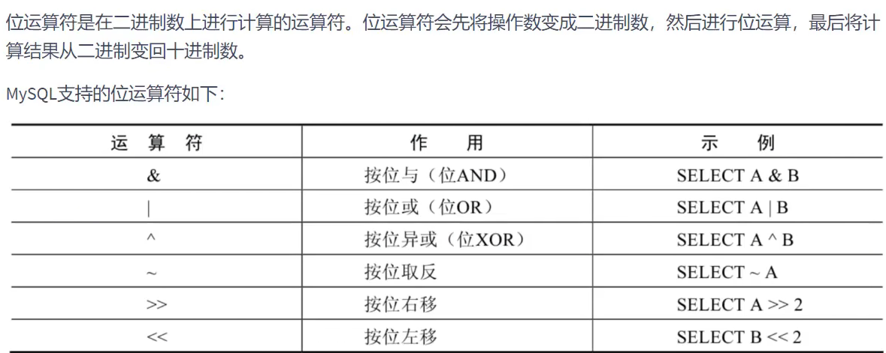


### 5. 运算符的优先级


## 排序与分页

```mysql
# example

# 排序

# 如果没有使用排序操作，默认情况下查询返回的数据是按照添加数据的顺序显示的
SELECT *
FROM employees;


# 使用 ORDER BY 对查询到的数据进行排序操作（默认是升序）
# 升序：ASC (ascend)
# 降序：DESC	(descend)

# 练习：按照salary从高到低的顺序显示员工信息
SELECT employee_id, last_name, salary
FROM employees
ORDER BY salary DESC;

# 可以使用列的别名，进行排序
SELECT employee_id, last_name, salary * 12 annual_sal
FROM employees
ORDER BY annual_sal DESC;
# 别名只能在 ORDER BY 中使用，不能在 WHERE 中使用
# 错误的，会报错
SELECT employee_id, last_name, salary * 12 annual_sal
FROM employees
WHERE annual_sal > 816000;

# 二级排序

# 练习：显示员工信息，按照department_id的降序排列，salary的升序排列
SELECT employee_id, last_name, salary
FROM employees
ORDER BY department_id DESC, salary ASC;
```

```mysql
# example

# 分页

# mysql使用LIMIT实现数据的分页显示

# 需求：每页显示20条记录，此时显示第1页
SELECT employee_id, last_name
FROM employees
LIMIT 0, 20;

# 需求：每页显示20条记录，此时显示第2页
SELECT employee_id, last_name
FROM employees
LIMIT 20, 20;


# WHERE ... ORDER BY ... LIMIT 声明顺序

# LIMIT 的格式：严格来说 LIMIT 位置偏移量，条目数
# 结构"LIMIT 0, 条目数"等价于"LIMIT 条目数"
SELECT employee_id, last_name, salary
FROM employees
WHERE salary > 6000
ORDER BY salary DESC
# LIMIT 0, 10;
LIMIT 10;


# MySQL8.0新特性：LIMIT ... OFFSET ...
SELECT employee_id, last_name
FROM employees
# LIMIT 31, 2;
LIMIT 2 OFFSET 31;
```


## 多表查询


### 1. 笛卡尔积（或交叉连接）的理解

笛卡尔积是一个数学运算。假设有两个集合`X`和`Y`，那么`X`和`Y`的笛卡尔积就是`X`和`Y`的所有可能组合。

```mysql
# example

# 笛卡尔积错误
SELECT employee, department_name
FROM employees, departments;

# 多表查询的正确方式：需要有连接条件
SELECT employee, department_name
FROM employees, departments
# 两个表的连接条件
WHERE employees.`department_id` = departmets.department_id;

# 如果查询语句中出现了多个表中都存在的字段，则必须指明此字段所在的表
SELECT employee, department_name，employees.department_id
FROM employees, departments
WHERE employees.`department_id` = departmets.department_id;

# 建议：从sql优化的角度，建议多表查询时，每个字段前都指明其所在的表

# 可以给表起别名，在SELECT和WHRER中使用表的别名
SELECT emp.employee, dept.department_name，emp.department_id
FROM employees emp, departments dept
WHERE emp.`department_id` = dept.department_id;
# 如果给表请了别名，一旦在SELECT或WHERE中使用表名的话，则必须使用表的别名，而不能使用表的别名
# 如下操作是错误的，会报错
SELECT emp.employee, dept.department_name，emp.department_id
FROM employees emp, departments dept
WHERE emp.`department_id` = departments.department_id;


# 练习：查询员工的employee_id, last_name, department_name, city
SELECT employee_id, last_name, department_name, city
FROM employees e, departments d, locations l
WHERE e.`department_id` = d.`department_id`
AND d.`location_id` = l.`location_id`;
```

​	

### 2. 多表查询的分类

角度一：等值连接	vs	非等值连接

角度二：自连接		vs	非自连接

角度三·：内连接		vs	外连接

```mysql
# example

# 等值连接	vs	非等值连接

# 例子非等值连接
SELECT e.last_name, e.salary, j.grade_level
FROM employees e, job_grades j
WHERE e.`salary` BETWEEN j.`lowest_sal` AND j.`highest_sal`;


# 自连接	vs	非自连接

# 自连接例子
# 练习：查询员工id，员工名字及其管理者的id和姓名
SELECT emp.employee_id, emp.last_name, emp.employee_id, mgr.last_name
FROM employees emp, employees mgr
WHERE emp.`manager_id` = mgr.`employee_id`


# 内连接	vs	外连接

# 内连接：合并具有同一列的两个以上的表的行，结果集中不包含一个表与另一个表不匹配的行


# 外连接：合并具有同一列的两个以上的表的行，结果集中除了包含一个表与另一个表匹配的行之外，还查询到左表或右表中不匹配的行
# 外连接的分类：左外连接、右外连接、满外连接
# 左外连接：两个表在连接过程中除了返回满足连接条件的行以外还返回左表不满足条件的行
#右外连接：两个表在连接过程中除了返回满足连接条件的行以外还返回右表不满足条件的行
# -----------------
# 练习：查询所有的员工的last_name, department_name信息

# SQL92语法实现外连接：使用 + --- MySQL不支持SQL92语法实现的外连接
/*
失败的，会报错的左外连接
SELECT employee_id, department_name
FROM employees e, department d
WHERE e.`department_id` = d.department_id (+);
*/

# SQL99语法中使用 JOIN ... ON 的方式实现多表的查询，这种方式也能外连接的问题。MySQL支持这种方式
# 内连接
SELECT employee_id, department_name
FROM employees e JOIN department d
ON e.`department_id` = d.`department_id`;
# 左外连接(OUTER可以省略掉)
SELECT employee_id, department_name
FROM employees e LEFT OUTER JOIN department d
ON e.`department_id` = d.`department_id`;

# 满外连接（全外连接）：MySQL 不支持 FULL OUTER JOIN
SELECT employee_id, department_name
FROM employees e FULL OUTER JOIN department d
ON e.`department_id` = d.`department_id`;
# -----------------
```

SQL99语法JOIN


### 3. UNION的使用

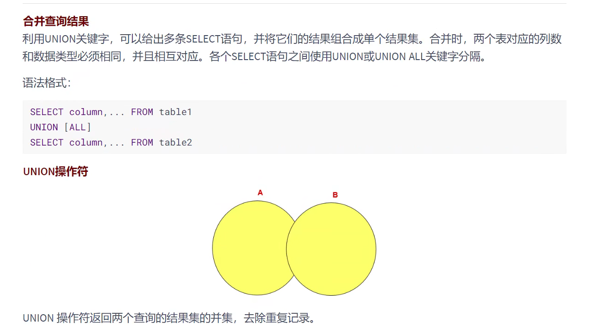


### 4. SQL99语法的新特性1：自然连接

SQL99在SQL92的基础上提供了一些特殊语法，比如`NATURAL JOIN`用来表示自然连接。它会自动查询两张表中**所有相同的字段**，然后进行**等值连接**。

```mysql
# example

SELECT employee_id, department_name
FROM employees e JOIN department d
ON e.`department_id` = d.`department_id`
AND e.`manger_id` = d.`manger_id`;
#等价于自然连接
SELECT employee_id, department_name
FROM employees e NATURAL JOIN department d;
```

### 5. SQL99语法的新特性2：

```mysql
# example

SELECT employee_id, department_name
FROM employees e JOIN department d
ON e.`department_id` = d.`department_id`;
#等价于USING 
SELECT employee_id, department_name
FROM employees e JOIN department d
USING (department_id);
```


## 函数


### MySQL的内置函数以及分类


### 1. 数值函数


#### 1.1 基本函数

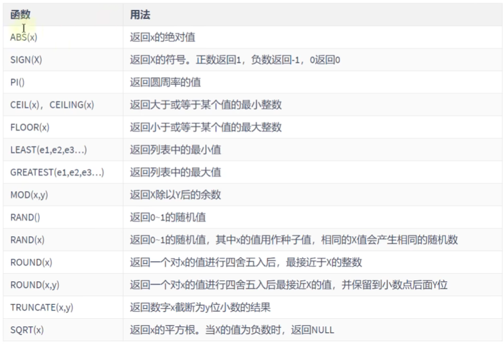


#### 1.2 角度与弧度互换函数

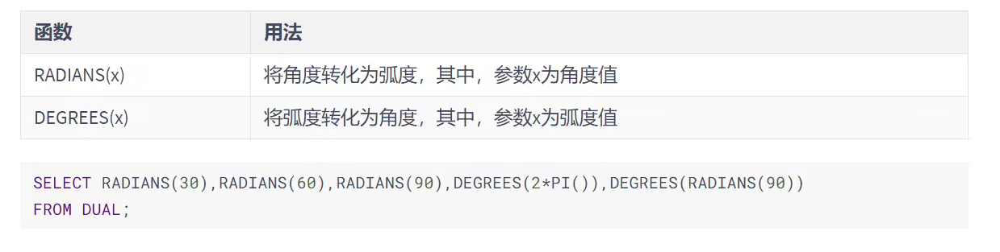


#### 1.3 三角函数


#### 1.4 指数与对数

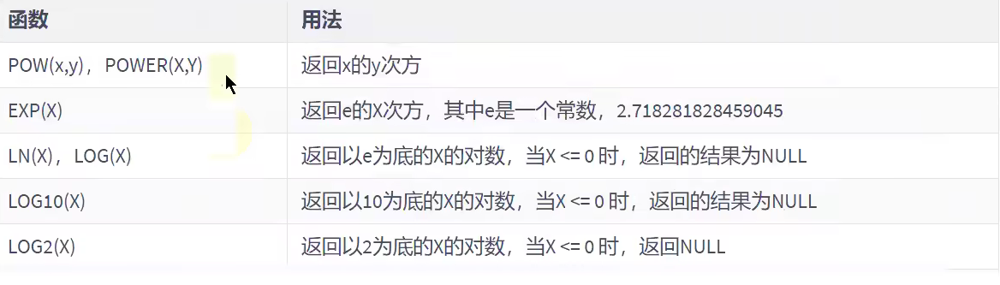


#### 1.5 进制间的转换


### 2. 字符串函数

一般用到的：


### 3. 日期和时间类型函数


#### 3.1 获取日期、时间

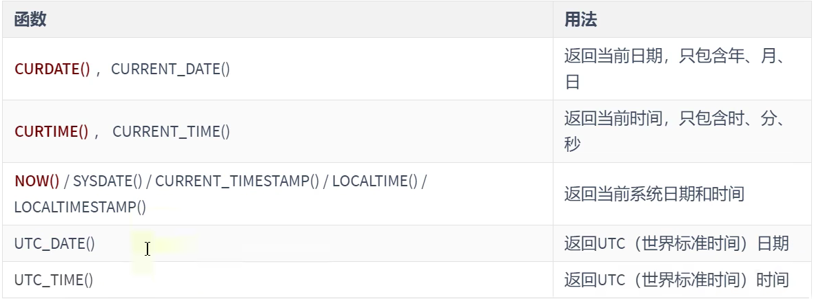


#### 3.2 日期与时间戳的转换


#### 3.3 获取月份、星期、星期数、天数等函数

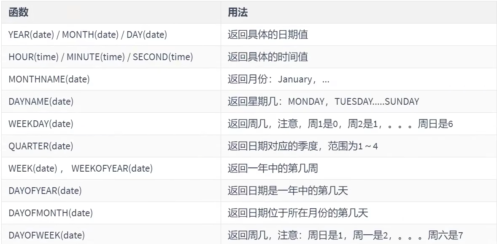


#### 3.4 日期的操作函数


#### 3.5 时间和秒钟转换的函数


#### 3.6 计算日期和时间的函数

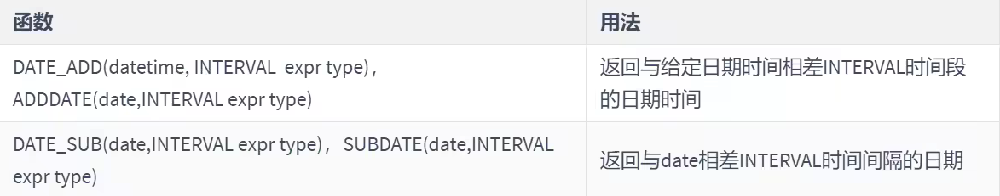

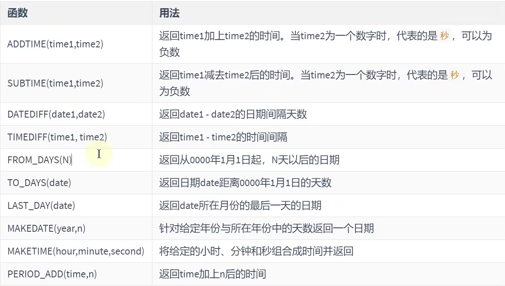


#### 3.7 日期的格式化与解析


### 4. 流程控制函数

流程处理函数根据不同的条件，执行不同的处理流程，可以在**SQL**语句中实现不同的条件选择。**MySQL**中的流程处理函数主要包括`IF()`、`IFNULL()`和`CASE()`函数


```mysql
# example

# 练习1查询部门号为 10,20，30 的员工信息若部门号为 10，则打印其工资的 1.1 倍，20 号部门，则打印其工资的 1.2 倍，30 号部门.打印其工资的 1.3 倍数其他部门,打印其工资的 1.4 倍数
SELECT employee_id, last_name, deapartment_id, salary, CASE department_id WHEN 10 THEN salary * 1.1
																		  WHEN 20 THEN salary * 1.2
																		  WHEN 20 THEN salary * 1.2
																		  ELSE salary * 1.4 END "details"
FROM employees;

```


### 5. 加密与解密函数

加密与解密函数主要用于对数据库中的数据进行加密和解密处理，以防数据被他人窃取。这些函数在保证数据库安全时非常有用。


```mysql
# example

# ENCODE(), DECODE(), PASSWORD()在MySQL8.0中弃用
SELECT MD5('MySQL'), SHA('MySQL')
FROM DUAL;
```


### 6. MySQL信息函数

MySQL中内置了一些可以查询MySQL信息的函数，这些函数主要用于帮助数据库开发或运维人员更好地对数据库进行维护工作

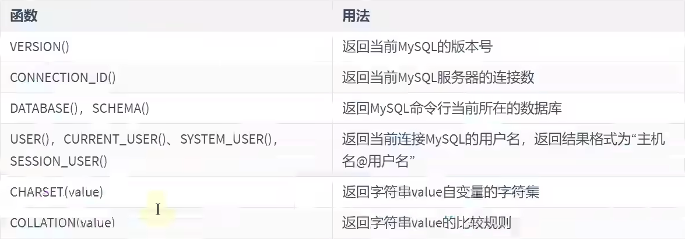


### 7. 其他函数

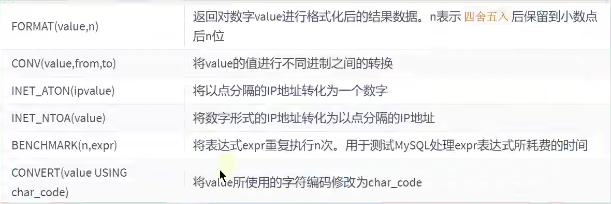


## 聚合函数

它是对一组函数进行汇总的函数，输入的是一组数据的集合，输出的是单个值。


### 1. 聚合函数介绍

* 聚合函数作用于一组数据，并对一组数据返回一个值

* （常用）聚合函数类型

  * AVG()

    ```mysql
    # example
    
    # 需求：查询公司中平均奖金率
    # 错误的！
    SELECT AVG(commission_pct)
    FROM employees;
    
    # 正确的：
    SELECT SUM(commission_pct) / COUNT(IFNULL(commission_pct, 0))
    # AVG(IFNULL(commission_pct, 0))
    FROM employees;
    ```

    

  * SUM()

  * MAX()

  * MIN()

  * COUNT()

    ```mysql
    # example
    
    # 如果计算表中有多少条记录，如何实现？
    # 方式一：COUNT(*)
    # 方式二：COUNT(1)
    # 方式三：COUNT(具体字段)：不一定对！
    
    # 注意：计算指定字段出现的个数时，是不计算NULL值的
    SELECT COUNT(commission_pct)
    FROM employees;
    
    # 如何需要统计表中的记录数，使用COUNT(*)、COUNT(1)、COUNT(具体字段)哪个效率更高呢？
    # 如果使用的是 MyISAM 存储引擎，则三者效率相同同时O(1)
    # 如果使用的时 InnoDB 存储引擎，则三者效率：COUNT(*) =  COUNT(1) > COUNT(字段)
    ```
    


### 2. GROUP BY

```mysql
# example

# 需求：查询各个部门的平均工资、最高工资
SELECT department_id, AVG(salary)
FROM employees
GROUP BY department_id;

# 需求：查询各个job_id的平均工资
SELECT job_id, AVG(salary)
FROM employees
GROUP BY job_id;

# 需求：查询各个department++id, job_id的平均工资
SELECT AVG(salary)
FROM employees
GROUP BY department_id, job_id;
# 或
SELECT AVG(salary)
FROM employees
GROUP BY job_id, department_id;

# 结论一：SELECT中出现的非组函数的字段必须声明在GROUP BY中。
# 反之，GROUP BY中声明的字段可以不出现在SELECT中
# 结论二：GROUP BY 声明在FROM后面、WHERE后面、ORDER BY前面、LIMIT前面

```


### 3.HAVING

用来过滤数据

```mysql
# example

# 练习：查询各个部门中最高工资比10000高的部门信息
# 要求1：如果过滤条件中使用了聚合函数，则必须使用HAVING来替换WHERE。否则，报错
# 要求2：HAVING 必须声明在 GROUP BY 的后面
SELECT dapartment_id, MAX(salary)
FROM employees
GROUP BY department_id
HAVING MAX(salary);

# 要求3：开发中，我们使用HAVING的前提时SQL中使用了GROUP BY

# 练习：查询部门id为10，20，30，40这4个部门中最高工资比10000高的部门信息
# 方式1：推荐，执行效率高于方式2
SELECT department_id, MAX(salary)
FROM employees
WHERE department_id IN (10, 20, 30, 40)
GROUP BY department_id
HAVING MAX(salary) > 10000;
# 方式2：
SELECT department_id, MAX(salary)
FROM employees
GROUP BY department_id
HAVING MAX(salary) > 10000 AND department_id IN (10, 20, 30, 40);

# 结论：当过滤条件中有聚合函数时，则此过滤条件必须声明在HAVING中
# 	   当过滤条件没有聚合函数时，则此过滤条件声明在WHERE中或HAVING中都可以。但是建议大家声明在WHERE中


```

#### 3.1 WHERE 和 HAVING的对比


### 4. SQL 底层执行原理


#### 4.1 SELECT 语句的完整结构

```mysql
# sql92语法：
SELECT ...,...,...(存在聚合函数)
FROM ...,...,...
WHERE 多表的连接条件 AND 不包含聚合函数的过滤条件
GROUP BY ...,...
HAVING 包含聚合函数的过滤条件
ORDER BY ...,...(ASC / DESC)

# sql99语法：
SELECT ...,...,...(存在聚合函数)
FROM ...(LEFT / RIGHT) JOIN ... ON 多表的连接条件
WHERE 不包含聚合函数的过滤条件
GROUP BY ...,...
HAVING 包含聚合函数的过滤条件
ORDER BY ...,...(ASC / DESC)
LIMIT ...,...
```


#### 4.2 SQL语句的执行过程：

在SELECT语句执行这些步骤的时候，每个步骤都会产生一个`虚拟表`，然后将这个虚拟表转入下一个步骤中作为输入

```mysql
FROM ...,... -> ON -> (LEFT / RIGHT JOIN) -> WHERE -> GROUP BY -> HAVING -> SELECT -> DISTINCT -> ORDER BY -> LIMIT
```


## 子查询

子查询指一个查询语句嵌套在另一个查询语句内部的查询。

 SQL中子查询的使用大大增强了SELECT查询的能力，因为很多时候查询需要从结果集中获取数据、或者需要从同一个表中先计算得出一个数据结果，然后与这个数据结果（可能是某个标量，也可能是某个集合）进行比较。

```mysql
# example

# 需求：谁的工资比Abel的高？
# 方式一：
SELECT salary
FROM employees
WHERE last_name = 'Abel';

SELECT last_name, salary
FROM employees
WHERE salary > 11000;

# 方式二：自连接
SELECT e2.last_name, e2.salary
FROM employees e1, employees e2
WHERE e2.`salary` > e1.`salary` # 多表的连接条件
AND e1.last_name = 'Abel';

# 方式三：子查询
SELECT last_name, salary
FROM employees
WHERE salary > (
				SELECT salary
    			FROM employees
    			WHERE last_name = 'Abel'
			   	);

# 称谓的规范：外查询（或主查询）、内查询（或子查询）
/*
- 子查询（内查询）在主查询之前一次执行完成。
- 子查询的结果被主查询（外查询）使用。
- **注意事项**
	- 子查询要包含在括号内
	- 将子查询放在比较条件的右侧
	- 单行操作符对应单行子查询，多行操作符对应多行子查询
*/

/*
子查询的分类
角度一： 从内查询返回的结果的条目数
		单行子查询	vs	多行子查询
角度二： 内查询是否被执行多次
		相关子查询	vs	不相关子查询
比如：相关子查询地需求：查询大于其本部门平均工资地员工信息
*/

```


### 1. 单行子查询


#### 1.1 单行比较操作符


#### 1.2  子查询的编写技巧（或步骤）：1.  从里往外写	2.  从外往里写


#### 1.3 HAVING中的子查询

* 首先执行子查询
* 向主查询中的HAVING子句返回结果

```mysql
# example

# 题目：查询最低工资大于50号部门最低工资的部门id和其最低工资
SELECT department_id, MIN(salary)
FROM employees
GROUP BY department_id
HAVING MIN(salary) > (
						SELECT MIN(salary)
						FROM employees
						WHERE depart_id = 110
					 );
					 

# 题目：显示员工的employee_id，last_name和location。
# 其中若员工department_id与location_id为1800的department_id相同，
# 则location为`Canada`，其余则为`USA`。
SELECT employee_id, last_name, CASE department_id WHEN (SELECT department_id FROM departments WHERE location_id = 1800) THEN 'Canada' ELSE 'USA' END 'location'
FROM employees

```


### 2. 多行子查询

* 也称集合比较子查询
* 内查询返回多行
* 使用多行比较操作符

#### 2.1 多行比较操作符


```mysql
# example

# 例子
# IN:
SELECT employees_id, last_name
FROM employees
WHERE salary IN 
				(
                    SELECT MIN(salary)
                    FROM employees
                    GROUP BY department_id
				);

# ANY / ALL:
# 题目：返回其它job_id中比job_id为`IT_PROG`部门任一工资低的员工的员工号、
# 姓名、job_id 以及 salary
SELECT employee_id, last_name, job_id, salary
FROM employees
WHERE job_id <> 'IT_PROG'
AND salary < ANY (
    SELECT salary
    FROM employees
    WHERE job_id = 'IT_PROG'
);
# 题目：返回其它job_id中比job_id为`IT_PROG`部门所有工资都低的员工的员工号、
# 姓名、job_id 以及 salary
SELECT employee_id, last_name, job_id, salary
FROM employees
WHERE job_id <> 'IT_PROG'
AND salary < ALL (
	SELECT salary
    FROM employees
    WHERE job_id = 'IT_PROG'
);

# 题目：查询平均工资最低的部门id
# MySQL中聚合函数是不能嵌套使用的
# 方式一：
SELECT department_id
FROM employees
GROUP BY department_id
HAVING AVG(salary) = (
	SELECT MIN(avg_sal)
	FROM (
	    SELECT AVG(salary) avg_sal
	    FROM employees
	    GROUP BY department_id
	) t_dept_avg_sal
);
# 方式二：
SELECT department_id
FROM employees
GROUP BY department_id
HAVING AVG(salary) <= ALL (
	    SELECT AVG(salary) avg_sal
	    FROM employees
	    GROUP BY department_id
);

# 空值问题
当内查询存在空值就会查询不到东西
```


### 3. 相关子查询

#### 3.1 相关子查询执行流程

如果子查询的执行依赖于外部查询，通常情况下都是因为子查询中的表用到了外部的表，并进行了条件关联，因此每执行一次外部查询，子查询都要重新计算一次，这样的子查询就称之为**关联子查询**。

相关子查询按照一行接一行的顺序执行，主查询的每一行都执行一次子查询。

```mysql
# example

# 题目：查询员工中工资大于本部门平均工资的员工的last_name, salary和其department_id
# 相关子查询
SELECT last_name, salary, department_id
FROM employees e1
WHERE salary > (
	SELECT AVG(salary)
    FROM employees e2
    WHERE department_id = e1.`department_id`
);

# 题目：查询员工的id，salary，按照 department_name 排序
SELECT employee_id, salary
FROM employees e
ORDER BY (
	SELECT department_name
    FROM departments d
    WHERE e.`department_id` = d.`department_id	`
);


```


### 4. EXISTS 与 NOT EXISTS 关键字

* 关联子查询通常也会和**EXISTS**操作符一起来使用，用来检查在子查询中是否存在满足条件的行
* 如果在子查询中不存在满足条件的行
  * 条件返回**FALSE**
  * 继续在子查询中查找
* 如果在子查询中存在满足条件的行
  * 不在子查询中继续查找
  * 条件返回TRUE
* NOT EXISTS 关键字表示如果不存在某种条件，则返回TRUE，否则返回FALSE

```mysql
# example

# 题目：查询公司管理者的employee_id, last_name, job_id, department_id信息
SELECT employee_id, last_name, job_id, department_id
FROM employees e1
WHERE EXISTS (
	SELECT *
    FROM employees e2
    WHERE e1.`employee_id` = e2.`manager_id`
);


```


### 结论

在 **SELECT** 中，除了 **GROUP BY** 和 **LIMIT** 之外，其他位置都可以声明子查询！


## 创建和管理表


### 1 基础知识


#### 1.1 一条数据存储的过程

**存储数据是处理数据的第一步**。在**MySQL**中，一个完整的数据存储过程总共4步，分别是创建数据库、确认字段、创建数据表、插入数据。

从系统架构的层次来看，MySQL数据库系统从小到大依次是**数据库服务器**、**数据库**、**数据表**、数据表的**行与列**


#### 1.2 标识符命名规则

* 数据库名、表名不得超过30个字符，变量名限制为29个
* 必须只能包含A-Z，a-z，0-9，_共63个字符
* 数据库名、表名、字段名等对象中间不要包含空格
* 同一个**MySQL**软件中，数据库不能同名；同一个库中，表不能重名；同一个表中，字段不能重名
* 必须保证你的字段没有和保留字、数据库系统或常用方法冲突。如果坚持使用，请在**SQL**语句中使用`（着重号）引起来
* 保持字段名和类型的一致性：在命名字段并为其指定数据类型的时候一定要保证一致性，假如数据类型在一个表里是整数，那在另一个表里可就别变成字符型了


#### 1.3 MySQL中的数据类型


其中，常用的几类类型介绍如下：


### 2. 创建和管理数据库


#### 2.1 创建数据库

* 方式1：创建数据库

```mysql
CREATE DATABASE 数据库名;
```

* 方式2：创建数据库并指定字符集

```mysql
CREATE DATABASE 数据库名 CHARACTER SET 字符集;
```

* 方式3：判断数据库是否已存在，不存在则创建数据库（推荐）

```mysql
CREATE DATABASE IF NO EXISTS 数据库名;(CHARACTER SET 'utf8')
```

如果MySQL中已存在数据库，则忽略创建语句，不再创建数据库

***注意：DATABASE不能改名。一些可视化工具可以改名，它是建新库，把所有表复制到新库，再删掉旧库完成的***


#### 2.2 使用数据库

* 查看当前所有数据库

```mysql
SHOW DATABASES; # 有一个S，代表多个数据库
```

* 查看当前正在使用的数据库

```mysql
SELECT DATABASE(); # 使用的一个mysql中的全局函数
```

* 查看指定库下所有的表

```mysql
SHOW TABLE FROM 数据库名;
```

* 查看数据库的创建信息

```mysql
SHOW CREATE DATABASE 数据库名;
或者：
SHOW CREATE DATABASE 数据库名\G
```

* 使用/切换数据库

```mysql
USE 数据库名;
```

* 查看当前数据库中保存的数据表

```mysql
SHOW TABLES;
```

* 查看当前使用的数据库

```mysql
SELECT DATABASE() FROM DUAL;
```

* 查看指定数据库下保存的数据表

```mysql
SHOW TABLES FROM 数据库名;
```

* 修改数据库
  * 修改数据库数据库字符集

```mysql
ALTER DATABASE 数据库名 CHARACTER SET 'utf8';
```


### 3. 创建表

* 必须具备：
  * CREATE TABLE 权限
  * 存储空间
* 语法格式：

```mysql
CREATE TABLE [IF NOT EXISTS] 表名(
	字段1, 数据类型 [约束条件] [默认值]
    字段2, 数据类型 [约束条件] [默认值]
    字段3, 数据类型 [约束条件] [默认值]
    ...
    [表约束条件]
);
```

***加上了IF NOT EXISTS 关键字，则表示：如果当前数据库中不存在要创建的数据表，则创建数据表；如果当前数据库中已经存在要创建的数据表，则忽略建表语句，不再创建数据表***

* 必须指定：
  * 表名
  * 列名（或字段名），数据类型，**长度**
* 可选指定：
  * 约束条件
  * 默认值

```mysql
# example

# 方式一
# 需要用户具备创建表的权限
CREATE TABLE IS NOT EXISTS myemp1 (
	id INT,
    emp_name VARCHAR(15),
    hire_data DATE
);
# 查看表结构
DESC myemp1;
SHOW CREATE TABLE myemp1;

# 方式二：基于现有的表
CREATE TABLE myemp2
AS
SELECT employee_id, last_name, salary
FROM employees;
DESC myemp2;
# 方式二同时会导入数据
SELECT *
FROM myemp2

CREATE TABLE myemp3
AS
SELECT e.employee_id emp_id, e.last_name lname, d.department dept_name
FROM employees e JOIN departments d
ON e.department_id = d.department_id;

# 练习：创建一个表employees_copy，实现对employees表的复制，包括表数据
CREATE TABLE employees_copy
AS
SELECT *
FROM employees; 

# # 练习：创建一个表employees_blank，实现对employees表的复制，包括表数据
CREATE TABLE employees_blank
AS
SELECT *
FROM employees
WHERE 1 = 2;
```


### 4. 修改表 --> ALTER TABLE


#### 4.1 添加一个字段

```mysql
ALTER TABLE 表名 ADD 【COLUMN】字段名 字段类型 【FIRST | AFTER 字段名】
```

```mysql
# example

ALTER TABLE myemp1
ADD salary DOUBLE(10, 2); # 默认添加到表中的最后一个字段的位置

ALTER TABLE myemp1
ADD phone_number VARCHAR(20) FIRST;

ALTER TABLE myemp1
ADD email VARCHAR(45) AFTER emp_name;
```


#### 4.2 修改一个字段：数据类型、长度、默认值（略）

```mysql
# example 

ALTER TABLE myemp1
MODIFY emp_name VARCHAR(25);

ALTER TABLE myemp1
MODIFY emp_name VARCHAR(35) DEFAULT 'AAA';
```


#### 4.3 重命名一个字段

```mysql
# example

ALTER TABLE myemp1
CHANGE salary monthly_salary DOUBLE(10, 2);

ALTER TABLE myemp1
CHANGE email my_email VARCHAR(50);
```


#### 4.4 删除一个字段

```mysql
ALTER TABLE myemp1
DROP COLUMN my_email;
```


### 5. 重命名表

* 方式一：使用**RENAME**

```mysql
RENAME TABLE emp
TO myemp;
```

```mysql
# example

RENAME TABLE myemp
TO myemp11;
```

* 方式二：

```mysql
ALTER TABLE dept
RENAME [TO] detail_dept; -- [TO] 可以省略
```

```mysql
# example

ALTER TABLE myemp2
RENAME TO myemp12;
```

* 必须是对象的拥有者


### 6. 删除表

* 在**MySQL**中，当一个数据表**没有与其他任何数据表形成关联关系**时，可以将当前数据表直接删除。
* 数据和结构都被删除
* 所有在运行的相关事务被提交
* 所有相关索引被删除
* 语法格式：

```mysql
DROP TABLE [IF EXISTS] 数据表1 [, 数据表2, ..., 数据表n];
```

**IF EXISTS**的含义为：如果当前数据库中存在相应的数据表，则删除数据表；如果当前数据库中不存在相应的数据表，则忽略删除语句，不再执行删除数据表的操作。

* **DROP TABLE** 语句不能回滚

```mysql
# example

# 删除表
DROP TABLE IF EXISTS myemp2;

DROP TABLE IF EXISTS myemp12;
```


### 7. 清空表

* **TRUNCATE TABLE**语句：
  * 删除表中所有的数据
  * 释放表的存储空间

```mysql
# example 

TRUNCATE TABLE default_dept;
```

* **TRUNCATE TABLE**语句**不能回滚**，而使用**DELETE**语句删除数据，可以回滚

```mysql
# example

# 清空表，表示清空表中的所有数据，但是表结构保留

SELECT * FROM employees_copy;

TRUNCATE TABLE employeees_copy;

SELECT * FROM employees_copy;

DESC employees_copy;
```


## DCL 中 COMMIT 和 ROLLBACK

* **COMMIT**：提交数据。一旦执行**COMMIT**，则数据就被永久的保存在了数据库中，意味着数据不可以回滚
* **ROLLBACK**：回滚数据。一旦执行**ROLLBACK**，则可以实现数据的回滚。回滚到最近的一次**COMMIT**之后

* 对比 **TRUNCATE TABLE** 和 **DELETE FROM**
  * 相同点：都可以实现对表中所有数据的删除，同时保留表的结构
  * 不同点：
    * **TRUNCATE TABLE**：一旦执行操作，表数据全部清除。同时，数据是不可以回滚的
    * **DELETE FROM**：一旦执行此操作，表数据可以全部清除（不带**WHERE**）。同时，数据是可以实现回滚
* **DDL** 和 **DML** 的说明
  * **DDL** 的操作一旦执行，就不可回滚。指令**SET autocommit = FALSE**对**DDL**操作失效（因为在执行完**DDL**，一定会执行一次**COMMIT**，而此**COMMIT**操作不受**SET autocommit = FALSE**影响）
  * **DML** 的操作默认情况，一旦执行也是不可回滚的。但是，如果在执行**DML**之前，执行了`SET autocommit = FALSE`，则执行的**DML**操作就可以实现回滚

```mysql
# example

--- DELETE FROM
# 1)
SET autocommit = FALSE
# 2) 
DELETE FROM myemp3;
# 3)
SELECT * FROM myemp3;
# 4)
ROLLBACK;
# 5)
SELECT * FROM myemp3; # 数据回来了

--- TRUNCATE TABLE
# 1)
COMMIT; # 先将上面的操作保存下
SET autocommit = FALSE # 上面执行了，其实没有必要再执行了
# 2) 
TRUNCATE TABLE myemp3;
# 3)
SELECT * FROM myemp3;
# 4)
ROLLBACK;
# 5)
SELECT * FROM myemp3; # 数据没有回来
```

***阿里开发规范：【参考】TRUNCATE TABLE 比 DELETE 速度快，且使用的的系统和事务日志资源少，但TRUNCATE 无事务且不接触TRIGGER，有可能造成事故，故不建议在开发代码中使用此句***

```mysql
# MySQL8.0新特性：DDL的原子化

CREATE DATABASE mytest;

USE mytest;

CREATE TABLE book1(
	book_id 	INT,
    book_name	VARCHAR(255)
);

SHOW TABLES;

DROP TABLE book1, book2;

SHOW TABLES; # MySQL5.x的话book1已经被删除，MySQL8.0报错会回滚book1还在
```


## 数据处理之增删改


### 1. 插入数据


#### 1.1 方式一：VALUES 的方式添加

```mysql
# example

# 储备工作
USE testdb;

CREATE TABLE IF NOT EXISTS emp1 (
	id 			INT,
    `name` 		VARCHAR(15),
    hire_date	DATE,
    salary		DOUBLE(10, 2)
);

DESC emp1;


# 添加数据
# 1.
# 正确的
INSERT INTO emp1
VALUES (1, 'testname1', '2001-09-26', 10000000);
# 2.
# 正确的
# 指明要添加的字段（推荐）
INSERT INTO emp1(id, hire_date, salary, `name`)
VALUES (2, '20001-09-26', 50000000, 'testname2');
# 说明：没有进行赋值的hire_date值为 null
INSERT INTO emp1(id, salary, `name`)
VALUES (3, 50000000, 'testname3');
# 同时插入多条记录 （推荐）
INSERT INTO emp1(id, NAME, salary)
VALUES
(4, 'testname4', 400000000),
(5, 'testname5', 800000000);
```


#### 1.2 方式二：将查询内容插入到表中

```mysql
# example

SELECT * FROM emp1;

INSERT INTO emp1(id, NAME, salary, hire_date)
SELECT employee_id, last_name, salary, hire_date # 查询的字段一定要与添加到的表的字段一一对应
FROM employees
WHERE dapartment_id IN (70, 60);

# 说明：emp1表中要添加数据的字段的长度不能低于employees表中查询的字段的长度
# 如果emp1表中要添加数据的字段的长度低于employees表中查询的字段的长度，就有1添加不成功的风险
```


### 2. 更新数据（或修改数据）

* `UPDATE ... SET ... WHERE ...`

```mysql
# example

UPDATE emp1
SET hire_date = CURDATE()
WHERE id = 5;

# 同时修改一条数据的多个字段
UPDATE emp1
SET hire_date = CURDATE(), salary = 13145209
WHERE id = 4;


# 练习：将表中姓名中包含字符a的提薪20%
UPDATE emp1
SET salary = salary * 1.2
WHERE NAME LIKE '%a%';

# 修改数据时，是可能存在不成功的情况的。（可能是由于约束的影响造成的）
```


### 3. 删除数据

```mysql
# example

DELETE FROM emp1
WHERE id = 1;

# 删除数据时，也有可能因为约束的影响，导致删除失败
DELETE FROM departments
WHERE department_id = 50;

# 小结：DML操作默认情况下，执行完以后都会自动提交数据
# 如果希望执行完以后不自动提交数据，则需要使用 SET autocommit = FALSE 。
```


### 4. MySQL新特性：计算列

简单来说，就是某一列的值是通过别的列计算得来的。

```mysql
# example

USE emp1;

CREATE TABLE test1 (
	a INT,
    b INT,
    c INT GENRATED ALWAYS AS (a + b) VIRTUAL # 字段c即为计算列
);

INSERT INTO test1(a, b)
VALUES(10, 20);

SELECT * FROM test1;

UPDATE test1 
SET a = 100;

SELECT * FROM test1;
```


## MySQL数据类型精讲


### 1. MySQL中的数据类型


常见数据类型的属性，如下：

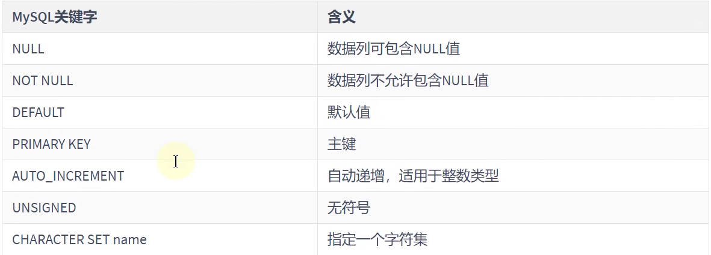

```mysql
# example

# 关于属性：character set name

# 创建数据库时指定字符集
CREATE DATABASE IF NOT EXISTS dbtest12 CHARACTER SET 'utf8';
SHOW CREATE DATABASE dbtest12;
# 创建表的时候，指名表的字符集
CREATE TABLE temp (
    id INT
) CHARACTER SET 'utf8';
SHOW CREATE TABLE temp;

# 创建表，指名表中的字段时，可以指定字段的字符集
CREATE TABLE temp1 (
	id INT,
    NAME VARCHAR(15) CHARACTER SET 'gbk'
);
SHOW CREATE TABLE temp1;
```


### 2. 整数类型

#### 2.1 类型介绍

整数类型一共有5种，包括TINYINT，SAMLLINT，MEDIUMINT，INT（INTEGER）和BIGINT。

它们区别如下表所示：

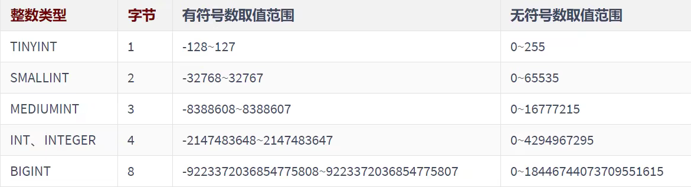

```mysql
# example

USE dbtest12;

CREATE TABLE test_int1 (
	f1 	TINYINT,
    f2	SMALLLINT,
    f3	MEDIUMINT,
    f4	INTEGER,
    f5	BIGINT
);
```

#### 2.2 可选属性

整数类型的可选属性有三个：

##### 2.2.1 M

**M**：表示显示宽度，M的取值范围是（0， 255）。

***显示宽度与类型可以存储的值范围无关***

```mysql
# example

CREATE TABLE test_int2 (
	f1	INT,
    f2	INT(5),
    f3	INT(5) ZEROFILL # 指不满5位宽度用0填充
);
```

##### 2.2.2 UNSIGNED

**UNSIGNED**：无符号类型（非负），所有的整数类型都有一个可选的属性**UNSIGNED**（无符号属性），无符号整数的最小取值为0。

##### 2.2.3 ZEROFILL

**ZEROFILL**：0填充，（如果某列是**ZEROFILL**，那么**MySQL**会自动为当前列添加**UNSIGNED**属性），如果指定了**ZEROFILL**只是表示不够**M**位时，用0在左边填充，如果超过**M**位，只要不超过数据存储范围即可。


### 3. 浮点类型


#### 3.1 类型介绍

浮点数和顶点数类型的特点是可以**处理小数**，你可以把整数看出小数的一个特例。因此，浮点数和定点数的使用场景，比整数大多了。**MySQL**支持的浮点数类型，分别是**FLOAT**、**DOUBLE**、**REAL**

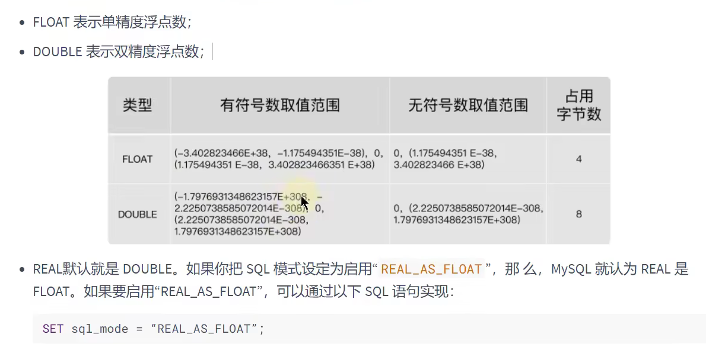

```mysql
# example

CREATE TABLE test_double1 (
	f1 	FLOAT,
    f2 	FLOAT(5, 2),
    f3	DOUBLE,
    f4	DOUBLE(5, 2)
);

INSERT INTO test_double1(f3, f4)
VALUES (123.45, 123.456); # 存在四舍五入

# Out of range value for column 'f4' at row 1
INSERT INTO test_double1(f3, f4)
VALUES (123.45, 1234.456)
```

#### 3.2 精度误差说明

浮点数类型有个缺陷，就是不精确。

```mysql
# example

CREATE TABLE test_double2 (
	f1 DOUBLE
);

INSERT INTO test_double2
VALUES (0.47), (0.44), (0.19);

SELECT SUM(f1)
FROM test_double2;

SELECT SUM(f1) = 1.1 # 为0
FROM test_double2;
```

因为浮点数是不准确的，所以我们要避免使用`=`来判断两个数是否相等


### 4. 定点数类型


#### 4.1 类型介绍

* **MySQL**中的定点数类型只有**DECIMAL**一种类型

| 数据类型                    | 字节数    | 含义               |
| --------------------------- | --------- | ------------------ |
| DECIMAL(M, D), DEC, NUMERIC | M + 2字节 | 有效范围由M和D决定 |

使用 DECIMAL(M, D) 的方式表示高精度小数。其中，M被称为精度，D被称为标度。

* **DECIMAL(M, D)的最大取值范围与DOUBLE类型一样**

* 定点数在**MySQL**内部是以字符串的形式进行存储，这就决定了它一定是精准的。
* 当**DECIMAL**类型不指定精度和标度是，其默认为**DECIMAL(10, 0)**。当数据的精度超出了定点数类型的精度范围时，则**MySQL**同样会进行四舍五入处理

* **浮点数** vs **定点数**
  * 浮点数相对于定点数的优点是在长度一定的情况下，浮点数取值范围大，但不精准，适用于需要取值范围大，又可以容忍微小误差的科学计算场景（比如计算化学，分子建模，流体动力学等）
  * 定点数类型取值范围相对小，但是精准，没有误差，适合于对精度要求极高的场景（比如涉及金额计算的场景）

```mysql
# example

CREATE TABLE test_decimall (
	f1	DECIMAL,
    f2	DECIMAL(5, 2)
);

DESC test_decimall;

INSERT INTO test_decimall(f1)
VALUES(123), (123.45); # 后一个f1会四舍五入

INSERT INTO test_decimall(f2)
VALUES(67.567); # 存在四舍五入

# Out of range value for column 'f2' at row 1
INSERT INTO test_decimall(f2)
VALUES(1267.567); # 存在四舍五入
```


### 5. 位类型：BIT

**BIT**类型中存储的是二进制，类似010110

| 二进制字符串类型 | 长度 | 长度范围     | 占用空间            |
| ---------------- | ---- | ------------ | ------------------- |
| BIT(M)           | M    | 1 <= M <= 64 | 约为（M+7）/8个字节 |

**BIT**类型，如果没有指定（M），默认是1位。这个1位，表示只能存1位的二进制值。这里（M）是表示二进制的位数，位数最小值为1，最大值为64

```mysql
CREATE TABLE test_bit1 (
	f1	BIT,
    f2	BIT(5),
    f3	BIT(64)
);

DESC test_bit1;

INSERT INTO test_bit1(f1)
VALUES (0), (1);

SELECT * 
FROM test_bit1;

# Data too long for column 'f1' at row 1
INSERT INTO test_bit1(f1)
VALUES (2);
```

使用**SELECT**命令查询位字段时，可以用**BIN()**或**HEX()**函数进行读取


### 6. 日期与时间类型

**MySQL**有多种表示日期和时间的数据类型，不同的版本可能有所差异，**MySQL8.0**版本支持的日期和时间类型主要有：**YEAR类型**、**TIME类型**、**DATE类型**、**DATETIME类型**和**TIMESTAMP类型**

* **YEAR**类型通常用来表示年
* **DATE**类型通常用来表示年、月、日
* **TIME**类型通常用来表示时、分、秒
* **DATETIME**类型通常用来表示年、月、日、时、分、秒
* **TIMESTAMP**类型通常用来表示时区的年、月、日、时、分、秒

| 类型      | 名称     | 字节 | 日期格式            | 最小值                  | 最大值                  |
| --------- | -------- | ---- | ------------------- | ----------------------- | ----------------------- |
| YEAR      | 年       | 1    | YYYY或YY            | 1901                    | 2155                    |
| TIME      | 时间     | 3    | HH:MM:SS            | -838:59:59              | 838:59:59               |
| DATE      | 日期     | 3    | YYYY-MM-DD          | 1000-01-01              | 9999-12-03              |
| DATETIME  | 日期时间 | 8    | YYYY-MM-DD HH:MM:SS | 1000-01-01 00:00:00     | 9999-12-31 23:59:59     |
| TIMESTAMP | 日期时间 | 4    | YYYY-MM-DD HH:MM:SS | 1970-01-01 00:00:00 UTC | 2038-01-19 03:14:01 UTC |

#### 6.1 YEAR 类型

**YEAR**类型用来表示年份，在所有的日期时间类型中所占用的存储空间最小，只需要**1个字节**的存储空间

在**MySQL**中，**YEAR**有以下几种存储格式：

* 以**4**位字符串或数字格式表示**YEAR**类型，其格式位**YYYY**，最小值位**1901**，最大值位**2155**
* 以**2**位字符串格式表示**YEAR**类型，最小值为**00**，最大值为**99**
  * 当取值为**01**到**69**时，表示**2001**到**2069**
  * 当取值为**70**到**99**时，表示**1970**到**1999**
  * 当取值整数的**0**或**00**添加的话，那么是**0000**年
  * 当取值是日期/字符串的**'0'**添加的话，是**2000**年

***从MySQL5.5.27开始，2位格式的YEAR已经不推荐使用***

#### 6.2 DATE 类型

**DATE**类型表示日期，没有时间部分，格式为`YYYY-MM-DD`，其中，`YYYY`表示年份，`MM`表示月份，`DD`表示日期。需要`3个字节`的存储空间

#### 6.3 TIME 类型

`TIME`类型用来表示时间，不包含日期部分。在`MySQL`中，需要**3个字节**的存储空间来存储**TIME**类型的数据

在**MySQL**中，向**TIME**类型的字段插入数据时，也可以使用几种不同的格式

1. 可以使用带有冒号的字符串，比如`D HH:MM:SS`、`HH:MM:SS`、`HH:MM`、`D HH:MM`、`D HH`或`SS`格式，都能被正确地插入`TIME`类型的字段中。
2. 可以使用不带冒号的字符串或者数字，格式为`HHMMSS`或`HHMMSS`
3. 使用`CURRENT_TIME()`或者`NOW()`，会插入当前系统时间

#### 6.4 DATETIME类型

**DATETIME**类型在所有的日期时间类型中占有的存储空间最大，总共需要**8**个字节的存储空间。在格式上为**DATE**类型和**TIME**类型的组合，可以表示为**YYYY-MM-DD HH:MM:SS**，其中**YYYY**表示年份，**MM**月份，**DD**表示日期，**HH**表示小时，**MM**表示分钟，**SS**表示秒

1. 比如`YYYY-MM-DD HH:MM:SS`或者`YYYYMMDDHHMMSS`格式
2. 格式为`YY-MM-DD HH:MM:SS`或`YYMMDDHHMMSS`
3. 使用`CURRENT_TIME()`或者`NOW()`，会插入当前系统时间

#### 6.5 TIMESTAMP类型

**TIMESTAMP**类型也可以表示日期时间，其显示格式与**DATETIME**类型相同，都是**YYYY-MM-DD HH:MM:SS**，需要**4**个字节的存储空间。但是**TIMESTAMP**存储的时间范围比**DATETIME**要小很多

* **存储数据的时候需要对当前时间所在的时区进行转换，查询数据的时候再将时间转换回当前的时区。因此，使用TIMESTAMP存储的同一个时间值，在不同的时区查询会显示不同的时间**

向**TIMESTAMP**类型的字段插入数据时，当插入的数据格式满足**YY-MM-DD HH:MM:SS**和**YYMMDDHHMMSS**时，两位数值的年份同样符合**YEAR**类型的规则条件，只不过表示的时间范围要小很多

***TIMESTAMP 和 DATETIME 的区别***

* **TIMESTAMP**存储空间比较小，表示的日期时间范围也比较小
* 底层存储方式不同，**TIMESTAMP**底层存储的是毫秒值，距离`1970-1-1 0:0:0 0`毫秒的毫秒值
* 两个日期比较大小或日期计算时，**TIMESTAMP**更方便、更快
* **TIMESTAMP**和时区有关。**TIMESTAMP**会根据用户的时区不同，显示不同的结果。而**DATETIME**则只能反映出插入时当地的时区，其他时区的人查看数据必然会有误差


#### 6.6 开发中的经验

用得最多的日期时间，就是**DATETIME**。

此外，一般存注册时间、商品发布时间等，不建议使用**DATETIME**存储，而是使用**时间戳**，因为**DATETIME**虽然直观，但不便于计算


### 7. 文本字符串类型

**MySQL**中，文本字符串总体上分为**CHAR**、**VARCHAR**、**TINYTEXT**、**TEXT**、**MEDIUMTEST**、**LONGTEXT**、**ENUM**、**SET**等类型

| 文本字符串类型 | 值的长度 | 长度范围         | 占用的存储空间      |
| -------------- | -------- | ---------------- | ------------------- |
| CHAR(M)        | M        | 0<=M<=255        | M个字节             |
| VARCHAR(M)     | M        | 0<=M<=65535      | M+1个字节           |
| TINYTEXT       | L        | 0<=L<=255        | L+2个字节           |
| TEXT           | L        | 0<=L<=65535      | L+2个字节           |
| MEDIUMTEXT     | L        | 0<=L<=16777215   | L+3个字节           |
| LONGTEXT       | L        | 0<=L<=4294967295 | L+4个字节           |
| ENUM           | L        | 1<=L<=65535      | 1或2个字节          |
| SET            | L        | 0<=L<=64         | 1，2，3，4或8个字节 |

#### 7.1 CHAR 与 VARCHAR 类型

**CHAR**和**VARCHAR**类型都可以存储比较短的字符串

| 字符串（文本）类型 | 特点     | 长度 | 长度范围    | 占用的存储空间       |
| ------------------ | -------- | ---- | ----------- | -------------------- |
| CHAR(M)            | 固定长度 | M    | 0<=M<=255   | M个字节              |
| VARCHAR(M)         | 可变长度 | M    | 0<=M<=65535 | （实际长度+1）个字节 |

**CHAR类型**

* **CHAR(M)**类型一般需要预定先定义字符串长度。如果不指定（M），则表示长度默认是`1`个字符
* 如果保存时，数据的实际长度比**CHAR**类型声明的长度小，则会在**右侧填充**空格以达到指定的长度。当**MySQL**检索**CHAR**类型的数据时，**CHAR**类型的字段会去除尾部的空格
* 定义**CHAR**类型字段时，声明的字段长度即为**CHAR**类型字段所占的存储空间的字节数


#### 7.2 VARCHAR类型

* **VARCHAR(M)**定义时，**必须指定**长度M，否则报错

* **MySQL4.0**版本以下，**varchar（20）**：指的是20字节，如果存放UTF8汉字时，只能存6个（每个汉字3字节）

  **Mysql5.0**版本以上，**varchar（20）**：指的是20字符

  * 检索**VARCHAR**类型的字段数据时，会保留数据尾部的空格。**VARCHAR**类型的字段所占用的存储空间为字符串实际长度加1个字节


***那些情况使用CHAR 或 VARCHAR 更好***

| 类型       | 特点     | 空间上       | 时间上 | 适用场景             |
| ---------- | -------- | ------------ | ------ | -------------------- |
| CHAR(M)    | 固定长度 | 浪费存储空间 | 效率高 | 存储不大，速度要求高 |
| VARCHAR(M) | 可变长度 | 节省存储空间 | 效率低 | 非CHAR的情况         |


#### 7.3 TEXT 类型

在**MySQL**中，**TEXT**用来保存文本类型的字符串，总共包含4种类型，分别是**TINYTEXT**、**TEXT**、**MEDIUMTEXT**和**LONGTEXT**类型

在向**TEXT**类型的字段保存和查询数据时，系统自动按照实际长度存储，不需要预先定义长度。这一点和**VARCHAR**类型相同

每种**TEXT**类型保存的数据长度和所占用的存储空间不同

| 文本字符串类型 | 特点               | 长度 | 长度范围                      | 占用的存储空间 |
| -------------- | ------------------ | ---- | ----------------------------- | -------------- |
| TINYTEXT       | 小文本、可变长度   | L    | 0<=L<=255                     | L + 2个字节    |
| TEXT           | 文本，可变长度     | L    | 0<=L<=65535                   | L + 2个字节    |
| MEDIUMTEXT     | 中等文本，可变长度 | L    | 0<=L<=16777215                | L + 3个字节    |
| LONGTEXT       | 大文本、可变长度   | L    | 0<=L<=4294967295（相当于4GB） | L + 4个字节    |

**由于实际存储的长度不确定，MySQL不允许TEXT类型的字段做主键**


### 8. ENUM类型

**ENUM**类型也叫作枚举类型，**ENUM**类型的取值范围需要在定义字段时进行指定。设置字段值时，**ENUM**类型只允许从成员中选取单个值，不能一次选取多个值

其所需要的存储空间由定义**ENUM**类型时指定的成员个数决定

| 文本字符串类型 | 长度 | 长度范围    | 占用的存储空间 |
| -------------- | ---- | ----------- | -------------- |
| ENUM           | L    | 1<=L<=65535 | 1或2个字节     |

```mysql
# example

CREATE TABLE test_enum (
	season ENUM('春', '夏', '秋', '东', 'unknow')
);
```


### 9. SET 类型

**SET**表示一个字符串对象，可以包含0个或多个成员，但成员个数的上限为**64**。设置字段值时，可以取取值范围内的0个或多个值

当**SET**类型包含的成员个数不同时，其所占用的存储空间也是不同的

| 成员个数范围（L表示实际成员个数） | 占用的存储空间 |
| --------------------------------- | -------------- |
| 1<=L<=8                           | 1个字节        |
| 9<=L<=16                          | 2个字节        |
| 17<=L<=24                         | 3个字节        |
| 25<=L<=32                         | 4个字节        |
| 33<=L<=64                         | 8个字节        |

**SET**类型在存储数据时成员个数越多，其占用的存储空间越大。注意：**SET**类型在选取成员时，可以一次选择多个成员，这一点于**ENUM**类型不同


### 10. 二进制字符串类型

**MySQL**中的二进制字符串类型主要存储一些二进制数据，比如可以存储图片、音频和视频等二进制数据

**MySQL**中支持的二进制字符串类型主要包括**BINARY**、**VARBINARY**、**TINYBLOB**、**BLOB**、**MEDIUMBLOB**和**LONGBLOB**类型


#### BINARY与VARBINARY类型

**BINARY**和**VARBINARY**类似于**CHAR**和**VARCHAR**，只是它们存储的是二进制字符串	


#### BLOB类型

**BLOB**是一个**二进制大对象**，可以容纳可变数量的数据

| 二进制字符串类型 | 值的长度 | 长度范围                      | 占用空间    |
| ---------------- | -------- | ----------------------------- | ----------- |
| TINYBLOB         | L        | 0<=L<=255                     | L + 1个字节 |
| BLOB             | L        | 0<=L<=65535（相当于64kb）     | L + 2个字节 |
| MEDIUMBLOB       | L        | 0<=L<=16777215 （相当于16MB） | L + 3个字节 |
| LONGBLOB         | L        | 0<=L<=4294967295（相当于4GB） | L + 4个字节 |


### 11. JSON类型

**JSON**（JavaScript Object Notation）是一种轻量级的**数据交换格式**。**JSON**可以将**JavaScript**对象中表示的一组数据转换为字符串，然后就可以在网络或者程序之间轻松地传递这个字符串，并在需要的时候将它还原为各编程语言所支持的数据格式

```mysql
# example

CREATE TABLE test_json (
	js json
);

INSERT INTO test_json (js)
VALUES ('{"name":"testName", "address":{"city":"shanghai"}}');

SELECT js -> '$.name' AS NAME
FROM test_json;
```


## 约束

为了保证数据的完整性，**SQL**规范以约束的方式对**表数据进行额外的条件限制**。从以下四个方面考虑

* **实体完整性(Entity Integrity)**
* **域完整性(Domain Integrity)**
* **引用完整性(Referential Integrity)**
* **用户自定义完整性(User-defined Integrity)**

```mysql
# example

# 按约束的作用分类（或功能）
not null --- 非空约束
unique --- 唯一性约束
primary key --- 主键约束
foreign key --- 外键约束
check --- 检查约束
default --- 默认值约束

# 添加/删除约束
CREATE TABLE --- 添加约束
ALTER TABLE --- 添加、删除约束
```

```mysql
# example

# 如何查看表中的约束
SELECT * 
FROM information_schema.table_constraints
WHERE table_name = 'employees';
```

### 1. 非空约束 *

**作用**

限定某个字段/某列的值不允许为空

**关键字**

NOT FULL

**特点**

* 默认，所有的类型的值都可以是NULL，包括INT，FLOAT等数据类型
* 非空约束只能出现在表对象的列上，只能某个列单独限定非空，不能组合非空
* 一个表可以有很多列都分别限定了非空
* 空字符串""不等于NULL，0也不等于NULL

```mysql
# example

CREATE TABLE dbtest13;
USE dbtest13;

CREATE TABLE test1 (
	id INT NOT NULL,
    last_name VARCHAR(15) NOT NULL,
    email VARCHAR(25),
    salary DECIMAL(10, 2)
);


# ALTER TABLE方式
ALTER TABLE test1
MODIFY email VARCHAR(15) NOT NULL;
```


### 2. 唯一性约束 *

**作用**

用来限制某个字段/某列的值不能重复

**关键字**

UNIQUE

**特点**

* 同一个表可以有多个唯一约束
* 唯一约束可以是某一个列的值唯一，也可以多个列组合的值唯一
* 唯一性约束允许列值为空
* 在创建唯一约束的时候，如果不给唯一约束命名，就默认和列名相同
* **MySQL会给唯一约束的列上默认创建一个唯一索引**

```mysql
CREATE TABLE test2 (
	id INT UNIQUE, # 列级约束
    last_name VARCHAR(15),
    email VARCHAR(25) UNIQUE,
    salary DECIMAL(10, 2),
    
    # 表级约束
    CONSTRAINT uk_test2_email UNIQUE(email)
);

SELECT *
FROM information_schema.table_constraints
WHERE table_name = 'test2';
# 可以向声明为 UNIQUE 的字段上添加null值

# ALTER TABLE 添加约束
ALTER TABLE test2
ADD CONSTRAINT uk_test2_sal UNIQUE(salary);

ALTER TABLE test2
MODIFY last_name VARCHAR(15) UNIQUE;

# 方式一
ALTER TABLE 表名称 ADD UNIQUE key(字段列表);
# 方式二
ALTER TABLE 表名称 MODIFY 字段名 字段类型 UNIQUE;


# 复合的唯一性约束
CREATE TABLE USER (
	id INT,
    `name` VARCHAR(15),
    `password` VARCHAR(25),
    
    # 表级约束
    CONSTRAINT uk_user_name_pwd UNIQUE(`NAME`, `PASSWORD`)
);
```

#### 2.1 删除唯一性约束

* 添加唯一性约束的列上也会自动创建唯一索引
* 删除唯一约束只能通过删除唯一索引的方式删除
* 删除时需要指定唯一索引名，唯一索引名就和唯一约束名一样
* 如果创建唯一约束时未指定名称，如果是单列，就默认和列名相同；如果是组合列，那么就默认和（）中排在第一个的列名相同。也可以自定义唯一性约束名

```mysql
# example


ALTER TABLE test2
DROP INDEX last_name;
```


## PRIMARY KEY 约束 *

**作用**

用来唯一标识表中的一行记录

**关键字**

PRIMARY KEY

**特点**

* 主键约束相当于**唯一约束+非空约束的组合**，主键约束列不允许重复，也不允许出现空值
* 一个表最多只能有一个主键约束，建立主键约束可以在列级别创建，也可以在表级别上创建
* 主键约束对应着表中的一列或者多列（复合主键）
* 如果是多列组合的复合主键约束，那么这些列都不允许为空值，并且组合的值不允许重复
* **MySQL的主键名总是PRIMARY**，就算自己命名了主键约束名也没用
* 当创建主键约束时，系统默认会在所在的列或者列组合上建立对应的**主键索引**（能够根据主键查询的，就根据主键查询，效率更高）。如果删除主键约束了，主键约束对应的索引就自动删除了
* 需要注意的一点是，不要修改主键字段的值。因为主键是数据记录的唯一标识，如果修改了主键的值，就有可能破坏数据的完整性

```mysql
# example

# 在CREATE TABLE时添加约束
CREATE TABLE test3 (
    		# 列级约束
	id INT PRIMARY KEY,
    last_name VARCHAR(15),
    salary DECIMAL(10, 2),
    email VARCHAR(25)
);
CREATE TABLE test4 (
	id INT,
    last_name VARCHAR(15),
    salary DECIMAL(10, 2),
    email VARCHAR(25),
    # 表级约束
    CONSTRAINT pk_test5_id PRIMARY KEY(id) # 还是会叫PRIMARY，主键自己命名没有用
);


# 在ALTER TABLE 时添加约束
CREATE TABLE test6 (
	id INT,
    last_name VARCHAR(15),
    salary DECIMAL(10, 2),
    email VARCHAR(25)
);

ALTER TABLE test6
ADD PRIMARY KEY(id);


# 删除主键约束(在实际开发中，不会去删除表的主键约束)
ALTER TABLE test6 DROP PRIMARY KEY;
```


## 自增列：AUTO_INCREMENT

**作用**

某个字段的值自增

**关键字**

auto_increment

**特点和要求**

1. 一个表最多只能有一个自增长列
2. 当需要产生唯一标识符或顺序值时，可设置自增长
3. 自增长列约束的列必须是键列（主键列，唯一键列）
4. 自增约束的列的数据类型必须是整数类型
5. 如果自增列指定了**0**和**null**，会在当前最大值的基础上自增；如果自增列手动指定了具体值，直接复制为具体值

```mysql
# example

# 自增长列：AUTO_INCREMENT
CREATE TABLE test7 (
	id INT PRIMARY KEY AUTO_INCREMENT,
    last_name VARCHAR(15)
);
# 当向主键（含AUTO_INCREMENT）的字段上添加0或null时，实际上会自动地往上添加指定的字段的数值
# 开发中，一旦主键作用的字段上声明有AUTO_INCREMENT，则我们在添加数据时，就不要给主键对应的字段赋值了


# 在 ALTER TABLE 时添加
CREATE TABLE test8 (
	id INT PRIMARY KEY,
    last_name VARCHAR(15)
);
ALTER TABLE test8
MODIFY id INT AUTO_INCREMENT;
# 在 ALTER TABLE 时删除
ALTER TABLE test8
MODIFY id INT;
```

**MySQL8.0新特性：自增持久化**

在**MySQL5.7**系统中，对于自增主键的分配规则，是由innoDB数据字典内部一个**计数器**来决定的，而该计数器只在**内存中维护**，并不会持久到磁盘中。当数据库重启时，该计数器会被初始化

**MySQL8.0**将自增逐渐的计数器持久化到**重做日志**中。每次计数器发生改变，都会将其写入重做日志中。如果数据库重启，**innoDB**会根据重做日志中的信息来初始化计数器的内存值


## FOREIGN KEY 约束

**作用**

限定某个表的某个字段的引用完整性

**关键字**

FOREIGN KEY

**主表和从表/父表和子表**

主表（父表）：被引用的表，被参考的表

从表（子表）：引用别人的表，参考别人的表

**特点**


```mysql
# example 

# 在 CREATE TABLE 时添加
# 先创建主表
CREATE TABLE dept1 (
	dept_id INT,
    dept_name VARCHAR(15)
);
# 再创建从表
CREATE TABLEL emp1 (
	emp_id INT PRIMARY KEY AUTO_INCREMENT,
    emp_name VARCHAR (15),
    department_id INT,
    
    # 表级约束
    CONSTRAINT fk_emp1_dept_id FOREIGN KEY (department_id) REFERENCES dept1(dept_id)
);
# 上述操作错误，是因为主表中的dept_id上没有主键约束或唯一性约束
# 添加
ALTER TABLE dept1
ADD PRIMARY KEY(dept_id);
# 再创建从表
CREATE TABLEL emp1 (
	emp_id INT PRIMARY KEY AUTO_INCREMENT,
    emp_name VARCHAR (15),
    department_id INT,
    
    # 表级约束
    CONSTRAINT fk_emp1_dept_id FOREIGN KEY (department_id) REFERENCES dept1(dept_id)
);

# 查询约束
SELECT * 
FROM information_schema.table_constraints
WHERE table_name = 'emp1';
```

### 1. 约束等级

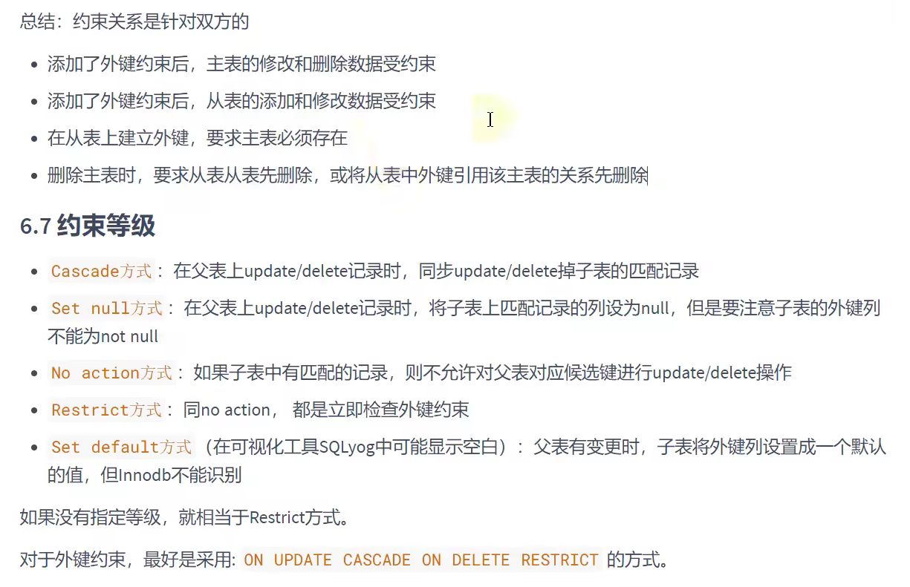


### 2. 删除外键约束

```mysql
# example

# 1. 查看约束名和删除外键约束
SELECT * FROM information_schema.table_constraints WHERE table_name = '表名称'; # 查看某个表的约束名

ALTER TABLE 从表名 DROP FOREIGN KEY 外键约束名;


# 2. 查看索引名和删除索引
SHOW INDEX FROM 表名称; # 查看某个表的索引名

ALTER TABLE 从表面 DROP INDEX 索引名;
```


## CHECK 约束

**作用**

检查某个字段的值是否符合xx要求，一般指的是值的范围

**关键字**

CHECK

**说明：MySQL 5.7 不支持**

MySQL 5.7 可以使用check约束，但check约束对数据验证没有任何作用。添加数据时，没有任何错误或警告

但是**MySQL 8.0**中可以使用**check**约束了

```mysql
# example

CREATE TABLE test10 (
	id INT,
    last_name VARCHAR(15),
    salary DECIMAL(10, 2) CHECK(salary > 2000)
);

# 在MySQL5.7没反应， 在MySQL8.0会添加失败
INSERT INTO test1
VALUES(1, 'Tom', 500);
```


## DEFAULT 约束 *

**作用**

给某个字段/某列指定默认值，一旦设置默认值，在插入数据时，如果此字段没有显示赋值，则赋值为默认值

**关键字**

DEFAULT

```mysql
# example

CREATE TABLE test11 (
	id INT,
    last_name VARCHAR(15),
    salary DECIMAL(10, 2) DEFAULT 1000000
);

CREATE TABLE test12 (
	id INT,
    last_name VARCHAR(15),
    salary DECIMAL(10, 2)
);
ALTER TABLE test12
MODIFY salary DECIMAL(12, 2) DEFAULT 2500000;

# 在 ALTER TABLE 删除约束
ALTER TABLE test12
MODIFY salary DECIMAL(12, 2);
```


## 视图


### 常见的数据库对象

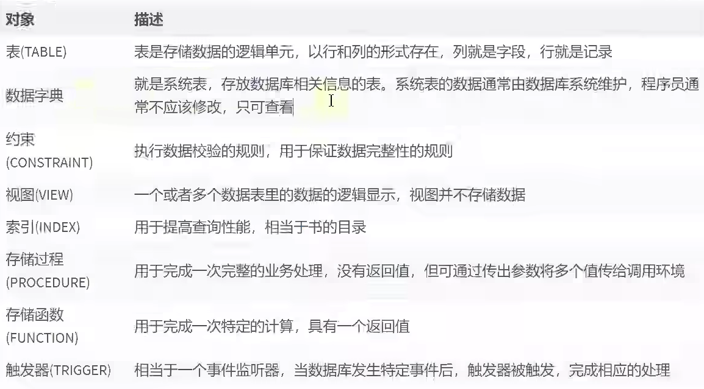

#### 视图的理解

* 试图是一种**虚拟表**，本身是**不具有数据**的，占用很少的内存空间，它是**SQL**中的一个重要概念
* **视图建立在已有表的基础上**，视图赖以建立的这些表称为**基表**

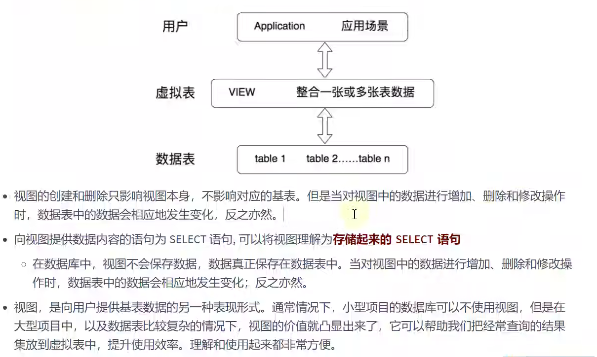

#### 创建视图

* 在**CREATE VIEW**语句中嵌入子查询

```mysql
CREATE [OR REPLACE]
[ALGORITHM = {UNDEFINED | MERGE | TEMPTABLE}]
VIEW 视图名称 [(字段列表)]
AS 查询语句
[WITH [CASCADED | LOCAL] CHECK OPTION]
```

* 精简版

```mysql
CREATE VIEW 视图名称 [(字段列表)]
AS 查询语句
```

```mysql
# example

CREATE VIEW vu_emp2
AS
SELECT employee_id emp_id, last_name lname, salary
FROM emps
WHERE salary > 8000;
# 等价于
CREATE VIEW vu_emp3(emp_id, lname, monthly_name) # 小括号内字段个数与SELECT中字段个数相同
AS
SELECT employee_id, last_name, salary
FROM emps
WHERE salary > 8000;

# 针对于多表
CREATE VIEW vu_emp_dept
AS
SELECT e.employee_id, e.department_id, d.department_name
FROM emps e JOIN depts d
ON e.`department_id` = d.`department_id`;

# 利用视图对数据进行格式化
CREATE VIEW vu_emp_dept1
AS
SELECT CONCAT(e.last_name, '(', d.department_name, ')')
FROM emps e JOIN depts d
ON e.`department_id` = d.`department_id`;

SELECT * FROM vu_emp_dept1;

# 基于视图创建视图
CREATE VIEW vu_emp4
AS 
SELECT employee_id, last_name
FROM vu_emp1;
```

#### 查看视图

* 语法一：查看数据库的表对象、视图对象

  ```mysql
  SHOW TABLES;
  ```

* 语法二：查看视图的结构

  ```mysql
  DESCRIBE vu_emp1;
  ```

* 语法三：查看视图的属性信息

  ```mysql
  SHOW TABLE STATUS LIKE 'vu_emp1';
  ```

* 查看使徒的详细定义信息

  ```mysql
  SHOW CREATE VIEW vu_emp1;
  ```


#### 更新视图数据与视图的删除

```mysql
# example

# 更新视图中的数据
# 更新视图的数据，会导致表中数据的修改
UPDATE vu_emp1
SET salary = 20000
WHERE employee_id = 101;
# 同理，更新表中的数据，会导致视图数据的修改
UPDATE emps
SET salary = 30000
WHERE employee_id = 101;

# 删除视图中的数据，会导致基表中的数据的修改
DELETE FROM vu_emp1
WHERE employee_id = 101;

# 不能更新视图中的数据的例子
# 更新失败
UPDATE vu_emp_sal
SET avg_sal = 5000
WHERE department_id = 30;
```

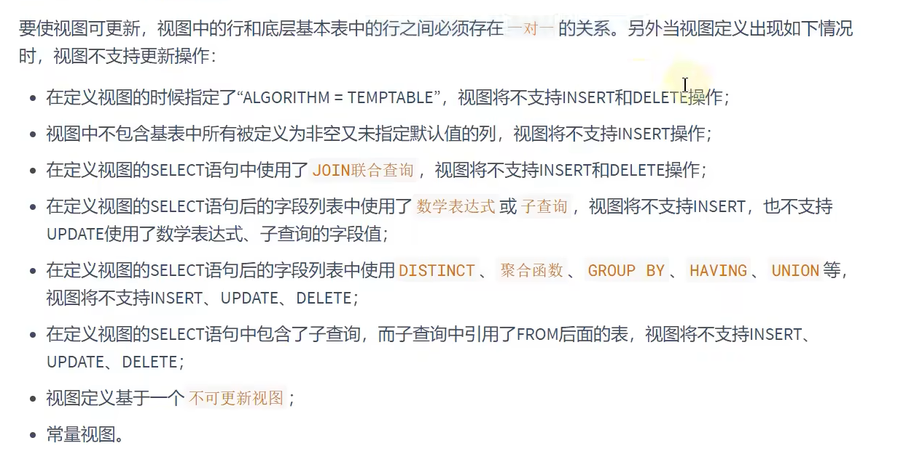

***虽然可以更新视图数据，但总的来说，视图作为虚拟表，主要用于方便查询，不建议更新视图的数据。对视图数据的更改，都是通过对实际数据表里数据的操作来完成的***


#### 修改、删除视图

##### 修改视图

* 方式1：使用CREATE **OR REPLACE** VIEW 子句**修改视图**

```mysql
# example

CREATE OR REPLACE VIEW vu_emp1
AS
SELECT employee_id, last_name, salary, email
FROM emps
WHERE salary > 10000;
```

* 方式2：ALTER方式

```mysql
# example

ALTER VIEW vu_emp1
AS
SELECT employee_id, last_name, salary,email, hire_date
FROM emps;
```


##### 删除视图

```mysql
# example

DROP VIEW vu_emp4;

DROP VIEW IF EXISTS vu_emp2, vu_emp3;
```


## 存储过程与函数


### 理解

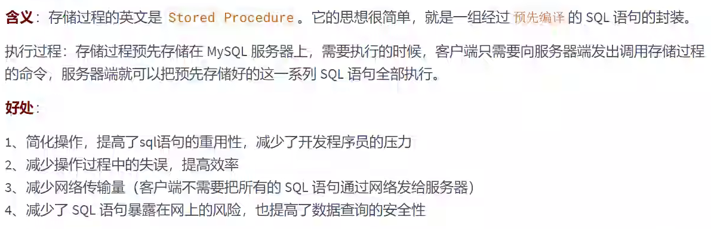


### 分类

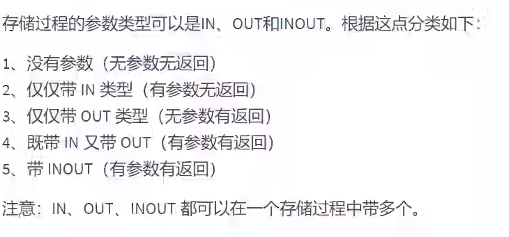


### 创建存储过程

#### 语法分析


```mysql
# example

# 创建存储过程select_all_data()，查看 emps 表的所有数据
# DELIMITER可以修改结束符
DELIMITER $

CREATE PROCEDURE select_all_data()
BEGIN
	SELECT * FROM emps;
END $

DELIMITER ;
```


### 存储过程的调用

```mysql
# example

CALL select_all_data();

# 创建存储过程 avg_employee_salary()， 返回所有员工的平均工资
DELIMITER //

CREATE PROCEDURE avg_employee_salary()
BEGIN
	SELECT AVG(salary) FROM employees;
END //

DELIMITER ;

# 调用
CALL avg_employee_salary();


# 带 OUT
# 创建存储过程 show_min_salary()，查看"emps"表的最低薪资值。并将最低薪资通过 OUT 参数"ms"输出
DELIMITER //

CREATE PROCEDURE show_min_salary(OUT ms DOUBLE)
BEGIN
	select MIN(salary) INTO ms
	FROM emploees
END //

DELIMITER ;

# 调用
CALL show_min_salary(@ms);

# 查看变量值
SELECT @ms;


# 带 IN
# 创建存储过程show_someone_salary()，查看"emps"表的某个员工的薪资，并用 IN 参数 empname 输入员工姓名
DELIMITER //

CREATE PROCEDURE show_someone_salary(IN empname VARCHAR(20))
BEGIN
	SELECT salary 
	FROM employees
	WHERE last_name = empname;
END //

DELIMITER ;

# 调用
CALL show_someone_salary('Abel');
# 另一种调用方式
SET @empname = 'Abel'; # := 这样明确赋值意义也可以
CALL show_someone_salary(@empname);
```


### 存储函数的使用


#### 语法分析

学过的函数：**LENGTH**、**SUBSTR**、**CONCAT**等

语法格式


```mysql
# example

# 创建存储函数，名称为email_by_name()，参数定义为空，该函数查询Abel的email，并返回，数据类型为字符串类型
DELIMITER //

CREATE FUNCTION email_by_name()
RETURNS VARCHAR(25)
		DETERMINISTIC
		CONTAINS SQL
		READS SQL DATA
BEGIN
	RETURN (SELECT email FROM employees WHERE last_name = 'Abel');
END //

DELIMITER ;

# 调用
SELECT email_by_name();


# 创建存储函数，名称为 email_by_id()，参数传入 emp_id，该函数查询 emp_id 的 email，并返回，数据类型为字符串类型

# 创建函数前执行此语句，保证函数的创建会成功
SET GLOBAL log_bin_trust_function_creators = 1;

# 声明函数
DELIMITER //

CREATE FUNCTION email_by_id(emp_id INT)
RETURNS VARCHAR(25)
BEGIN
	RETURN (SELECT email FROM employees WHERE employee_id = emp_id);
END

DELIMITER ;

# 调用
SELECT email_by_id(101);

SET @emp_id := 102;
SELECT email_by_id(@emp_id);
```


### 对比存储函数和存储过程

|          | 关键字    | 调用语法       | 返回值          | 应用场景                         |
| -------- | --------- | -------------- | --------------- | -------------------------------- |
| 存储过程 | PROCEDURE | CALL存储过程() | 理解为有0或多个 | 一般用于更新                     |
| 存储函数 | FUNCTION  | SELECT函数()   | 只能是一个      | 一般用于查询结果为一个值并返回时 |

此外，**存储函数可以放在查询语句中使用，存储过程不行**。反之，存储过程的功能更加强大，包括能够执行对表的操作（比如创建表，删除表）和事务操作，这些功能是存储函数不具备的。


### 存储过程和函数的查看、修改、删除

#### 查看

1. 使用**SHOW CREATE**语句查看存储过程和函数的创建信息

```mysql
SHOW CREATE {PROCEDURE | FUNCTION} 存储过程名或函数名
```

```mysql
# example
SHOW CREATE FUNCTION test_db.CountProc \G
```


2. 使用**SHOW STATUS**语句查看存储过程和函数的状态信息

```mysql
SHOW {PROCEDURE | FUNCTION} STATUS [LIKE 'pattern']
```

这个语句返回子程序的特征，如数据库、名字、类型、创建者以及创建和修改日期


3. 从**information_schema.Routines**表中查看存储过程和函数的信息

**MySQL**中存储过程和函数的信息存储在**information_schema**数据库下的**Routines**表中

```mysql
SELECT * 
FROM information_schema.Routines
WHERE ROUTINE_NAME = '存储过程或函数的名' [AND ROUTINE_TYPE = {'PPROCEDURE|FUNCTION'}]
```


#### 修改

修改存储过程或函数，不影响存储过程或函数功能，只是修改相关特性。使用**ALTER**语句实现

```mysql
ALTER {PROCEDURE | FUNCTION} 存储过程或函数的名 [characteristic ...]
```

其中，**characteristic**指定存储过程或函数的特性，其取值信息与创建存储过程、函数时的取值信息略有不同

```mysql
{CONTAINS SQL | NO SQL | READS SQL DATA | MODIFY SQL DATA}
| SQL SECURITY {DEFINER | INVOKER}
| COMMIT 'string'
```


#### 删除

删除存储过程和函数，可以使用**DROP**语句，其语法结构如下

```mysql
DROP {PROCEDURE | FUNCTION} [IF EXISTS] 存储过程或函数的名
```


## 变量、流程控制与游标


### 变量


### 系统变量

**系统变量分类**

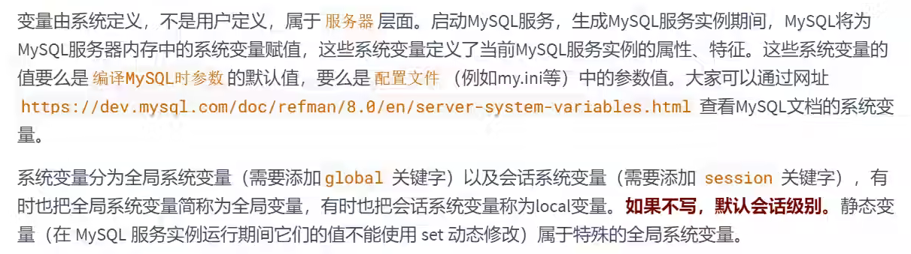

**查看系统变量**

* 查看所有或部分系统变量

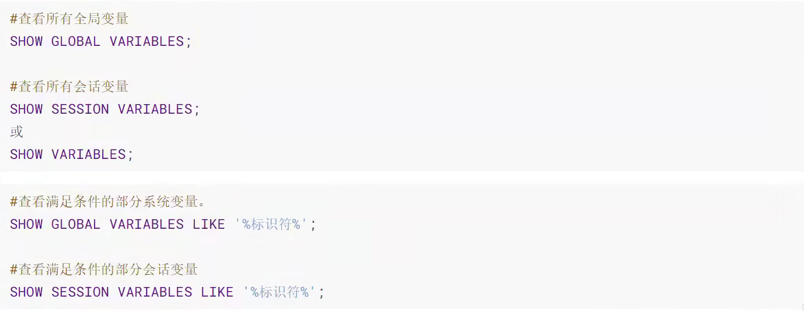

* 查看指定系统变量


* 修改系统变量的值


### 用户变量

#### 用户变量分类


#### 会话用户变量

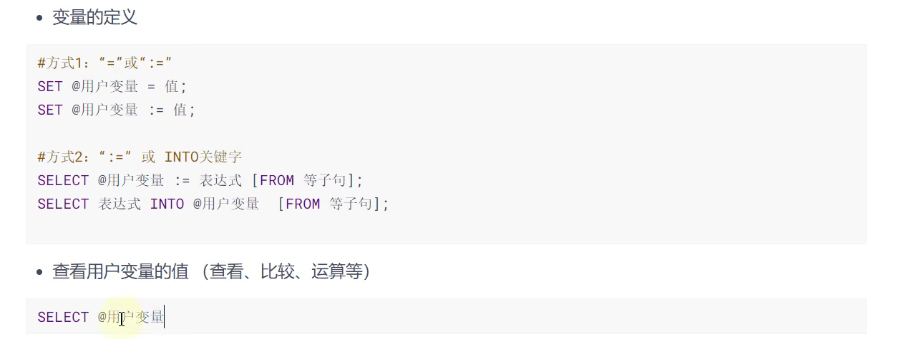

#### 局部变量

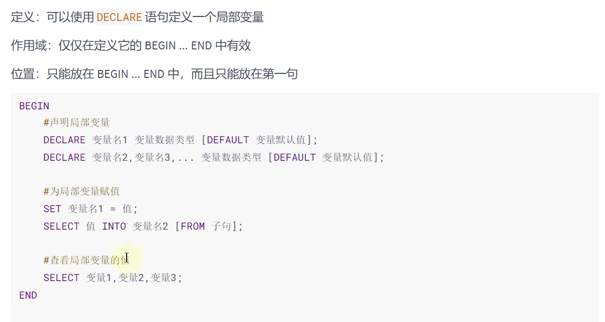

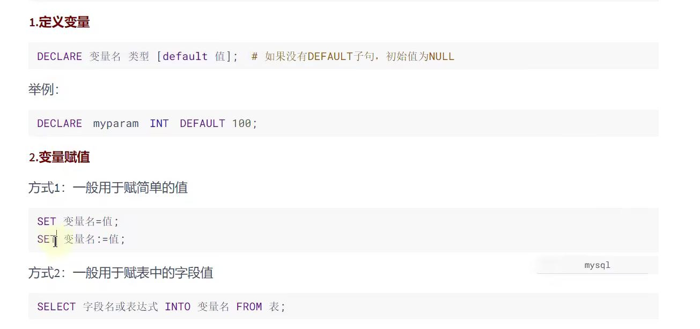


### 定义条件与处理程序


#### 定义条件


#### 定义处理程序

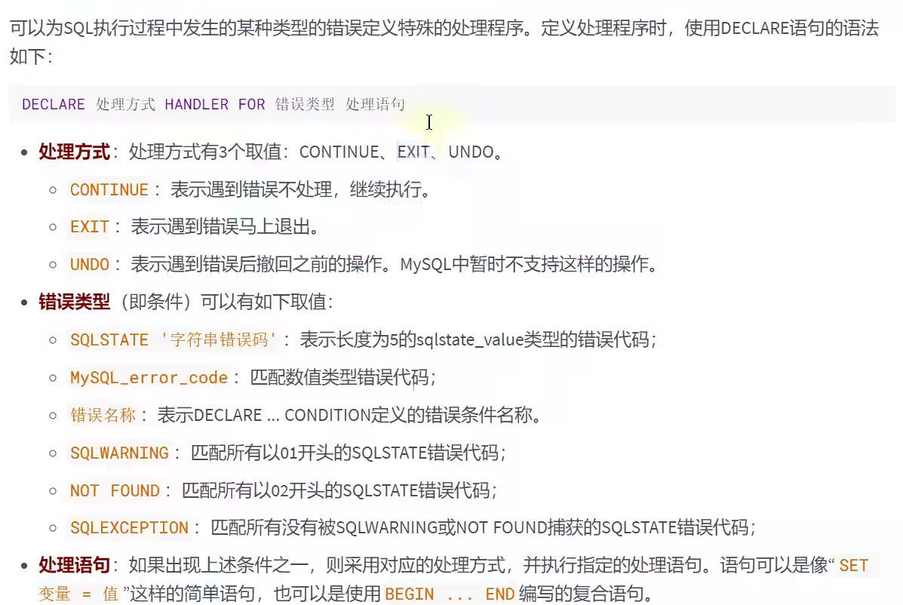


### 流程控制

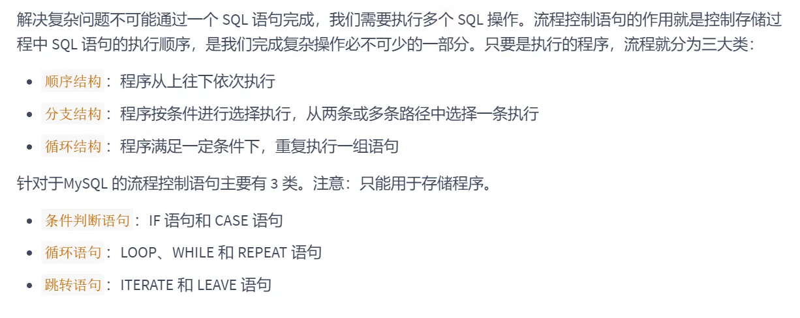

#### 分支结构之IF

* IF语句的语法结构是

```mysql
IF 表达式 THEN 操作1
[ELSEIF 表达式2 THEN 操作2] ...
[ELSE 操作N]
END IF
```

```mysql
# example

DELIMITER //
CREATE PROCEDURE test_if()
BEGIN
	# 声明局部变量
	DECLARE stu_name VARCHAR(15);
	
	IF stu_name IS NULL;
		THEN SELECT 'stu_name is null';
	END IF;
END //
DELIMITER ;

# 调用
CALL test_if();
```


#### CASE 语句的语法结构

1

```mysql
# 情况一：类似于switch
CASE 表达式
WHEN 值1 THEN 结果1或语句1（如果是语句，需要加分号）
WHEN 值2	THEN 结果2或语句2（如果是语句，需要加分号）
...
ELSE 结果n或语句n（如果是语句，需要加分号）
END [CASE] （如果是放在begin end中需要加上CASE，如果放在SELECT后面不需要）
```

2

```mysql
# 情况二：类似于多重if
CASE
WHEN 条件1 THEN 结果1或语句1（如果是语句，需要加分号）
WHEN 条件2	THEN 结果2或语句2（如果是语句，需要加分号）
...
ELSE 结果n或语句n（如果是语句，需要加分号）
END [CASE] （如果是放在begin end中需要加上CASE，如果放在SELECT后面不需要）
```

```mysql
# example

DELIMITER //
CREATE PROCEDURE test_case()
BEGIN
	# 演示1：case ... when .. then ..
	DECLARE var INT DEFAULT 2;
	
	CASE var
		WHEN 1 THEN SELECT 'var = 1';
		WHEN 2 THEN SELECT 'var = 2';
		WHEN 3 THEN SELECT 'var = 3';
		ELSE SELECT 'other value';
	END CASE;
END //

DELIMITER ;
```


#### 循环结构之LOOP

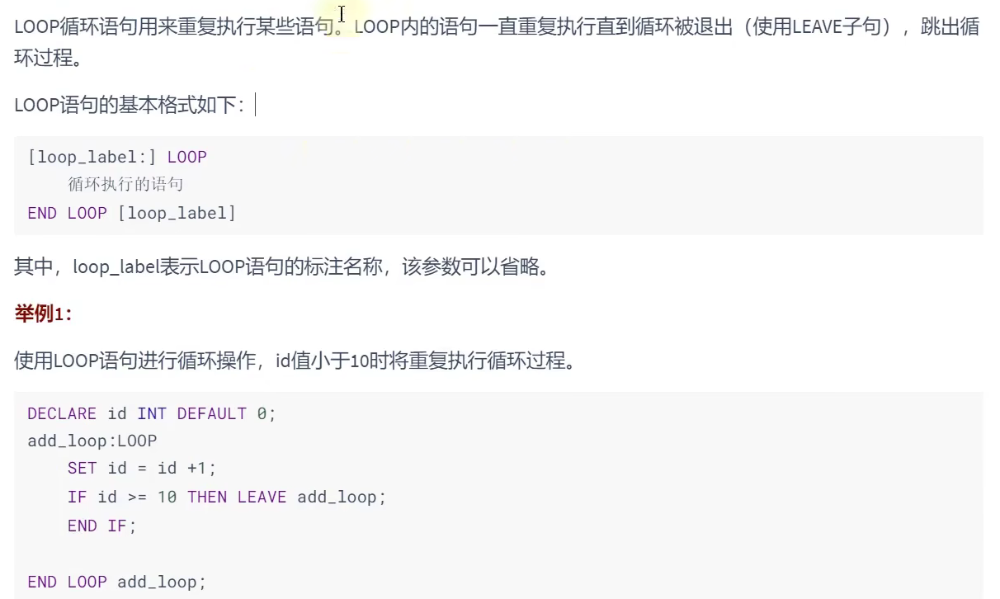


#### 循环结构之WHILE


#### 循环结构之REPEAT

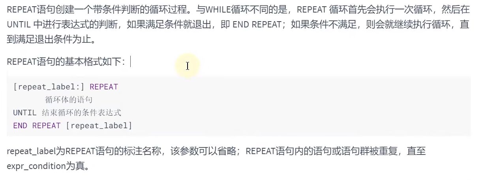

**对比三种循环结构**


#### 跳转语句之LEAVE语句


#### 跳转语句之ITERATE语句

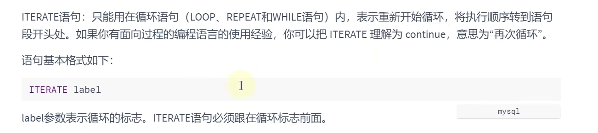


### 游标

#### 使用游标步骤

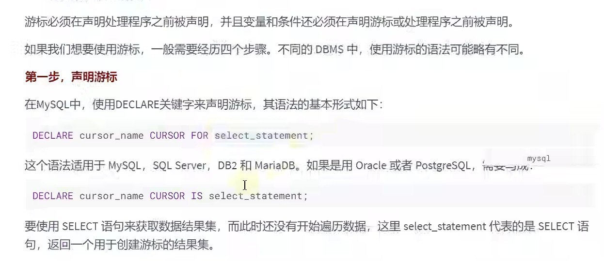


### 触发器

当对数据表中的数据执行插入、更新和删除操作，需要自动执行一些数据库逻辑时，可以使用触发器来实现


#### 触发器的创建


#### 查看、删除触发器

**查看触发器**

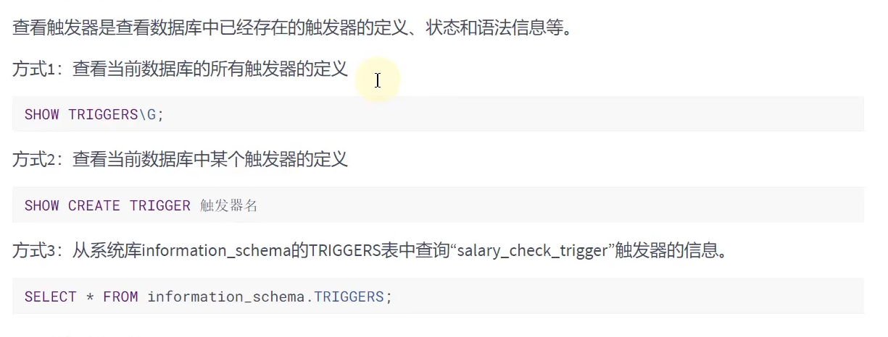

**删除触发器**

```mysql
#example 
DROP TRIGGER IF EXISTS after_insert_test_tri;
```

