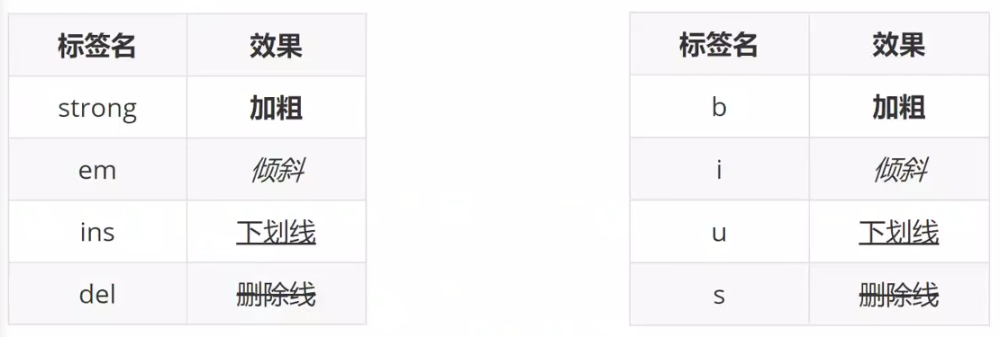
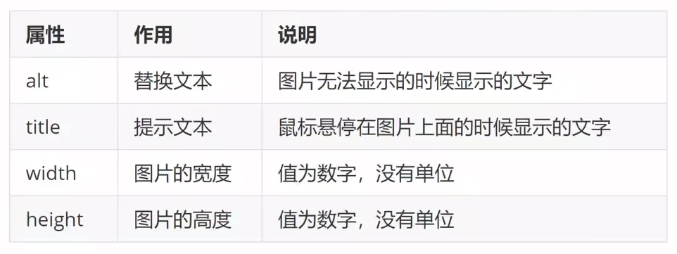
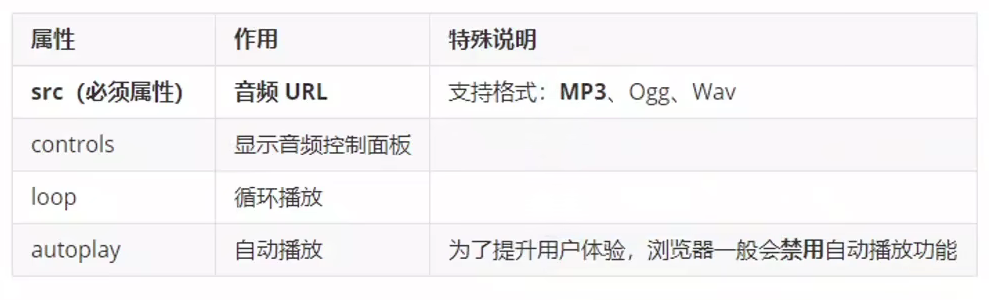
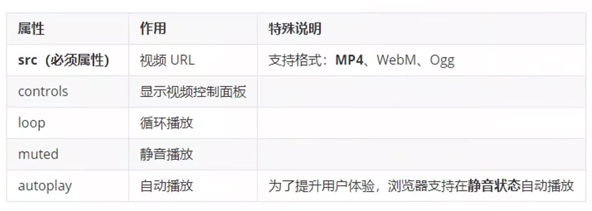

# HTML入门


## HTML定义

**HTML**超文本标记语言 --- **Hyper Text Markup Language**


### 标签语法

* **<>**里面放英文字母（标签名）
* 结束标签比开始标签多**/**
* 扩展
  * **双标签**：成对出现的标签
  * **单标签**：只有开始标签，没有结束标签

```html
<strong>文字内容</strong>
<!-- 加粗了文字内容 -->
<hr>
<!-- 一条横线 -->
```


## HTML基本骨架

**HTML**基本骨架是**网页模板**

```html
<html>
    <head>
        <title>网页标题</title>
    </head>
    <body>
        网页主体
    </body>
</html>
```

* html：**整个网页**
* head：**网页头部**，存放给**浏览器**看的代码
* body：**网页主体**，存放给**用户**看的代码
* title：**网页标题**


## 标签的关系

作用：明确代码的书写位置

* **父子关系**（嵌套关系）
* **兄弟关系**（并列关系）


## 标题标签

一般用在行文标题、文章标题等方面


### 标题标签

标签名：**h1 ~ h6（双标签）**


### 段落标签

标签名：**p（双标签）**


## 换行与水平线标签

* 换行：**```<br>```**（单标签）
* 水平线：**```<hr>```**（单标签）


## 文本格式化标签

作用：为文本添加特殊格式，以**突出重点**




## 图像标签 - 基本使用

作用：在网页中插入图片

```html

```


### 图像标签 - 属性




## 路径

路径指的是查找文件时，从**起点到终点**经历的路线

路径分类：

* 相对路径：从**当前文件位置**出发查找目标文件
* 绝对路径：从**盘符**出发查找目标文件


## 超链接

作用：点击跳转到其它页面

```html
<!-- target="_blank"实现新窗口跳转页面 -->
<a href="http://www.baidu.com" target="_blank">跳转到百度</a>
<!-- 开发初期，不知道超链接的跳转地址，href属性值写#，表示空链接，不会跳转 -->
```


## 音频标签

```html
<!-- 在HTML5里面，如果属性名和属性值完全一样，可以简写为一个单词 -->
<audio src="音频的URL" cotrols lop></audio>
```

### 常见属性




## 视频标签

```html
<video src="视频的URL"></video>
```

### 常见属性




## 列表

作用：布局内容排列整齐的区域

列表分类：无序列表、有序列表、定义列表

 

### 无序列表

作用：布局排列整齐的**不需要规定顺序**的区域

标签：ul**嵌套**li，**ul**是无序列表，**li**是列表条目

```html
<!--
ul标签里面只能包裹li标签
li标签里面可以包裹任何内容
-->
<ul>
    <li>第一项</li>
    <li>第二项</li>
    ......
</ul>
```


### 有序列表

作用：布局排列整齐的**需要规定顺序**的区域

标签：ol**嵌套**li，**ol**是有序列表，**li**是列表条目

```html
<!--
ol标签里面只能包裹li标签
li标签里面可以包裹任何内容
-->
<ol>
    <li>第一项</li>
    <li>第二项</li>
    ......
</ol>
```


### 定义列表

标签：dl**嵌套**dt和dd，**dl**是定义列表，**dt**是定义列表的**标题**，**dd**是定义列表的**描述/详情**

```html
<dl>
    <dt>列表标题</dt>
    <dd>列表描述/详情</dd>
    ......
</dl>
```


## 表格

标签：**table**嵌套**tr**，tr嵌套**td/th**

| 标签名 | 说明           |
| ------ | -------------- |
| table  | 表格           |
| tr     | 行             |
| th     | **表头**单元格 |
| td     | **内容**单元格 |

***提示：在网页中，表格默认没有边框线，使用`border`属性可以为表格添加边框线***


### 表格结构标签-了解

作用：用表格结构标签把内容划分区域，让表格结构更清晰，语义更清晰

| 标签名 | 含义     | 特殊说明     |
| ------ | -------- | ------------ |
| thead  | 表格头部 | 表格头部内容 |
| tbody  | 表格主体 | 主要内容区域 |
| tfoot  | 表格底部 | 汇总信息区域 |


### 合并单元格

作用：将**多**个单元格合并成**一**个单元格，以**合并同类信息**

合并单元格的步骤：

* 明确合并的目标
* 保留**最左最上**的单元格，添加属性（取值是**数字**，表示**需要合并的单元格数量**）
  * 跨行合并，保留**最上**单元格，添加属性**rowspan**
  * 跨列合并，保留**最左**单元格，添加属性**colspan**

* 删除其它单元格


## 表单

作用：收集用户信息


### input标签基本使用

input标签**type 属性值不同，则功能不同**

```html
<input type="...">
```

| type属性值 | 说明                     |
| ---------- | ------------------------ |
| text       | 文本框，用于输入单行文本 |
| password   | 密码框                   |
| radio      | 单选框                   |
| checkbox   | 多选框                   |
| file       | 上传文件                 |


### input标签占位文本

占位文本：提示信息

```html
<input type="..." placeholder="提示信息">
```


### 单选框radio

常用属性

| 属性名  | 作用     | 特殊说明                               |
| ------- | -------- | -------------------------------------- |
| name    | 控件名称 | 控件分组，同组只能选中一个（单选功能） |
| checked | 默认选中 | 属性名和属性值相同，简写为一个单词     |


### 上传文件 - file

默认情况下，文件上传表单控件只能上传一个文件，添加**multiple**属性可以实现**文件多选**功能

```html
<input type="file" multiple>
```


### 多选框 - checkbox

多选框也叫**复选框**

默认选中：**checked**

```html
<input type = "checkbox" checked>
```


### 下拉菜单

标签：**select嵌套option**，**select**是下拉菜单整体，**option**是下拉菜单的每一项

```html
<!-- selected是默认选中的 -->
<select>
    <option>北京</option>
    <option>上海</option>
    <option>深圳</option>
    <option>广州</option>
    <option selected>武汉</option>
</select>
```


### 文本域

作用：**多行**输入文本的表单控件

标签：**textarea**，双标签

```html
<!-- 这里有拖拽功能 -->
<textarea>默认提示文字</textarea>
```


### label标签

作用：网页中，某个标签的说明文本

#### label标签 - 增大点击范围

* 写法一

  * **label**标签**只**包裹**内容**，**不包裹表单控件**
  * 设置 label 标签的**for**属性值和表单控件的**id**属性值**相同**

  ```html
  <input type="radio" id="man">
  <label for="man">男</label>
  ```

* 写法二

  * 使用**label**标签**包裹文字和表单控件**，不需要属性

  ```html
  <label><input type="radio" name="gender">女</label>
  ```


### 按钮 - button

```html
<button type="">按钮</button>
```

type属性值

| type属性值 | 说明                                           |
| ---------- | ---------------------------------------------- |
| submit     | 提交按钮，点击后可以提交数据到后台（默认功能） |
| reset      | 重置按钮，点击后将表单控件恢复默认值           |
| button     | 普通按钮，默认没有功能，一般陪喝JavaScript使用 |


## 无语义的布局标签

作用：**布局网页**（划分网页区域，摆放内容）

* **div**：独占一行
* **span**：不换行


## 字符实体

作用：在网页中**显示预留字符**

| 显示结果 | 描述   | 实体名称 |
| -------- | ------ | -------- |
|          | 空格   | \&nbsp;  |
| <        | 小于号 | &lt      |
| >        | 大于号 | &gt      |


# CSS入门

**层叠样式表**（Cascading Style Sheets，缩写为CSS），是一种**样式表**语言，用来描述**HTML文档的呈现（美化内容）**

```html
<style>
    /* 选择器{} */
    /* 属性名和属性值成对出现 -> 键值对 */
    p{
        /*CSS属性*/
        color: red;
    }
</style>
```


## CSS 引入方式

* 内部样式表

  * CSS 代码写在**style**标签里面

* 外部样式表

  * CSS 代码写在单独的CSS 文件中（**.css**）

  * 在HTML使用**link**标签引入

    ```html
    <link rel="stylesheet" href="./xxx.css">
    ```

* 行内样式

  * CSS 写在标签的**style**属性值里

    ```html
    <div style="color:red;font-size:20px;">这是div标签</div>
    ```


## 选择器

标签选择器：使用**标签名**作为选择器 -> 选中 **同名标签**设置**相同的样式**


### 类选择器

作用：查找标签，**差异化**设置标签的显示效果

步骤：

* 定义类选择器 -> **.类名**
* 使用类选择器 -> 标签添加**class=”类名“**

```html
<style>
    /*定义类选择器*/
    .red{
        color: red;
    }
</style>

<!-- 使用类选择器 -->
<div class="red">
    这是div标签
</div>
```


### id选择器

作用：查找标签，**差异化**设置标签的显示效果

场景：id选择器一般**配合JavaScript使用**，很少用来**设置 CSS 样式**

步骤：

* 定义id选择器 -> **#id名**
* 使用id选择器 -> 标签添加 **id="id名"**

```html
<style>
    #red {
        color: red;
    }
</style>

<!-- 使用id选择器 -->
<div id="red">
    这是div标签
</div>
```

**规则：同一个id选择器在一个页面只能使用一次**


### 通配符选择器

作用：查找页面**所有标签，设置相同样式**

通配符选择器：**\*，不需要调用**，浏览器**自动**查找页面**所有**标签，设置相同样式

```html
* {
	color: red;
}
```


## 画盒子

目标：使用合适的选择器画盒子

新属性

| 属性名           | 作用   |
| ---------------- | ------ |
| width            | 宽度   |
| height           | 高度   |
| background-color | 背景色 |


## 文字控制属性

| 描述         | 属性            |
| ------------ | --------------- |
| 字体大小     | font-size       |
| 字体粗细     | font-weight     |
| 字体倾斜     | font-style      |
| 行高         | line-height     |
| 字体族       | font-family     |
| 字体复合属性 | font            |
| 文本缩进     | text-indent     |
| 文本对齐     | text-align      |
| 修饰线       | text-decoration |
| 颜色         | color           |

### 数字粗细

属性名：**font-weight**

属性值

* **数字（开发使用）**

| 正常 | 400  |
| ---- | ---- |
| 加粗 | 700  |

* 关键字

| 正常 | normal |
| ---- | ------ |
| 加粗 | bold   |

### 字体样式（是否倾斜）

作用：**清除文字默认的倾斜效果**

属性名：**fort-style**

属性值

* **正常（不倾斜）**：**normal**
* 倾斜：italic

### 行高

作用：设置多行文本的间距

属性名：**line-height**

属性值

* **数字+px**
* **数字**（当前标签font-size属性值的**倍数**）

#### 行高-垂直居中

垂直居中技巧：**行高属性值等于盒子高度属性值**（只能是单行文字居中）

### 字体族

属性名：**font-family**

属性值：字体名

```css
font-family: 楷体;
```

扩展（了解）：font-family属性值可以书写多个字体名，各个字体名用**逗号**隔开，执行顺序是**从左向右**依次查找

* `font-family`属性**最后**设置一个**字体族名**，网页开发建议使用**无衬线字体**

### 文字复合属性

```css
div {
    /* 文字倾斜 */
    font-style: italic;
    /* 文字加粗 */
    font-weight: 700;
    /* 文字大小是30px */
    font-size: 30px;
    /* 行高为字号的2倍 */
    line-height: 2;
    /* 字体是楷体 */
    font-family: 楷体;
}

/* 等价于 */
div {
    /* font: 是否倾斜 是否加粗 字号/行高 字体; */
    font: italic 700 30px/2 楷体;
}
```

复合属性：属性的**简写**方式，**一个属性**对应**多个值**的写法，各个属性值之间用**空格**隔开

font：是否倾斜 是否加粗 **字号/行高** **字体** **（必须按顺序书写）**

注意：**字号和字体值必须书写**，否则font属性不生效

### 文本缩进

属性名：**text-indent**

属性值：

* 数字 + px
* **数字 + em**（推荐：lem=当前标签的字号大小）

### 文本对齐

作用：控制内容水平对齐方式

属性名：**text-align**

属性值

| 属性值     | 效果           |
| ---------- | -------------- |
| left       | 左对齐（默认） |
| **center** | 居中对齐       |
| right      | 右对齐         |

```css
text-align: center;
```

#### 水平对齐方式 - 图片

text-align本质是控制**内容**的**对齐方式**，属性要设置给**内容的父级**

### 文本修饰线

属性名：**text-decoration**

属性值

| 属性值        | 效果   |
| ------------- | ------ |
| **none**      | 无     |
| **underline** | 下划线 |
| line-through  | 删除线 |
| overline      | 上划线 |

### 文字颜色

属性名：**color**

属性值

| 颜色表示方式   | 属性值                 | 说明                                  | 使用场景                 |
| -------------- | ---------------------- | ------------------------------------- | ------------------------ |
| 颜色关键字     | 颜色英文单词           | red、green、blue ...                  | 学习测试                 |
| rgb表示法      | rgb(r, g, b)           | r, g, b 表示红绿蓝三原色，取值：0-255 | 了解                     |
| rgba表示法     | **rgba（r，g，b，a）** | a表示**透明度**，取值：0-1            | 开发使用，实现**透明色** |
| 十六进制表示法 | **#RPGGBB**            | #000000，#ffcc00，简写：#000，#fc0    | 开发使用（从设计稿复制） |


## 调试工具 - 谷歌浏览器

作用：检查、调试代码；帮助程序员发现代码问题、解决问题

* 打开调试工具

  快捷键：**f12**


## 复合选择器

定义：由**两个或多个基础选择器**，通过不同的方式组合而成

作用：**更精确**、**更高效**的选择目标元素（标签）

### 后代选择器

后代选择器：选中某元素的**后代**元素

选择器写法：**父选择器** **子选择器** {CSS属性}，父子选择器之间用**空格**隔开

```html
<style>
    /* 后代选择器，选中所有后代，包含儿子，孙子 ... */
    div span {
        color: red;
    }
</style>

<span> span 标签 </span>
<div>
    <span>这是 div 的儿子</span>
    <p>
       <!-- 也是变红 --> 
        <span>孙子 span</span>
    </p>
</div>
```

### 子代选择器

子代选择器：选中某元素的**子代**元素（最近的子级）

选择器写法：**父选择器 > 子选择器** {CSS 属性}，父子选择器之间用 **>** 隔开

### 并集选择器

并集选择器：选中**多组**标签设置**相同**的样式

选择器写法：**选择器1**，**选择器2**，...，**选择器N** {CSS 属性}，选择器之间用**,**隔开

### 交集选择器 - 了解

交集选择器：选中**同时**满足**多个条件**的元素

选择器写法：**选择器1选择器2**{CSS属性}，选择器之间连写，没有任何符号

**注意：如果交集选择器中有标签选择器，标签选择器必须书写在最前面**

### 伪类选择器

伪类选择器：伪类表示元素**状态**，选中元素的某个状态设置样式

鼠标悬停状态：选择器**:hover**{CSS属性}

#### 伪类 - 超链接（扩展）

超链接一共有**四**个状态

| 选择器   | 作用           |
| -------- | -------------- |
| :link    | 访问前         |
| :visited | 访问后         |
| :hover   | 鼠标悬停       |
| :active  | 点击时（激活） |

提示：如果要给超链接设置以上四个状态，需要按**LVHA**的顺序书写


## CSS 特性

CSS特性：化简代码/定位问题，并解决问题

* 继承性

  **子**级默认继承**父**级的**文字控制属性**

* 层叠性

  * 相同的属性会**覆盖**：**后面**的CSS属性覆盖**前面**的CSS属性
  * 不同的属性会**叠加**：**不同**的CSS属性**都生效**

* 优先级

  也叫权重，当一个标签使用了**多种**选择器时，基于不同种类的选择器的**匹配规则**

  规则：**选择器优先级高的样式生效**

  公式：通配符选择器 < 标签选择器 < 类选择器 < id选择器 < 行内样式 < !important （选中标签的范围越大，优先级越低）

### 优先级 - 叠加计算规则

叠加计算：如果是**复合选择器**，则需要权重叠加计算

公式：（每一级之间**不存在进位**）

（**行内**样式，**id**选择器个数，**类**选择器个数，**标签**选择器个数）

* **从左向右**一次比较选个数，**同一级**个数**多**的优先级**高**，如果个数相同，则向后比较
* !important 权重最高
* 继承权重最低


## 背景属性

| 描述           | 属性                    |
| -------------- | ----------------------- |
| 背景色         | **background - color**  |
| 背景图         | **background - image**  |
| 背景图平铺方式 | background - repeat     |
| 背景图位置     | background - position   |
| 背景图缩放     | background - size       |
| 背景图固定     | background - attachment |
| 背景复合属性   | background              |

### 背景图

网页中，使用背景图实现**装饰性**的图片效果

属性名：**background-iamge**（bgi）

属性值：**url（背景图URL）**

### 背景图平铺方式

属性名：**background-repeat**（bgr）

属性值

| 属性值        | 效果             |
| ------------- | ---------------- |
| **no-repeat** | 不平铺           |
| repeat        | 平铺（默认效果） |
| repeat-x      | 水平方向平铺     |
| repeat-y      | 垂直方向平铺     |

### 背景图位置

属性名：**background-position**（bgp）

属性名：水平方向位置 垂直方向位置

* 关键字

  | 关键字 | 位置 |
  | ------ | ---- |
  | left   | 左侧 |
  | right  | 右侧 |
  | center | 居中 |
  | top    | 顶部 |
  | bottom | 底部 |

* 坐标（数字 + px，**正负**都可以）

  水平：正数向右；负数向左

  垂直：正数向下；负数向上

提示：

* **关键字**取值方式写法，可以**颠倒**取值顺序
* 可以只写一个关键字，**另一个方向**默认为**居中**；**数字**只写一个值表示**水平**方向，垂直方向为**居中**

### 背景图缩放

作用：设置背景图大小

属性名：**background-size**（bgz）

常用属性值：

* **关键字**

  **cover**：等比例缩放背景图片以完全覆盖背景区，可能背景图片部分看不见

  **contain**：等比例缩放背景图片以完全装入背景区，可能背景区部分空白

* **百分比**：根据盒子尺寸计算图片大小

* 数字 + 单位（例如：px）

### 背景图固定

作用：背景不会随着元素的内容滚动

属性名：**background-attachment**（bga）

属性值：**fixed**

### 背景复合属性

属性名：**background**（bg）

属性值：背景色 背景图 背景图平铺方式 背景图位置/背景图缩放 背景图固定（**空格**隔开各个属性值，**不区分顺序**）


## 显示模式

显示模式：标签（元素）的显示方式

作用：布局网页的时候，根据标签的显示模式选择**合适**的标签摆放内容

* 块级元素
  * **独占**一行
  * 宽度默认是**父**级的**100%**
  * 添加**宽高**属性**生效**
* 行内元素
  * 一行共存多个
  * 宽高属性不生效
  * 宽高由内容撑开
* 行内块
  * 一行共存多个
  * 宽高属性生效
  * 宽高默认由内容撑开

### 转换显示模式

属性名：**display**

属性名：

| 属性值           | 效果   |
| ---------------- | ------ |
| **block**        | 块级   |
| **inline-block** | 行内块 |
| inline           | 行内   |


## 结构伪类选择器

作用：根据元素的**结构关系**查找元素

| 选择器         | 说明                               |
| -------------- | ---------------------------------- |
| E:first-child  | 查找第一个E元素                    |
| E:last-child   | 查找最后一个E元素                  |
| E:nth-child(N) | 查找第N个E元素（第一个元素N值为1） |

### :nth-child（公式）

作用：根据元素的**结构关系**查找**多个**元素

| 功能                | 公式       |
| ------------------- | ---------- |
| 偶数标签            | 2n         |
| 奇数标签            | 2n+1；2n-1 |
| 找到5的倍数的标签   | 5n         |
| 找到第5个以后的标签 | n+5        |
| 找到第5个以前的标签 | -n+5       |


## 伪元素选择器

作用：创建**虚拟**元素（为元素），用来摆放**装饰性**的内容

| 选择器     | 说明                                    |
| ---------- | --------------------------------------- |
| E:：before | 在E元素**里面**最**前**面添加一个伪元素 |
| E::after   | 在E元素**里面**最**后**面添加一个伪元素 |

注意点：

* **必须**设置**content：" "**属性，用来设置**伪元素的内容**，如果没有内容，则引号**留空**即可
* 伪元素默认是**行内**显示模式
* **权重**和**标签选择器**相同


## 盒子模型

### 盒子模型 - 组成

作用：布局页面，摆放盒子和内容

盒子模型重要组成部分：

* 内容区域 - width & height
* 内边距 - **padding** （出现在内容与盒子边缘之间）
* 边框线 - **border**
* 外边距 - **margin** （出现在盒子外面）

### 盒子模型 - 边框线

属性名：**border**（bd）

属性值：边框线粗细 线条样式 颜色 （**不**区分顺序）

常用线条样式

| 属性值 | 线条样式 |
| ------ | -------- |
| solid  | 实线     |
| dashed | 虚线     |
| dotted | 点线     |

设置单方向边框线

属性名：**border-方位名词**（bd+方位名词首字母，例如，bdl）

属性值：边框线粗细 线条样式 颜色 （**不**区分顺序）

```css
div {
	border-top: 2px solid red;
    border-bottom: 4px dotted blue;
}
```

### 盒子模型 - 内边距

作用：设置**内容**与**盒子边缘**之间的距离

属性名：**padding** / **padding-方位名词**

#### 盒子模型 - 内边距 - 多值写法

padding 多值写法

**四值写法：上 右 下 左**

**三值写法：上 左右 下**

**两值写法：上下 左右**

**一值写法：上下左右**

### 盒子模型 - 尺寸计算

* 默认情况

  盒子尺寸 = 内容尺寸 + border尺寸 + 内边距尺寸

* 结论：给盒子加border / padding 会**撑大**盒子

* 解决

  * **手动做减法**，减掉border/padding的尺寸
  * 内减模式：**box-sizing: border-box**

### 盒子模型 - 外边距

作用：拉开两个盒子之间的距离

属性名：**margin**

提示：与padding属性值写法、含义相同

#### 版心居中

版心居中要求：盒子要有宽度

```css
margin: 0 auto;
```

### 盒子模型 - 元素溢出

作用：控制**溢出**元素的**内容**的**显示方式**

属性名：overflow

属性值

| 属性值     | 效果                                       |
| ---------- | ------------------------------------------ |
| **hidden** | **溢出隐藏**                               |
| scroll     | 溢出滚动（无论是否溢出，都显示滚动条位置） |
| auto       | 溢出滚动（溢出才显示滚动条位置）           |

 ### 盒子模型 - 圆角

作用：设置元素的外边框为圆角

属性名：**border-radius**

属性值：数字+px / 百分比

提示：属性值是圆角半径

### 盒子模型 - 阴影

作用：给元素设置**阴影**效果

属性名：**box-shadow**

属性值：**x轴偏移量** **y轴偏移量** 模糊半径 扩散半径 颜色 内外阴影

注意：

* x轴偏移量和y轴偏移量**必须**书写
* **默认是外阴影**，内阴影需要添加**inset**


## 清除默认样式

清除标签默认的样式，比如：默认的内外边距

```html
<!-- example -->
<style>
    * {
        margin: 0;
        padding: 0;
    }
    /* 去掉列表的项目符号 */
    li {
        list-style: none;
    }
</style>
```


## 外边距问题 - 合并现象

场景：**垂直**排列的**兄弟**元素，**上下margin**会合并

场景：取两个margin中的**较大值**生效

## 外边距问题 - 塌陷问题

场景：**父子级**的标签，**子级**的添加**上外边距**会产生**塌陷**问题

现象：导致父级一起向下移动

解决办法

* **取消子级margin**，**父**级设置**padding**
* **父**级设置**overflow: hidden**
* **父**级设置**border-top**


## 行内元素 - 内外边距问题

场景：**行内**元素添加**margin**和**padding**，无法改变元素**垂直**位置

解决办法：给行内元素添加**line-height**可以改变垂直位置


## 浮动 - 基本使用与布局

作用：让块元素水平排列

属性名：**float**

属性值

* **left**：左对齐
* **right**：右对齐

### 清除浮动

场景：浮动元素会**脱标**，如果**父级没有高度**，子级**无法撑开父级高度**（可能导致页面布局错乱）

解决办法：**清除浮动**（清除浮动带来的影响）

方法一：额外标签法

* 在**父**元素**内容的最后**添加一个**块**级元素，设置 CSS 属性**clear: both**

方法二：单伪元素法

```css
.clearfix::after {
    content: "";
    display: block;
    clear: both;
}
```

**方法三：双伪元素法（推荐）**

```css
.clearfix::before,
.clearfix::after {
    content: "";
    display: table;
}

.clearfix::after {
    clear: both;
}
```

方法四：overflow

* **父**元素添加CSS属性 **overflow: hidden**


## Flex 布局

Flex布局也叫弹性布局，是**浏览器提倡**的布局模型，非常适合结构化布局，提供了强大的**空间分布**和**对齐**能力

Flex模型**不会**产生浮动布局中**脱标**现象，布局网页**更简单**、**更灵活**

### flex - 组成

设置方式：给**父**元素设置**display: flex**，**子**元素可以自动挤压或拉伸

组成部分：

* 弹性容器
* 弹性盒子
* 主轴：默认在**水平**方向
* 侧轴 / 交叉轴：默认在**垂直**方向

### flex - 主轴对齐方式

属性名：**justify-content**

| 属性值            | 效果                                                   |
| ----------------- | ------------------------------------------------------ |
| flex-start        | 默认值，弹性盒子从**起点**开始依次排列                 |
| flex-end          | 弹性盒子从**终点**开始一次排列                         |
| **center**        | 弹性盒子沿主轴**居中**排列                             |
| **space-between** | 弹性盒子沿主轴均匀排列，空白间距均分在弹性盒子**之间** |
| **space-around**  | 弹性盒子沿主轴均匀排列，空白间距均分在弹性盒子**两侧** |
| **space-evenly**  | 弹性盒子沿主轴均匀排列，弹性盒子与容器之间间距相等     |

### flex - 侧轴对齐方式

属性名

* **align-items**：当前弹性容器内**所有**弹性盒子的侧轴对齐方式（给弹性容器设置）
* **align-self**：单独控制**某个**弹性盒子的侧轴对齐方式（给弹性盒子设置）

| 属性值     | 效果                                                         |
| ---------- | ------------------------------------------------------------ |
| stretch    | 弹性盒子沿着侧轴线被**拉伸至铺满容器**（弹性盒子没有设置侧轴方向尺寸则默认拉伸） |
| center     | 弹性盒子沿侧轴**居中**排列                                   |
| flex-start | 弹性盒子从**起点**开始依次排列                               |
| flex-end   | 弹性盒子从**终点**开始依次排列                               |

### flex - 修改主轴方向

主轴**默认在水平方向**，侧轴默认在垂直方向

属性名：**flex-direction**

属性值

| 属性值         | 效果                       |
| -------------- | -------------------------- |
| row            | 水平方向，从左向右（默认） |
| **column**     | **垂直方向，从上向下**     |
| row-reverse    | 水平方向，从右向左         |
| column-reverse | 垂直方向，从下向上         |

