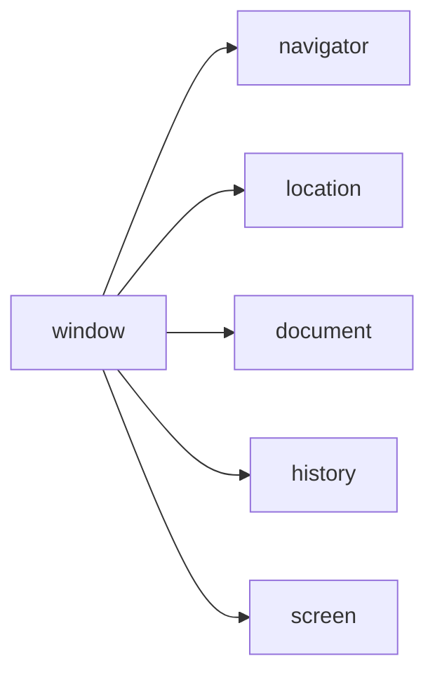
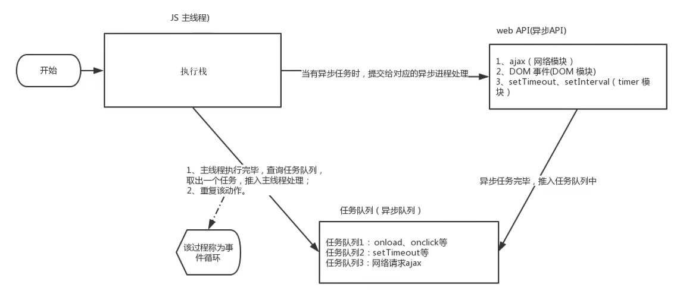

# JavaScript是什么

1. 是什么

   是一种运行在客户端（浏览器）的编程语言，实现人机交互效果

2. 做什么

   - 网页特效（监听用户的一些行为让网页做出对应的反馈）
   - 表单验证（针对表单数据的合法性进行判断）
   - 数据交互（获取后台的数据，渲染到前端）
   - 服务端编程（node.js）

3. JavaScript组成

   * ECMAScript

     规定了js基础语法核心知识

     * 比如：变量、分支语句、循环语句、对象等等

   * Web APIs

     * DOM 操作文档，比如对页面元素进行移动、大小、添加删除等操作
     * BOM 操作浏览器，比如页面弹窗、检测窗口宽度、存储数据到浏览器等等

 JavaScript权威网站：https://developer.mozilla.org/zh-CN/docs/Web/JavaScript


# JavaScript 书写位置

## 内部JavaScript

直接写在html文件里，用script标签包住

**规范**：script标签写在</body>上面

扩展：alert('你好，js')页面弹出警告对话框


## 外部 JavaScript

代码写在以**.js**结尾的文件里

**语法：**通过script标签，引入到html页面中


# Javascript 输入输出语法

* **输出语法**

  * 语法一

    ```javascript
    document.write('要输出的内容')
    ```

    作用：向body内输出内容

    注意：如果输出的内容写的是标签，也会被解析成网页元素

  * 语法二

    ```javascript
    alert('要输出的内容')
    ```

    作用：页面弹出警告对话框

  * 语法三

    ```javascript
    console.log('控制台打印')
    ```

    作用：控制台输出语法，程序员调试使用

* 输入语法

  * 语法

    ```javascript
    prompt('请输入您的姓名:')
    ```

  * 作用：显示一个对话框，对话框中包含一条文字信息，用来提示用户输入文字

## JavaScript 代码执行顺序

* 按HTML文档流顺序执行JavaScript代码
* **alert()**和**prompt()**它们回跳过页面渲染先被执行


# 变量

## 变量的基本使用

### 声明变量

**语法**

```javascript
let 变量名
```

* 声明变量有两部分构成：声明关键字、变量名（标识）
* **let**即关键字

**变量赋值**

定义了一个变量后，能够初始化它（赋值）。在变量名之后跟上一个**=**，然后是数值

**更新变量**

变量赋值后，还可以通过简单地给它一个不同的值来更新它

**声明多个变量**

变量赋值后，还可以通过简单地给它一个不同的值来更新它


## 变量的本质

**内存**：计算机中存储数据的地方，相当于一个空间

**变量本质**：是程序在内存中申请的一块用来存放数据的小空间


## let和var的区别

**var**现在开发中一般不再使用它

**let**为了解决**var**的一些问题

**var**声明：

* 可以先使用在声明（不合理）
* **var**声明过的变量可以重复声明（不合理）
* 比如变量提升、全局变量、没有块级作用域等等


## 数组

* 数组是一种将**一组数据存储在单个变量名下**的方式

  ```javascript
  let arr = []
  ```

  ### 声明语法

  ```javascript
  let 数组名 = [数据1, 数据2, ..., 数据n]
  ```

* 数据是按顺序保存，所以每个数据都有自己的编号

* 在数组中，数据的编号也叫**索引或下标**

* 数组可以存储任意类型的数据

  ### 取值语法

  ```javascript
  数组名[下标]
  ```


## 常量

**概念**：使用**const**声明的变量称为“常量”

**使用场景**：当某个变量永远**不会改变**的时候，就可以使用**const**来声明，而不是**let**

**命名规范**：和变量一致

**注意**：常量不允许重新赋值，声明的时候必须赋值


## 数据类型

js数据类型整体分为两大类

* 基本数据类型
  
  在存储时变量中存储的是值本身，因此叫做值类型
  
  * nember 数字型
  * string 字符串型
  * boolean 布尔型
  * undefined 未定义型
  * null 空类型
  
* 引用数据类型
  
  复杂数据类型，在存储时变量中存储的仅仅是地址（引用），因此叫做引用数据类型
  
  * object 对象

### 模板字符串

**使用场景**

* 拼接字符串和变量

**语法**

* **``**（反引号）
* 在英文输入模式下按键盘**tab**键上方那个键（1左边那个键）
* 内容拼接变量时，用**${}**包住变量

### null和undefined区别

* undefined 表示没有赋值
* null 表示赋值了，但是内容为空


## 检测数据类型

通过**typeof**关键字检测数据类型

**typeof**运算符可以返回被检测的数据类型。支持两种语法形式：

1. 作为运算符：**typeof x**（常用的写法）
2. 函数形式：**typeof(x)**


# 匿名函数

使用方式

* 函数表达式

  将匿名函数赋值给一个变量，并且通过变量名称进行调用，这个称为**函数表达式**

  语法

  ```javascript
  let fn = function () {
      // 函数体
  }
  ```

* 立即执行函数

  场景：避免全局变量之间的污染

  语法

  ```javascript
  //方式一
  (function () { /*函数体*/ })();
  
  //方式二
  (function () { /*函数体*/ }())
  ```


# 转换为Boolean型

显示转换

1. Boolean（内容）

   ***记忆：''、0、undefined、null、false、NaN转换为布尔值后都是false，其余则为true***


# 对象

* 对象（object）：JavaScript里的一种数据类型
* 可以理解为是一种无序的数据集合，注意数组是有序的数据集合
* 用来描述某个事物

## 对象的使用

* 对象声明语法

  ```javascript
  // example
  
  // 方式1
  let 对象名 = {}
  
  // 方式2
  let 对象名 = new Object()
  ```

## 对象由属性和方法组成

* 属性：信息或叫特征
  * 属性都是成对出现，包括属性名和值，它们之间使用英文 **:** 分隔
  * 多个属性之间使用英文 **,** 分隔
  * 属性就是依附再对象的变量
  * 属性名可以使用 **""** 或 **''** ，**一般情况下省略**
* 方法：功能或叫行为

```javascript
// example

let person = {
    name: 'hello',
    sayHi: function() {
        document.write('hi~')
    }
}
```


# DOM树和DOM对象

## 作用和分类

* 作用：就是使用**JS**去操作html和浏览器
* 分类：**DOM**（文档对象模型）、**BOM**（浏览器对象模型）


## DOM

**Document Object Model**（文档对象模型）是用来呈现以及与任意**HTML**或**XML**文档交互的**API**

作用

* 开发网页内容特效


## DOM对象

浏览器根据**HTML**标签生成的**JS对象**

* 所有的标签属性都可以在这个对象上面找到
* 修改这个对象的属性会自动映射到标签身上

DOM的核心思想

* 把网页内容当做**对象**来处理

document对象

* 是DOM里提供的一个对象
* 所以它提供的属性和方法都是**用来访问和操作网页内容的**
  * 例如：**document.write()**
* 网页所有内容都在document里面


## 获取DOM对象

* 根据**CSS选择器**来获取**DOM元素**

  1. 选择匹配的第一个元素

     语法

     ```javascript
     // example
     // 获取匹配的第一个元素
     document.querySelector('css选择器')
     ```

     参数

     包含一个或多个有效的CSS选择器**字符串**

     返回值

     CSS选择器匹配的**第一个元素**，一个**HTMLElement**对象

     如果没有匹配到，则返回null

  2. 选择匹配的多个元素

     语法

     ```javascript
     document.querySelectorAll('css选择器')
     ```

     参数

     包含一个或多个有效的CSS选择器**字符串**

     返回值

     CSS选择器匹配的**NodeList 对象集合**

* 其它获取**DOM元素**方法

  ```javascript
  // example
  
  // 根据id获取一个元素
  document.getElementById('nav')
  // 根据标签获取一类元素 获取页面 所有的div
  document.getElementByTagName('div')
  // 根据类名获取元素 获取页面 所有类名为w的
  document.getElementsByClassName('w')
  ```


# 操作元素内容

* **DOM**对象都是根据标签生成的，所以操作标签，本质上就是操作**DOM**对象

* 操作对象使用的点语法

* 如果想要修改标签元素的里面的**内容**，则可以使用如下几种方式

  1. 对象**.innerText**属性

     * 将文本内容添加/更新到任意标签位置
     * 显示纯文本，不解析标签

  2. 对象**.innerHTML**属性

     * 将文本内容添加/更新到任意标签位置
     * 会解析标签，多标签建议使用模板字符

     ```javascript
     // example
     
     const info = document.querySelector('.info')
     // 获取标签内部的文字
     // console.log(info.innerHTML)
     // 添加/修改标签内部文字内容
     info.innerHTML = `hello,<strong>world</strong>`
     ```


# 操作元素属性

## 操作元素常用属性

* 还可以通过**JS**设置/修改标签元素属性

* 最常见的属性比如：href、title、src等

* 语法

  ```javascript
  对象.属性 = 值
  ```


## 操作元素样式属性

* 还可以通过**JS**设置/修改标签元素的样式属性

* 方法

  * 通过**style**属性操作**CSS**

    语法

    ```javascript
    对象.style.样式属性 = 值
    ```

  * 操作类名（**className**）操作**CSS**

    语法

    ```javascript
    // example
    
    // active 是一个css类名
    元素.className = 'active'
    ```

    * 注意
      1. 由于**class**是关键字，所以使用**className**去替代
      2. **className**是使用新值**换**旧值，如果需要添加一个类，需要保留之前的类名

  * 通过**classList**操作类控制**CSS**

    语法

    ```javascript
    // example
    
    // 追加一个类
    元素.classList.add('类名')
    // 删除一个类
    元素.classList.remove('类名')
    // 切换一个类
    元素.classList.toggle('类名')
    ```


## 操作表单元素属性

* 表单很多情况，也需要修改属性

* 正常的有属性有取值的跟其他的标签属性没有任何区别

* 获取：**DOM**对象.属性名

* 设置：**DOM**对象.属性名 = 新值

  ```javascript
  表单.value = '用户名'
  表单.type = 'password'
  ```

* 表单属性中添加就有效果，移除就没有效果，一律使用布尔值表示，如果为**true**代表添加了该属性；如果是**false**嗲表移除了该属性

  * 比如：disabled、checked、selected


## 自定义属性

* **标准属性**：标签天生自带的属性，比如**class id title**等，可以直接使用点语法操作比如： **disabled**、**checked**、**selected**
* **自定义属性**
  * 在html5中推出来了专门的**data-自定义属性**
  * 在标签上一律以**data-开头**
  * 在**DOM**对象上一律以**dataset**对象方式获取


# 定时器 - 间歇函数

定时器函数可以开启和关闭定时器

1. **开启定时器**

   ```javascript
   setInterval(函数, 间隔时间)
   ```

   * 作用：每隔一段时间调用这个函数
   * 间隔时间单位是毫秒

2. 关闭定时器

   ```javascript
   let 变量名 = setInterval(函数, 间隔时间)
   clearInterval(变量名)
   ```

   一般不会刚创建就停止，而是满足一定条件再停止

   ```javascript
   let timer = setInterval(function() {
       console.log('hello')
   }, 1000)
   clearInterval(timer)
   ```


注意：

1. 函数名字**不需要加括号**
2. **定时器返回的是一个id数字**


# 事件监听（绑定）

事件监听就是让程序检测是否有事件产生，一旦有事件触发，就立即调用一个函数做出响应，也称为绑定事件或者注册事件

## 事件监听

* 语法

  ```javascript
  元素对象.addEventListener('事件类型', 要执行的函数)
  ```

* 事件监听三要素

  * 事件源：那个**DOM**元素被事件触发了，要获取**DOM**元素
  * 事件类型：用什么方式触发，比如鼠标单击**click**，鼠标经过**mouseover**等
  * 事件调用的函数：要做什么事

## 事件监听版本

* DOM L0

  事件源.on事件 = function() { }

* DOM L2

  事件源.addEventListener(事件, 事件处理函数)

* 区别

  on方式会被覆盖，**addEventListener**方式可绑定多次，拥有事件更多特性


## 事件类型

* 鼠标触发

  | click    | mouseenter | mouseleave |
  | -------- | ---------- | ---------- |
  | 鼠标点击 | 鼠标经过   | 鼠标离开   |

* 表单获得光标

  | focus    | blur     |
  | -------- | -------- |
  | 获得焦点 | 失去焦点 |

* 键盘触发

  | Keydown      | Keyup        |
  | ------------ | ------------ |
  | 键盘按下触发 | 键盘抬起触发 |

* 表单输入触发

  | input        |
  | ------------ |
  | 用户输入事件 |


# 事件对象event以及常见属性

## 获取事件对象

* 语法

  * 在事件绑定的回调函数的第一个参数就是事件对象
  * 一般命名为**event**、**ev**、**e**

  ```javascript
  元素.addEventListener('click', function (e) {
      
  })
  ```


## 部分常见属性

* **type**
  * 获取当前的事件类型
* **clientX / clientY**
  * 获取光标相对于浏览器可见窗口左上角的位置
* **offsetX / offsetY**
  * 获取光标相对于当前**DOM**元素左上角的位置
* **key**
  * 用户按下的键盘键的值
  * 现在不提倡使用keyCode


# 环境对象

**环境对象**：指的是函数内部特殊的**变量 this**，它代表着当前函数运行时所处的环境

**作用**：弄清楚**this**的指向，可以使代码更简洁

* 函数的调用方式不同，**this**指代的对象也不同
* **[谁调用， this就是谁]**是判断**this**指向的粗略规则

* 直接调用函数，其实相当于时 **window.函数**，所以**this**指代**window**


# 回调函数

如果将函数A作为参数传递给函数B时，称函数A为**回调函数**

```javascript
function fn() {
    console.log('回调函数')
}
// fn传递给了setInterval, fn就是回调函数
setInterval(fn, 1000)
```

```javascript
box.addEventListener('click', function() {
    console.log('也是回调函数')
})
```

* 把函数当做另外一个函数的参数传递，这个函数就叫**回调函数**
* 回调函数本质还是函数，只不过把它当作参数使用
* 使用匿名函数做为回调函数比较常见


# 事件流

## 事件流和两个阶段说明

* **事件流**指的是事件完整执行过程中的流动路径
* **实际工作都是使用事件冒泡为主**


## 事件捕获

* **事件捕获概念**

  从**DOM**的根元素开始去执行对应的事件（从外到里）

* 事件捕获需要写对应代码才能看到效果

* 代码

  ```javascript
  DOM.addEventListener(事件类型, 事件处理函数, 是否使用捕获机制)
  ```

* 说明

  * **addEventListener**第三个参数传入**true**代表是捕获阶段触发（很少使用）
  * 若传入**false**代表冒泡阶段触发，默认就是**false**
  * 若是用**L0**事件监听，则只有冒泡阶段，没有捕获


## 事件冒泡

* **事件冒泡概念**

  当一个元素的事件被触发时，同样的事件将会在该元素的所有祖先元素中依次被触发。这一过程被称为事件冒泡

* 简单理解：当一个元素触发事件后，会依此向上调用所有父级元素的**同名事件**

* 事件冒泡是默认存在的
* **L2**事件监听第三个参数是false，或者默认都是冒泡


## 阻止冒泡

* **问题**：因为默认就有冒泡模式的存在，所以容易导致事件影响到父级元素

* **需求**：若想把事件就限制在当前元素内，就需要阻止事件冒泡

* **前提**：阻止事件冒泡需要拿到事件对象

* **语法**

  ```javascript
  事件对象.stopPropagation()
  ```

* **注意**：此方法可以阻断事件流动传播，不光在冒泡阶段有效，捕获阶段也有效


## 解绑事件

**on**事件方式，直接使用**null**覆盖就可以实现事件的解绑

* **语法**

  ```javascript
  // 绑定事件
  btn.onclick = function () {
      alert('点击')
  }
  // 解绑事件
  btn.onclick = null
  ```

**addEventListener**方式，必须使用

**removeEventListener(事件类型, 事件处理函数, [获取捕获或者冒泡阶段])**


## 鼠标经过事件的区别

* 鼠标经过事件：
  * mouseover 和 mouseout 会有冒泡效果
  * mouseenter 和 mouseleave 没有冒泡效果（推荐）


## 两种注册事件的区别

* 传统on注册（L0）
  * 同一个对象，后面注册的事件会覆盖前面的注册（同一个事件）
  * 直接使用null覆盖偶就可以实现事件的解绑
  * 都是冒泡阶段执行的
* 事件监听注册（L2）
  * 语法：addEventListener （事件类型，事件处理函数，是否使用捕获）
  * 后面注册的事件不会覆盖前面注册的事件（同一个事件）
  * 可以通过第三个参数去确定是在冒泡或者捕获阶段执行
  * 必须使用removeEventListener（事件类型，事件处理函数，获取捕获或者冒泡阶段）
  * 匿名函数无法被解绑


# 事件委托

事件委托是利用事件流的特征解决一些开发需求的知识技巧

* 优点：减少注册次数，可以提高程序性能
* 原理：事件委托其实是利用事件冒泡的特点
  * 给**父元素注册事件**，当我们触发子元素的时候，会冒泡到父元素身上，从而触发父元素的事件
* 实现：事件对象.target.tagName 可以获得真正触发事件的元素


# 阻止元素默认行为

```javascript
e.preventDefault()
```


# 页面加载事件

* 加载外部资源（如图片、外联CSS和JavaScript等）加载完毕时出发的事件
* 事件名：load

* 监听页面所有资源加载完毕

  * 给window添加load事件

  ```javascript
  // 页面加载事件
  window.addEventListener('load', function (){
      // 执行的操作
  })
  ```

* 注意：不光可以监听整个页面资源加载完毕，也可以针对某个资源绑定load事件


* 当厨师的HTML文档被完全加载和解析完成之后，DOMContentLoaded事件被触发，而无需等待样式表、图像等完全加载
* 事件名：DOMContentLoaded

* 监听页面DOM加载完毕

  * 给document添加DOMContentLoaded事件

    ```javascript
    document.addEventListener('DOMContentLoaded', function () {
        // 执行的操作
    })
    ```


# 页面滚动事件

* 滚动条在滚动的时候持续触发的事件

* 事件名：scroll

* 监听整个页面滚动

  ```javascript
  // 页面滚动事件
  window.addEventListener('scroll', function () {
      // 执行的操作
  })
  ```

  * 给window或document添加scroll事件

* 监听某个元素的内部滚动直接给某个元素加即可


## 获取位置

* scrollLeft和scrollTop（属性）

  * 获取被卷去的大小
  * 获取元素内容往左、往上滚出去看不到的距离
  * 这两个值是可**读写**的

* 尽量在scroll事件里面获取被卷去的距离

  ```javascript
  div.addEventListener('scroll', function () {
      console.log(this.scrollTop)
  })
  ```


## 滚动到指定的坐标

* scrollTo() 方法可把内容滚动到指定的坐标

* 语法

  元素.scrollTo(x, y)


# 页面尺寸事件

* 会在窗口尺寸改变的时候触发事件

  * resize

    ```javascript
    window.addEventListener('resize', function () {
        // 执行的代码
    })
    ```

* 检测屏幕宽度

## 获取元素宽高

* **获取宽高**
  * 获取元素的可见部分宽高（不包含边框，margin，滚动条等）
  * **clientWidth**和**clientHeight**


## 元素尺寸于位置

* 使用场景
  * 就是通过**js**的方式，得到**元素在页面中的位置**
  * 这样做，页面滚动到这个位置，就可以做某些操作，省去计算了

### 尺寸

* 获取宽高

  * 获取元素的自身宽高、包含元素自身设置的宽高、**padding**、**border**
  * **offsetWidth**和**offsetHeight**
  * 获取出来的是数值，方便计算
  * 注意：获取的是可视宽高、如果盒子是隐藏的，获取的结果是0

* 获取位置

  * 获取元素距离自己定位父级元素的左、上距离

  * **offsetLeft**和**offsetTop**注意是只读属性

  * `element.getBoundingClientRect()`

    方法返回元素的大小以及相对于视口


## 总结

| 属性                        | 作用                                     | 说明                                                        |
| --------------------------- | ---------------------------------------- | ----------------------------------------------------------- |
| scrollLeft 和 scrollTop     | 被卷去的头部和左侧                       | 配合页面滚动来用，**可读写**                                |
| clientWidth 和 clientHeight | 获得元素宽度和高度                       | 不包含border， margin， 滚动条 用于js获取元素大小，只读属性 |
| offsetWidth 和 offsetHeight | 获得元素宽度和高度                       | **包含border、padding，滚动条等，只读**                     |
| **offsetLeft和offsetTop**   | 获取元素距离自己定位父级元素的左、上距离 | 获取元素位置的时候使用，只读属性                            |


# 日期对象

* 日期对象：用来表示时间的对象
* 作用：可以得到当前系统时间

* 在代码中发现了**new**关键字时，一般将这个操作称为**实例化**

* 创建一个时间对象并获取时间

  * 获得当前时间

    ```javascript
    const date = new Date()
    ```

  * 获得指定时间

    ```javascript
    const date = new Date('xxxx-x-x')
    // Date('xxxx-x-x xx:xx:xx')
    console.log(date)
    ```


## 日期对象方法

| 方法          | 作用               | 说明                 |
| ------------- | ------------------ | -------------------- |
| getFullYear() | 获得年份           | 获取四位年份         |
| getMonth()    | 获取月份           | 取值为**0~11**       |
| getDate()     | 获取月份中的每一天 | 不同月份取值也不相同 |
| getDay()      | 获取星期           | 取值为**0~6**        |
| getHours()    | 获取小时           | 取值为0~23           |
| getMinutes()  | 获取分钟           | 取值为0~59           |
| getSeconds()  | 获取秒             | 取值为0~59           |


## 时间戳

* **什么是时间戳**

  是指1970年01月01日00时00分00秒起至现在的**毫秒数**，它是一种特殊的计量时间的方式

* **算法**

  * 将来的时间戳 - 现在的时间戳 = 剩余时间的毫秒数
  * 剩余时间毫秒数 转换为 剩余时间的 年月日时分秒 就是倒计时时间

### 三种方式获取时间戳

1. 使用**getTime()**方法

   ```javascript
   const date = new Date()
   console.log(date.getTime())
   ```

2. **简写 +new Date()**

   ```javascript
   console.log(+new Date())
   ```

   * 无需实例化

3. 使用 **Date.now()**

   ```javascript
   console.log(Date.now())
   ```

   * 无需实例化
   * ***但是只能得到当前的时间戳，而前面两种可以返回指定时间的时间戳***


# DOM 节点

* DOM 节点
  * DOM 树里每一个内容都称之为节点
* 节点类型
  * **元素节点**
    * 所有的标签 比如 body、div
    * html 是根节点
  * 属性节点
    * 所有的属性 比如 href
  * 文本节点
    * 所有的文本
  * 其他


## 查找节点

* 父节点查找

  * parentNode属性

  * 返回最近一级的父节点 找不到返回为null

    ```javascript
    子元素.parentNode
    ```

* 子节点查找

  * childNodes

    * 获得所有子节点、包括文本节点（空格、换行）、注释节点等

  * **children 属性（重点）**

    * 仅获得所有元素节点
    * 返回的还是一个伪数组

    ```javascript
    父元素.children
    ```

* 兄弟关系查找

  * 下一个兄弟节点
    * **nextElementSibling** 属性
  * 上一个兄弟节点
    * **previousElementSibling** 属性


## 增加节点

* 一般情况下，新增节点，按照如下操作
  * 创建一个新的节点
  * 把创建的新的节点放入到指定的元素内部

### 创建节点

* 即创造出一个新的网页元素，再添加到网页内，一般先创建节点，然后插入节点

* 创建元素节点方法

  ```javascript
  // 创造一个新的元素节点
  document.createElement('标签名')
  ```

### 追加节点

* 要想在界面看到，还得插入到某个父元素中

* 插入到父元素的最后一个子元素

  ```javascript
  // 插入到这个父元素的最后
  父元素.appendChild(要插入的元素)
  ```

* 插入到父元素中某个子元素的前面

  ```javascript
  // 插入到某个子元素的前面
  父元素.insertBefore(要插入的元素, 在哪个元素前面)
  ```


### 特殊情况

* 特殊情况下，新增节点，按照如下操作

  * 复制一个原有的节点
  * 把复制的节点放入到指定的元素内部

* **克隆节点**

  ```javascript
  // 克隆一个已有的元素节点
  元素.cloneNode(布尔值)
  ```

  **cloneNode**会克隆出一个跟源标签一样的元素，括号内传入布尔值

  * 若为**true**，则代表克隆时会包含后代节点一起克隆
  * 若为**false**，则代表科隆时不包含后代节点
  * 默认为**false**


## 删除节点

* 若一个节点再页面中已不需要时，可以删除它

* 在**JavaScript**原生**DOM**操作中，要删除元素必须通过**父元素删除**

* 语法

  ```javascript
  父元素.removeChild(要删除的元素)
  ```

* 注意

  * 如不存在父子关系则删除不成功
  * 删除节点和隐藏节点（**display: none**）有区别：隐藏节点还是存在的，但是删除，则从**html**中删除节点


# M端事件

移动端有自己独特的地方。比如**触屏事件 touch**（也称触摸事件），**Android** 和 **IOS**都有

* **触屏事件 touch** （也称触摸事件），**Android** 和 **IOS**都有

* **touch**对象代表一个触摸点

* 常见的触屏事件如下

  | 触屏 touch 事件 | 说明                            |
  | --------------- | ------------------------------- |
  | touchstart      | 手指触摸到一个 DOM 元素时触发   |
  | touchmove       | 手指在一个 DOM 元素上滑动时触发 |
  | touchend        | 手指从一个 DOM 元素上移开时触发 |


# Window 对象

## BOM

浏览器对象模型



* window 对象是一个全局对象，也可以说时JavaScript中的顶级对象
* 像`document`、`alert()`、`console.log()`这些都是`window`的属性，基本**BOM**的属性和方法都是**window**的
* 所有通过**var**定义在全局作用域中的变量、函数都会变成**window**对象的属性和方法
* **window**对象下的属性和方法调用的时候可以省略**window**


## 定时器 - 延时函数

* **JavaScript** 内置的一个用来让代码延迟执行的函数，叫 **setTimeout**

* 语法

  ```javascript
  setTimeout(回调函数, 等待的毫秒数)
  ```

* **setTimeout** 仅仅只执行一次，所以可以理解为就是把一段代码延迟执行，平时省略window

* **清除延时函数**

  ```javascript
  let timer = setTimeout(回调函数, 等待的毫秒数)
  clearTimeout(timer)
  ```

* **两种定时器对比**：执行的次数
* 延时函数：执行一次
* 间歇函数：每隔一段时间就执行一次，除非手动清除


## JS 执行机制

JavaScript 语言的一大特点就是**单线程**，也就是说，**同一个时间只能做一件事**

JavaScript是为处理页面中用户的交互，以及操作**DOM**而诞生的

* 为了解决这个问题，利用多核 **CPU** 的计算能力，**HTML5**提出 **Web Worker** 标准，允许 **JavaScript** 脚本创建多个线程。于是，**JS** 中出现了 **同步** 和 **异步**

### 同步任务

同步任务都在主线程上执行，形成一个**执行栈**

### 异步任务

**JS** 的异步是通过回调函数实现的

一般而言，异步任务有以下三种类型

1. 普通事件，如 **click**，**resize** 等
2. 资源加载，如 **load**、**error** 等
3. 定时器，包括 **setInterval**、**setTimeout** 等

异步任务相关添加到**任务队列**中（任务队列也称为消息队列）

### JS 执行机制

1. 先执行**执行栈中的同步任务**
2. 异步任务放入任务队列中
3. 一旦执行栈中的所有同步任务执行完毕，系统就会按次序读取**任务队列**中的异步任务，于是被读取的异步任务结束等待状态，进入执行栈，开始执行



由于主线程不断的重复获得任务、执行任务、再获取任务、再执行，所以这种机制被称为**事件循环（event loop）**


## location 对象

* **location**的数据类型是对象，它拆分并保存了 **URL** 地址的各个组成部分

* **常用属性和方法**

  * **search** 属性获取地址中携带的参数，符号 **?** 后面部分

    ```javascript
    console.log(location.search)
    ```

  * **hash** 属性获取地址中的哈希值，符号 **#** 后面部分

  * **reload** 方法用来刷新当前页面，传入参数 **true** 时表示强制刷新

    ```html
    <button>点击刷新</button>
    <script>
        let btn = document.querySelector('button')
        btn.addEventListener('click', function () {
            location.reload(true)
            // 强制刷新 类似于 ctrl + f5
        })
    </script>
    ```


## navigator 对象

* **navigator**的数据类型是对象，该对象下记录了浏览器自身的相关信息

* **常用属性和方法**

  * 通过 **userAgent** 检测浏览器的版本以及平台

    ```javascript
    // 检测 userAgent （浏览器信息）
    !(function () {
       const userAgent = navigator.userAgent
       // 验证是否为Android或iPhone
       const android = userAgent.match(/(Android);?[￥s￥/]+([￥d.]+)?/)
       const iphone = userAgent.match(/(iPhone￥sOS)￥s([￥d+]+)/)
       
       // 如果是 Android 或 iPhone，则跳转至移动站点
       if(android || iphone) {
           location.href = 'http://m.itcast.cn'
       }
    })()
    ```


## histroy 对象

* histroy 的数据类型是对象，主要管理历史记录，该对象与浏览器地址栏的操作相对应，如前进、后退、历史记录等

* **常用属性和方法**

  | history 对象方法 | 作用                                                     |
  | ---------------- | -------------------------------------------------------- |
  | back()           | 可以后退功能                                             |
  | forward()        | 前进功能                                                 |
  | go(参数)         | 前进后退功能，参数如果是1前进1个页面 如果是-1后退1个页面 |


## 本地存储

* 随着互联网的快速发展，基于网页的应用越来越普遍，同时也变的越来越复杂，为了满足各种各样的需求，会经常性在本地存储大量的数据，**HTML5**规范提出了相关解决方案
  1. 数据存储在**用户浏览器**中
  2. 设置、读取方便、甚至页面刷新不丢失数据
  3. 容量较大，**sessionStorage** 和 **localStorage** 约 **5M** 左右

### localStorage

* **作用**：可以将数据永久存储在本地（用户的电脑），除非手动删除，否则关闭页面也会存在

* **特性**

  * 可以多窗口（页面）共享（同一浏览器可以共享）
  * 以键值对的形式存储使用

* **语法**

  **存储数据**

  如果原来有这个键，则是改

  ```javascript
  localStorage.setItem(key, value)
  ```

  **获取数据**

  ```javascript
  localStorage.geetItem(key)
  ```

  **删除数据**

  ```javascript
  localStorage.removeItem(key)
  ```

### seesionStorage

* **特性**
  * 生命周期为关闭浏览器窗口
  * 在同一个窗口（页面）下数据可以共享
  * 以键值对的形式存储使用
  * 用法跟**localStorage**基本相同


## 存储复杂数据类型

* 本地只能存储字符串，无法存储复杂数据类型

* **解决**：需要将复杂数据类型转换成**JSON**字符串，再存储本地

* **语法：JSON.stringify(复杂数据类型)**

  **JSON.parse(JSON字符串)** （可以将**JSON**字符串转换为对象）

  ```javascript
  // example
  
  localStorage.setItem('obj', JSON.stringify(obj))
  const str = localStorage.getItem('obj')
  console.log(JSON.parse(str))
  ```


## 数组中map方法 -- 迭代数组

* 使用场景

  **map** 可以遍历数组**处理数据**，并且**返回新的数组**

  ```javascript
  // example
  
  const arr = ['red', 'blue', 'green']
  const newArr = arr.map(function (ele, index) {
      console.log(ele) // 数组元素
      console.log(index) // 数组索引号
      return ele + '颜色'
  })
  console.log(newArr) // ['red颜色', 'blue颜色', 'green颜色']
  ```

  **map也称为映射**

  **map重点在于有返回值**，forEach没有返回值


## 数组中的 join 方法

* 作用

  **join()** 方法用于把数组中的所有元素**转换一个字符串**

* 语法

  ```javascript
  // example
  
  // 小括号为空则默认是逗号分割
  const arr = ['red颜色', 'blue颜色', 'green颜色']
  console.log(arr.join('')) // red颜色blue颜色green颜色
  ```

* 参数

  数组元素是通过参数里面指定的分隔符进行分隔的，**空字符串**('')，则所有元素之间都**没有任何字符**


# 正则表达式

* 正则表达式（**Regular Expression**）是用于匹配字符串组合的模式。在JavaScript中，正则表达式也是对象
* 通常用来查找、替换那些符合正则表达式的文本

## 语法

* 定义正则表达式语法

  ```javascript
  const 变量名 = /表达式/
  ```

  * 其中**/   /**是正则表达式字面量

* 判断是否有符合规则的字符串

  **test()** 方法 用来查看正则表达式与指定的字符串是否匹配

  语法

  ```javascript
  regObj.test(被检测的字符串)
  ```

  如果正则表达式与指定的字符串匹配，返回**true**，否则**false**

* 检索（查找）符合规则的字符串

  **exec()** 方法 在一个指定字符串中执行一个搜索匹配

  语法

  ```javascript
  regObj.exec(被检测字符串)
  ```

  如果匹配成功，**exec()** 方法返回一个数组，否则返回**null**


## 元字符

* 普通字符

  大多数的字符仅能描述它们本身，这些字符称作普通字符，也就是说普通字符只能匹配字符串中与它们相同的字符

* **元字符**（特殊字符）

  是一些具有特殊含义的字符，可以极大提高了灵活性和强大的匹配功能

### 分类

* 边界符（表示位置，开头和结尾，必须用什么开头，用什么结尾）

  * 正则表达式中的边界符（位置符）用来**提示字符所在的位置**，主要有两个字符

    | 边界符 | 说明                           |
    | ------ | ------------------------------ |
    | ^      | 表示匹配行首的文本（以谁开始） |
    | $      | 表示匹配行尾的文本（以谁结束） |

    如果**^**和**$**在一起，表示必须是精确匹配

* 量词（表示重复次数）

  * 量词用来 **设定某个模式出现的次数**

    | 量词   | 说明             |
    | ------ | ---------------- |
    | *      | 重复零次或更多次 |
    | +      | 重复一次或更多次 |
    | ?      | 重复零次或一次   |
    | {n}    | 重复n次          |
    | {n,}   | 重复n此或更多次  |
    | {n, m} | 重复n到m次       |

    逗号左右两侧千万不能有空格

* 字符类（比如**\d**表示**0~9**）

  1. **[]**匹配字符集合

     ```javascript
     // example
     
     // 后面的字符串只要包含 abc 中任意一个字符，都返回true
     console.log(/[abc]/.test('andy')) // true
     console.log(/^[abc]$/.test('ab')) // false
     console.log(/[abc]/.test('die')) // false
     ```

  2. **[]** 里面加上**-**连字符

     * 使用连字符**-**表示一个范围

       ```javascript
       console.log(/^[a-z]$/.test('c')) // true
       ```

     * 比如

       * **[a-z]** 表示 **a到z** 26个英文字母都可以
       * **[a-zA-Z]** 表示大小写都可以
       * **[0-9]** 表示 **0~9** 的数字都可以

  3. **[]** 里面加上**^**取反符号

     * 比如

       **[^a-z]** 匹配除了小写字母以外的字符

  4. 预定义

     指的是 某些常见模式的简写方式

     | 预定类 | 说明                                                         |
     | ------ | ------------------------------------------------------------ |
     | \d     | 匹配**0-9**之间的任一数字，相当于 **[0-9]**                  |
     | \D     | 匹配所有**0-9**以外的字符，相当于 **[^0-9]**                 |
     | \w     | 匹配任意的字母、数字和下划线，相当于 **[A-Za-z0-9_]**        |
     | \W     | 除所有字母、数字和下划线以外的字符，相当于 **[^A-Za-z0-9_]** |
     | \s     | 匹配空格（包括换行符、制表符、空格符等），相等于 **[\t\r\n\v\f]** |
     | \S     | 匹配非空格的字符，相当于 **[^\t\r\n\v\f]**                   |


### 修饰符

* 修饰符约束正则执行的某些细节行为，如是否区分大小写、是否支持多行匹配等

* 语法

  ```javascript
  /表达式/修饰符
  ```

* **i**是单词**ignore**的缩写，正则匹配时字母不区分大小写

* **g**是单词**global**的缩写，匹配所有满足正则表达式的结果

  ```javascript
  // example
  
  console.log(/a/i.test('a')) // true
  console.log(/a/i.test('A')) // true
  ```

* **替换 replace 替换**

  **语法**

  ```javascript
  字符串.replace(/正则表达式/, '替换的文本')
  ```

  
