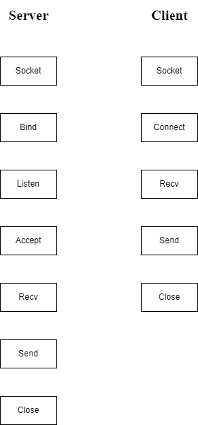
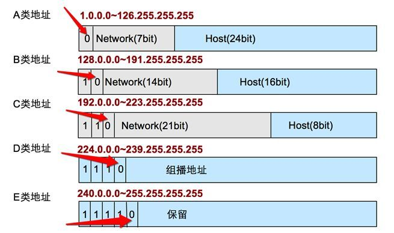

# POSIX网络API解析(主要以IPv4)

POSIX表示可移植操作系统接口（Portable Operating System Interface of UNIX，缩写为 POSIX ），POSIX标准定义了操作系统应该为应用程序提供的接口标准。

POSIX标准意在期望获得源代码级别的软件可移植性。换句话说，为一个POSIX兼容的操作系统编写的程序，应该可以在任何其它的POSIX操作系统（即使是来自另一个厂商）上编译执行。


## 1. API总览




## 2. 地址族与数据序列


### 2.1 分配给套接字的IP地址与端口号


#### 2.1.1 网络地址

* IPv4：4字节地址族
* IPv6：16字节地址族

IPv4标准的4字节IP地址分为网络地址和主机（指计算机）地址，且分为A，B，C，D，E等类型。




#### 2.1.2 网络地址分类与主机地址边界


* A类地址的首字节范围：0~127
* B类地址的首字节范围：128~191
* C类地址的首字节范围：192~223


还有如下表述方式


* A类地址的首位以0开始
* B类地址的前2位以10开始
* C类地址的前3位以110开始


#### 2.1.3 用于区分套接字的端口号


虽然端口号不能重复，但TCP套接字和UDP套接字不会公用端口号，所以允许重复。


#### 2.1.3  地址信息的表示

##### 1) 表示IPv4的结构体

```c
struct sockaddr_in
{
  	sa_family_t 	sin_family; // 地址族（Address Family）
    uint16_t 		sin_port;	// 16位TCP/UDP端口号
    struct in_addr	sin_addr;	// 32位IP地址
    char			sin_zero[8];// 不使用
};
```

其中该结构体中包含了一个用来存放32位IP地址的结构体in_addr

```c
struct in_addr
{
    in_addr_t		s_addr;	// 32位IPv4地址
};
```

<center>POSIX中定义的数据类型</center>

<center><div style = "color:green">sys/types.h</div></center>

| 数据类型名称 | 数据类型说明                         |
| ------------ | ------------------------------------ |
| int8_t       | signed 8-bit int                     |
| uint8_t      | unsigned 8-bit int (unsigned char)   |
| int16_t      | signed 16-bit int                    |
| uint16_t     | unsigned 16-bit int (unsigned short) |
| int32_t      | signed 32-bit int                    |
| uint32__t    | unsigned 32-bit int(unsigned long)   |

<center><div style = "color:green">sys/socket.h</div></center>

| 数据类型名称 | 数据类型说明           |
| ------------ | ---------------------- |
| sa_family_t  | 地址族(address family) |
| socklen_t    | 长度(length of struct) |

<center><div style = "color:green">netinet/in.h</div></center>

| 数据类型名称 | 数据类型说明           |
| ------------ | ---------------------- |
| in_addr_t    | IP地址，声明为uint32_t |
| in_port_t    | 端口号，声明为uint16_t |


###### 1.1) 成员sin_family

每种协议族使用的地址族均不同。

<center>地址族</center>

| 地址族（Address Family） | 含义                             |
| ------------------------ | -------------------------------- |
| AF_INET                  | IPv4网络协议中使用的地址族       |
| AF_INET6                 | IPv6网络协议中使用的地址族       |
| AF_LOCAL                 | 本地通信中含有的UNIX协议的地址族 |


###### 1.2) 成员sin_port

该成员保存16位端口号，重点在于，它以网络字节保存


###### 1.3) 成员sin_addr

该成员保存32位地址信息，且也以网络字节保存。其中in_addr只需要当作32位整数型即可


###### 1.4) 成员sin_zero

主要作用只是为了是结构体sockaddr_in大小与sockaddr结构体保持一致，必需填充为0


##### 2) 结构体sockaddr

```c
struct sockaddr
{
	sa_family_t		sin_family;	// 地址族（Address Family）
    char			sa_data[14];// 地址信息
};
```

此结构成员sa_data保存的地址信息中需要包含IP地址和端口号，剩余部分应该填充0

 `在保存IPv4地址信息的sockaddr_in结构体中还需要sin_family单独指定地址族信息的原因：为了保持与sockaddr一致（sockaddr并非只为了IPv4设计）`


### 3.1 网络字节序与地址变换


不同CPU中，4字节整数型值1在内存空间的保存方式是不同的

`00000000 00000000 00000000 00000001`

与

`00000001 00000000 00000000 00000000`


#### 3.1.1 字节序与网络字节序

CPU想内存保存数据的方式有两种，意味着CPU解析数据的方式也分为两种

* 大端序：高位字节存放到低位地址
* 小端序：高位字节存放到高位地址

在网络传输数据时约定统一方式，这种约定称为网络字节序（Network Byte Order）--- 统一为大端序


## 3. 函数参数分析


### 3.1 基于Linux的文件操作


#### 3.1.1 打开文件

```c
int open(const char* path, int flag)
    // 成功时返回文件描述符，失败时返回-1
```

* path：文件名的字符串地址
* flag：文件打开模式信息

<center>文件打开模式</center>

| 打开模式 | 含义             |
| -------- | ---------------- |
| O_CREAT  | 必要时创建文件   |
| O_TRUNC  | 删除全部现有数据 |
| O_APPEND | 维持现有数据     |
| O_RDONLY | 只读打开         |
| O_WRONLY | 只写打开         |
| ORDWR    | 读写打开         |


#### 3.1.2 关闭文件

```c
int close(int fd)
    // 成功时返回0，失败时返回-1
```

* fd：需要关闭的文件或套接字的文件描述符

此函数不仅可以关闭文件，还可以关闭套接字（Linux操作系统不区分文件与套接字）


#### 3.1.3 将数据写入文件

```c
ssize_t write(int fd, const void* buf, size_t nbytes)
    // 成功时返回写入的字节数，失败时返回-1
```

* fd：显示数据传输对象的文件描述符
* buf：保存要传输数据的缓冲地址值
* nbytes：要传输数据的字节数

注：size_t是通过typedef声明的unsigned int类型， 对ssize_t来说是代表signed int类型（在`sys/type.h`头文件一般有typedef声明定义）


#### 3.1.4 读取文件中的数据

```c
ssize_t read(int fd, void* buf, size_t nbytes)
    //成功是返回接受的字节数（但遇到文件结尾则返回0），失败时返回-1
```

* fd：显示数据接受对象的文件描述符
* buf：要保存几首护具的缓冲地址值
* nbytes：要接受数据的最大字节数


### 3.2 套接字协议


#### 3.2.1 socket

`<sys/socket.h>`

调用socket()会创建一个套接字(socket)对象---由文件描述符（fd）和TCP Control Block（TCB）。TCB控制块主要包括关系信息有网络的五元组(remote IP, remote PORT, local IP, local PORT, protocol)

```c
int socket(int domain, int type, int protocol)
    // 成功时返回文件描述符，失败时返回--1
```

* domain：套接字中使用的协议族（Protocol Family）信息
* type：套接字数据传输类型信息
* protocol：计算机间通信中使用的协议信息


##### 1) 协议族（Protocol Family）

<center>头文件sys/socket.h中声明的协议族</center>

| 名称      | 协议族               |
| --------- | -------------------- |
| PF_INET   | IPv4互联网协议族     |
| PF_INET6  | IPv6互联网协议族     |
| PF_LOCAL  | 本地通信的UNIX协议族 |
| PF_PACKET | 底层套接字的协议族   |
| PF_IPX    | IPX Novell协议族     |


##### 2) 套接字类型（Type）

主要介绍2种具有代表性的数据运输方式


###### 2.1) 面向连接的套接字（SOCK_STREAM）

* 传输过程中数据不会消失
* 按序传输数据
* 传输的数据不存在数据边界（Boundary）：在面向连接的套接字种，read函数和write函数的调用次数并无太大意义，所以说面向连接的套接字不存在数据边界。


###### 3.1) 面向消息的套接字（SOCK_DGRAM）

* 强调快速传输而非传输顺序
* 传输的数据可能丢失也可能损毁
* 传输的数据又数据边界
* 限制每次传输的数据大小


##### 3) 协议的最终选择

数据传输方式相同，但协议不同。此时需要通过第三个参数具体指定协议信息

常用的协议有，IPPROTO_TCP、IPPTOTO_UDP、IPPROTO_SCTP、IPPROTO_TIPC等，它们分别对应TCP传输协议、UDP传输协议、STCP传输协议、TIPC传输协议


### 3.2 字节序转换


#### 3.2.1 转换字节序的函数

* `unsigned short htons(unsigned short)`
* `unsigned short ntohs(unsigned short)`
* `unsigned long htonl(unsigned long)`
* `unsigned long ntohl(unsigned long)`

long在linux中占4个字节

`函数名记忆：htons中的h代表主机（host）字节序， n代表网络（network）字节序`

```c
int atoi(const char* str)
    // 将字符串转换成整数，函数的返回值为int类型的整数，转换后的值不可超出int可表示的范围
```


#### 3.2.2 inet_addr

`<arpa/inet.h>`

```c
in_addr_t inet_addr(const char* string)
    // 成功时返回32位大端序整数型值，失败时返回INADDR_NONE
```


#### 3.2.3 inet_aton

`<arpa/inet.h>`

```c
int inet_aton(const char* string, struct in_addr* addr)
    // 成功时返回1(true)，失败时返回0(false)
```

* string：含有需转换的IP地址信息的字符串地址值
* addr：将保存转换结果的in_addr结构体变量的地址值


#### 3.2.4 inet_ntoa

`<arpa/inet.h>`

```c
char* inet_ntoa(struct in_addr adr)
    // 成功时返回转换的字符串地址值，失败时返回-1
```


#### 3.2.5 INADDR_ANY

通过常数INADDR_ANY可以自动获取运行服务器的计算机IP地址。若同一个计算机中已分配多个IP地址（多宿主计算机，一般路由器属于这一类），则只要端口号一直，就可以从不同IP地址接受数据。


### 3.3 向套接字分配网络地址

#### 3.3.1 bind

`<sys/socket.h>`

```c
int bind(int sockfd, struct sockaddr* myaddr, socklen_t addrlen)
    // 成功返回0，失败返回-1
```

* sockfd：要分配地址信息（IP地址和端口号）的套接字文件描述符
* myaddr：存有地址信息的结构体变量地址值
* addrlen：第二个结构体变量的长度


### 3.4 进入等待连接请求状态

#### 3.4.1 linsten

`<sys/socket.h>`

```c
int listen(int sock, int backlog)
    // 成功返回0， 失败时返回-1
```

* sock：希望进入等待连接请求的套接字文件描述符，传递的描述符套接字参数为服务器端套接字（监听套接字）
* backlog：连接请求等待队列（Queue）的长度，若为5，则队列长度为5，表示最多使5个连接请求进去队列

listen/connect/accept三个函数和三次握手有关，这里放到一起进行描述。当客户端调用connet函数时表示开始进入三次握手，当服务端收到syn包后，listen函数会在内核协议栈为新的客户端创建一个TCB块同时将其**加入到半连接队列**。客户端收到对方的ACK和Syn包后会回复一个ACK这时候客户端就会认为整个连接已经建立；服务端收到ACK后会将半连接队列的TCB数据**移动到全连接队列**；当服务端**调用accept会在全连接队列有数据时被触发**，同时返回客户端的文件句柄和对方的ip端口；这时候TCB一个完整的五元组被构建好，服务端和客户端连接成功


### 3.5 受理客户端连接请求

#### 3.5.1 accept

`<sys/socket.h>`

```c
int accept(int sock, struct sockaddr* addr, socklen_t* addrlen)
    // 成功时返回创建的套接字文件描述符，失败时返回-1
```

* sock：服务器套接字的文件描述符
* addr：保存发起连接的客户端地址信息的变量地址值，调用函数后向传递来的地址变量参数填充客户端地址信息
* addrlen：第二个参数addr结构体的长度，但是存有长度的变量地址。函数调用完成后，该变量即被填入客户端地址长度

accept的第一个参数为服务器的socket描述字，是服务器开始调用socket()函数生成的，称为监听socket描述字；而accept函数返回的是已连接的socket描述字（用于数据I/O）。一个服务器通常通常仅仅只创建一个监听socket描述字，它在该服务器的生命周期内一直存在。内核为每个由服务器进程接受的客户连接创建了一个已连接socket描述字，当服务器完成了对某个客户的服务，相应的已连接socket描述字就被关闭？


### 3.6 TCP客户端的默认函数

#### 3.6.1 connect

`<sys/socket.h>`

```c
int connect(int sock, struct sockaddr* servaddr, socklen_t addrlen)
    // 成功时返回0，失败时返回-1
```

* sock：客户端套接字文件描述符
* servaddr：保存目标服务器端信息的变量地址值
* addrlen：以字节为单位传递已传递给第二个结构体参数servaddr的地址变量长度


### 3.7 UDP

#### 3.7.1 基于UDP的数据I/O函数


##### sendto

`<sys/socket.h>`

```c++
ssize_t sendto(int sock, void *buff, size_t nbytes, int flags, struct sockaddr *to, socklen_t addrlen)
    // 成功时返回传输的字节数，失败时返回-1
```

* sock：用于传输数据的UDP套接字文件描述符
* buff：保存待传输数据的缓冲地址值
* nbytes：待传输的数据长度，以字节为单位
* flag：可选项参数，若没有则传递0
* to：存有目标地址信息的sockaddr结构体变量的地址值
* addrlen：传递给参数to的地址值结构体变量长度


##### recvfrom

`<sys/socket.h>`

```c++
ssize_t recvfrom(int sock, void *buff, size_t nbytes, int flags, struct sockaddr *from, socketlen_t *addrlen)
    // 成功时返回接收的字节数，失败是返回-1
```

* sock：用于接收数据的UDP套接字文件描述符
* buff：保存接收数据的缓冲地址值
* nbytes：可接收的最大字节数，古无法超过参数buff所指的缓冲大小
* flags：可选项参数，若没有则传入0
* from：存有发送端地址信息的sockaddr结构体变量的地址值

* addrlen：保存参数from的结构体变量长度的变量地址值


#### 3.7.2 UDP 的数据传输特性和调用 connect 函数


##### UDP数据报（Datagram）

UDP套接字传输的数据包又称数据报，实际上数据报也属于数据包的一种。只是与TCP包不同，其本身可以成为1个完整数据。这与UDP的数据传输特性有关，UDP中存在数据边界，1个数据包即可成为1个完整数据，因此称为数据报。


##### 已连接（connected）UDP套接字与未连接（unconnected）UDP套接字

**TCP**套接字中需注册待传输数据的目标**IP**和端口号，而**UDP**中则无需注册。因此，通过**sendto**函数传输数据的过程大致可分为**3**个阶段

* 第一阶段：向**UDP**套接字注册目标**IP**和**端口号**
* 第二阶段：传输数据
* 第三阶段：删除**UDP**套接字中注册的目标地址信息


## 4. 优雅地断开套接字连接


### 4.1 基于 TCP 的半关闭

**Linux**的`close`函数意味着完全断开连接。完全断开不仅值无法传输数据，而且也不能接收数据。


### 4.2 套接字和流（Stream）

一旦两台主机间建立了套接字连接，每个主机就会拥有单独的输入流和输出流。


### 4.3 针对优雅断开的 shutdown 函数

#### shudown

`<sys/socket.h>`

```c++
int shutdown(int sock, int howto)
    // 成功时返回0， 失败时返回-1
```

* sock：需要断开的套接字文件描述符
* howto：传递断开方法信息
  * SHUT_RD：断开输入流
  * SHUT_WR：断开输出流
  * SHUT_RDWR：同时断开I/O流
