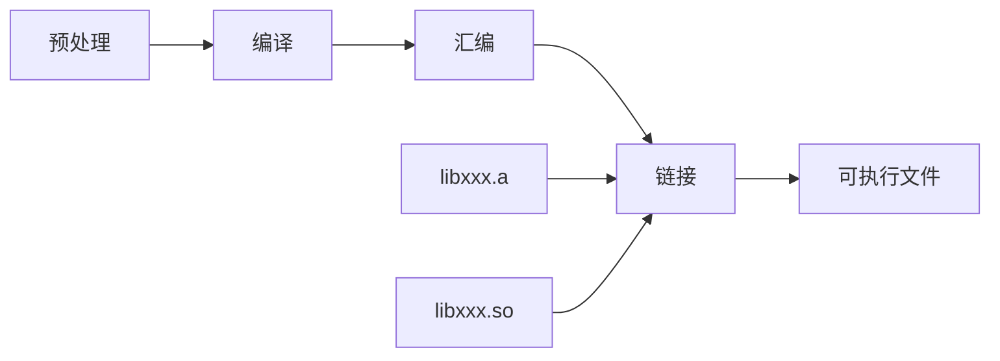

# c/cpp 基础杂项知识


## GCC常用参数选项（g++应该也是一样）

| gcc（g++）编译选项                           | 说明                                                         |
| -------------------------------------------- | ------------------------------------------------------------ |
| -E                                           | 预处理指定的源文件，不进行编译                               |
| -S                                           | 编译指定的源文件，但不进行汇编                               |
| -c                                           | 编译、汇编指定的源文件，但是不进行链接                       |
| -o [file1] [file2]（或者[file2] -o [file1]） | 将文件 file2 编译成可执行文件 file1                          |
| -I directory（i 的大写）                     | 指定 include 包含文件的搜索目录                              |
| -g                                           | 在编译的时候，生成调式信息，该程序可以被调试器调试           |
| -D                                           | 在程序编译的时候，指定一个宏                                 |
| -w                                           | 不生成任何警告信息                                           |
| -Wall                                        | 生成所有警告信息                                             |
| -On                                          | n的取值范围：0~3.编译器的优化选项的4个级别，-O0表示没有优化，-O1为缺省值，-O3优化级别最高 |
| -l（L的小写）                                | 在程序编译的时候，指定使用的库                               |
| -L                                           | 指定编译的时候，搜索的库的路径                               |
| -fPIC（fpic）                                | 生成与位置无关的代码                                         |
| -shared                                      | 生成共享目标文件，通常用在建立共享库时                       |
| -std                                         | 指定c方言（c++方言），如：-std=c99（c++11），gcc默认的方言是GNU C |


## 静态库的制作

库文件有两种，静态库和动态库（共享库），区别是：静态库在程序的链接阶段被复制到程序中；动态库在链接阶段没有被复制到程序中，而是程序在运行时由系统动态加载到内存中供程序调用

### 命名规则

* Linux：libxxx.a
  * lib：前缀（固定）
  * xxx：库的名字，自己起
  * .a：后缀（固定）
* Windows：libxxx.lib

### 静态库的制作

* gcc 获取 .o 文件

* 将 .o 文件打包，使用 ar 工具（archive）

  ```shell
  ar rcs libxxx.a xxx.o xxx.o
  ```

  * r - 将文件插入备存文件中
  * c - 建立备存文件
  * s - 索引


## 静态库的使用

```shell
# example

gcc main.c -o app -I ./include -L ./lib/ -l xxx(.a文件指定是哪个库)
```


## 动态库的制作

### 命名规则

* Linux：libxxx.so

  * lib：前缀（固定）
  * xxx：库的名字，自己起
  * .so：后缀（固定）

  在Linux下是一个可执行文件

* Windows：libxxx.dll

### 动态库的制作：

* gcc 得到 .o 文件，得到和位置无关的代码

  ```shell
  gcc -c -fpic(或者-fPIC) a.c b.c
  ```

* gcc 得到动态库

  ```shell
  gcc -shared a.o b.o -o libxxx.so
  ```


## 动态库的使用

```shell
# example

gcc main.c -o app -I ./include -L ./lib/ -l xxx(.a文件指定是哪个库)

# 解决动态库加载失败问题

```


## 静态库和动态库工作原理

* 静态库：**GCC**进行链接时，会把静态库中代码打包到可执行程序中

* 动态库：**GCC**进行链接时，动态库的代码不会被打包到可执行程序中

* 程序启动之后，动态库会被动态加载到内存中，通过**ldd**（**list dynamic dependencies**）命令检查动态库依赖关系

* 如何定位共享文件呢？

  当系统加载可执行代码时候，能够知道其所依赖的库的名字，但是还需要知道绝对路径。此时就需要系统的动态载入器来获取该绝对路径。对于**elf**格式的可执行程序，是由**ld-linux.so**来完成的，它先后搜索**elf**文件的**DT_RPATH**段 -> **环境变量 LD_LIBRARY_PATH** -> **/etc/ld.so.cache**文件列表 -> **/lib/，/usr/lib**目录找到库文件后将其载入内存

### 用户级别配置 LD_LIBRARY_PATH

```shell
cd
ll # 可以看到.bashrc文件
vim .bashrc
```

在`.bashrc`文件末尾

加上

```shell
export LD_LIBARY_PATH=$LD_LIBRARY_PATH:/xxx/xxx/xxx/xxx # 动态库的路径
# 然后需要变成命令模式即点击下键盘的ESC键
:wq! # 保存并退出
```

```shell
# 终端命令下
. .bashrc # 或者 source .bashrc
```

* `bashrc`文件：这个文件主要保存个人的一些个性化设置，如命令别名、路径等。也即在同一个服务器上，只对某个用户的个性化设置相关

### 系统级配置 LD_LIBRARY_PATH

```shell
sudo vim /ect/profile
```

在`profile`文件下最后一行

```shell
export LD_LIBARY_PATH=$LD_LIBRARY_PATH:/xxx/xxx/xxx/xxx # 动态库的路径
# 然后需要变成命令模式即点击下键盘的ESC键
:wq! # 保存并退出
```

```shel
# 终端命令下
source /etc/profile
```

### 配置 **/etc/ld.so.cache**

```shell
sudo vim /etc/ld.so.conf
```

在`ld.so.conf`文件中

```shell
/xxx/xxx/xxx/xxx # 动态库的路径
# 然后需要变成命令模式即点击下键盘的ESC键
:wq! # 保存并退出
```

```shell
# 在终端命令下
sudo ldconfig
```

### 不推荐将文件放到/lib/，/usr/lib目录

因为这里放着系统自带的库，避免冲突


## 静态库和动态库的对比


### 程序编译成可执行程序的过程



链接库、动态库区别来自链接阶段如何处理，链接成可执行程序。分别称为静态链接方式和动态链接方式

### 静态库制作过程


### 动态库制作过程


### 静态库的优缺点

#### 优点

* 静态库被打包到应用程序中加载速度快
* 发布程序无需提供静态库，移植方便

#### 缺点

* 消耗系统资源，浪费内存
* 更新、部署、发布麻烦


### 动态库的优缺点

#### 优点

* 可以实现进程间资源共享（共享库）
* 更新、部署、发布简单
* 可以控制何时加载动态库

#### 缺点

* 加载速度比静态库慢
* 发布程序时需要提供依赖的动态库


## Makefile

**Makefile** 文件定义了一系列的规则来指定哪些文件需要先编译，哪些文件需要后编译，哪些文件需要重新编译，甚至于进行更复杂的功能操作

### 文件命名

makefile 或者 Makefile

### Makefile 规则

* 一个 Makefile 文件中可以有一个或者多个规则

  ```makefile
  目标 ...: 依赖 ...
  	命令 (Shell 命令)
  	...
  ```

  * 目标：最终要生成的文件 （伪目标除外）
  * 依赖：生成目标所需要的文件或者目标
  * 命令：通过执行命令对依赖操作生成目标（命令前必须 Tab 缩进）

* Makefile 中的其它规则一般都是为第一条规则服务的

### 工作原理

* 命令在执行之前，需要先检查规则中的依赖是否存在
  * 如果存在，执行命令
  * 如果不存在，向下检查其它的规则，检查有没有一个规则是用来生成这个依赖的，如果找到了，则执行该规则中的命令
* 检测更新，在执行规则中的命令时，会比较目标和依赖文件的时间
  * 如果依赖的时间比目标的时间晚，需要重新生成目标
  * 如果依赖的时间比目标的时间早，目标不需要更新，对应规则中的命令不需要被执行

### 变量

* 自定义变量
  * 变量名=变量值	如 var = hello		`$(var)`
* 预定义变量
  * AR：归档维护程序的名称，默认值为ar
  * CC：C 编译器的名称，默认值为 cc
  * CXX：C++ 编译器的名称，默认值为 g++
  * $@：目标的完整名称
  * $<：第一个依赖文件的名称
  * $^：所有的依赖文件
* 获取变量的值
  * $(变量名)	

### 模式匹配

```makefile
%.o:%.c
	- %: 通配符，匹配一个字符串
	- 两个%匹配的是同一个字符串
%.o:%.c
	gcc -c $< -o $@
```

### 函数

```makefile
$(wildcard PATTERN...)
	功能：获取指定目录下指定类型的文件列表
	参数：PATTERN 指的是某个或多个目录下的对应的某种类型的文件，如果由多个目录，一般使用空格间隔
	返回：得到的若干个文件的文件列表，文件名之间使用空格间隔

# example
$(wildcard *.c ./sub/*.c)
返回值格式：a.c b.c c.c
```

```makefile
$(patsubst <pattern>, <replacement>, <text>)
	功能：查找<text>中的单词（单词以"空格"、"Tab"或者"回车""换行"分隔）是否符合模式<pattern>,如果匹配的化，则以<replacement>替换
	<pattern>可以包括通配符`%`，表示任意长度的字串。如果<replacement>中也包含`%`，那么<replacement>中的这个`%`将是<pattern>中那个%所代表的字串。（可以用`\`来转义，以`\%`来表示真实含义的`%`字符）
	返回：函数返回被替换过后的字符串
	示例：
		$(patsubst %.c, %.o, x.o, bar.c)
		返回值格式：x.o bar.o
```


## GDB

**GDB**是由**GNU**软件系统社区提供的调试工具

**GDB**主要能完成四个方面的功能：

* 启动程序，可以按照自定义的要求运行程序
* 可让被调试的程序在所指定的调置的断点处停止（断点可以是条件表达式）
* 当程序被停住时，可以检查此时程序中所发生的事
* 可以改变程序，将一个**BUG**产生的影响修正从而测试其它**BUG**

### 准备工作

* 通常，在为调试而编译时，会（）关掉编译器的优化选项（`-o`），并打开调试选项（`-g`）。另外，`-Wall`在尽量不影响程序行为的情况下选项打开所有**warning**，也可以发现许多问题，避免一些不必要的**BUG**

* **gcc -g -Wall porgram.c -o program**
* `-g`选项的作用是在可执行文件中加入源代码的信息

### GDB命令

* 启动和退出

  **gdb** 可执行程序

  **quit**

* 给程序设置参数/获取设置参数

  **set args 10 20**

  **show args**

* **GDB**使用帮助

  **help**

* 查看当前文件代码

  **list（/l）** （从默认位置显示）

  **list（/l） 行号** （从指定的行显示）

  **list（/l） 函数名** （从指定的函数显示）

* 显示非当前文件代码

  **list（/l）文件名：行号**

  **list（/l）文件名：函数名**

* 设置显示的行数

  **show list（/listsize）**

  **set list（/listsize） 行数**

* 设置断点

  **b（/break）行号**

  **b（/break）函数名**

  **b（/break）文件名：行号**

  **b（/break）文件名：函数**

* 查看断点

  **i（/info）b（/break）**

* 删除断点

  **d（/del）（/delete）断电编号**

* 设置断点无效

  **dis（/disable）断点编号**

* 设置断点生效

  **ena（/enable）断点编号**

* 设置条件断点（一般用在循环的位置）

  **b（/break）10 if i==5**

* 运行GDB程序

  **start**（程序停在第一行）

  **run**（遇到断点才停）

* 继续运行，到下一个断点停

  **c** **（/continue）**

* 向下执行一行代码（不会进入函数体）

  **n（/next）**

* 变量操作

  **p（/print）** 变量名（打印变量值）

  **ptype** 变量名（打印变量类型）

* 向下单步调试（遇到函数进入函数体）

  **s（/step）**

  **finish** （跳出函数体）

* 自动变量操作

  **display num** （自动打印指定变量的值）

  **i（/info） display** （查看display情况）

  **undisplay** 编号

* 其他操作

  **set var** 变量名=变量值

  **until** （跳出循环）

### GDB 多进程调试

使用**GDB**调试的时候，**GDB**默认只能跟踪一个进程，可以在**fork**函数调用之前，通过指令设置**GDB**调试工具跟踪父进程或者是跟踪子进程，默认跟踪父进程

设置调试父进程或者子进程：**set follow-fork-mode [parent (默认) | child]**

设置调试模式：**set detach-on-fork [ on | off ]**

默认为**on**，表示调试当前进程的时候，其它的进程继续运行，如果为**off**，调试当前进程的时候，其它进程被**GDB**挂起

查看调试的进程：**info inferiors**

切换当前调试的进程：**inferior id**

使进程脱离**GDB**调试：**detach inferiors id**


