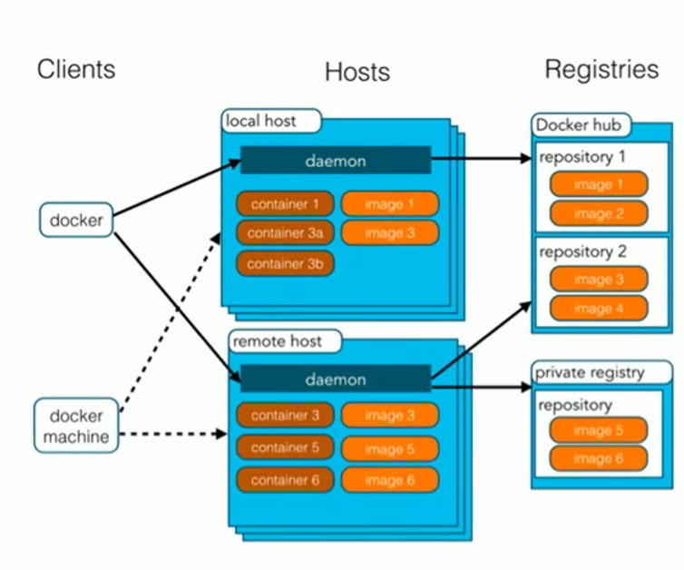

# Docker基础入门

**Docker概念**

* Docker是一个开源的应用容器引擎
* 基于`golang`语言开发
* `Docker`可以让开发者打包他们的应用以及依赖包一个轻量级、可移植的容器中，然后发布到任何流行的`Linux`机器上
* 容器是完全砂箱机制，相互隔离
* 容器性能开销极低

docker是一种容器技术，解决软件跨环境迁移的问题

**docker架构**



* 镜像（`Image`）：Docker镜像，就相当于是一个root文件系统
* 容器（`Container`）：镜像和容器的关系，就像是面向对象程序设计中的类和对象一样，镜像是静态的定义，容器是镜像运行时的实体
* 仓库（`Repository`）：仓库可看成一个代码控制中心，用来保存镜像

默认情况下，将从docker hub（https://hub.docker.com/）上下载docker镜像，太慢。一般都会配置镜像加速器：

* USTC：中科大镜像加速器（https://docker.mirrors.ustc.edu.cn）
* 阿里云（去阿里云官网登录可以生成自己的特有加速器）
* ...


 ## Docker命令


### docker服务相关命令

* 启动docker服务

  ```shell
  systemctl start docker
  ```

* 停止docker服务

  ```shell
  systemctl stop docker
  ```

* 重启docker服务

  ```shell
  systemctl restart docker
  ```

* 查看docker服务状态

  ```shell
  systemctl status docker
  ```

* 开机启动docker服务

  ```shell
  systemctl enable docker
  ```

  


## docker容器命令

### 新建 + 启动容器

#### docker run [OPTIONS] IMAGE [COMMAND] [ARG...]

##### OPTIONS 说明（常用）：有些是一个减号，有些是两个减号

* `--name=容器新名字`	为容器指定一个名称

* `-d`：后台运行容器并返回容器**ID**，也即启动守护式容器（后台运行）

  Docker 容器后台运行，就必须有一个前台进程

* `-i`：以交互模式运行容器，通常与`-t`同时使用

* `-t`：为容器重新分配一个伪输入终端，通常与`-i`同时使用

  也即**启动交互式容器（前台有伪终端，等待交互）**

* `-P`：随机端口映射，大写P

* `-p`：指定端口映射，小写p

### 列出当前所有正在运行的容器

#### docker ps [OPTIONS]

* `-a`：列出当前所有正在运行的容器 + 历史上运行过的
* `-I`：显示最近创建的容器
* `-n`：显示最近n个创建的容器
* `-q`：静默模式，只显示容器编号

### 退出容器

#### exit

run进去容器，exit退出

#### ctrl + p + q

run进去容器，ctrl + p + q退出

### 启动已停止运行的容器

#### docker start 容器ID或者容器名

### 重启容器

#### docker restart 容器 ID 或者容器名

### 停止容器

#### docker stop 容器 ID 或者容器名

### 强制停止容器

#### docker kill 容器ID 或者容器名

### 删除已停止的容器

#### docker rm 容器ID

##### 一次性删除多个容器实例

* docker rm -f $(docker ps -a -q)
* docker ps -a -q | xargs doceck rm

### 查看容器日志

#### docker logs 容器ID

### 查看容器内部细节

#### docker inspect 容器ID

### 进入正在运行的容器并以命令行交互

#### docker exec -it 容器ID bashShell

#### 重新进入docker attach 容器ID

**attach直接进入容器启动命令的终端，不会启动新的进程，用exit退出会导致容器的停止；exec是在容器中打开新的终端，并且可以启动新的进程，用exit退出，不会导致容器的停止**

### 从容器内拷贝文件到主机上

#### docker cp 容器ID：容器内路径 目的主机路径

### 导入和导出容器

#### export 导出容器的内容流作为一个tar归档文件[对应import命令]

`docker export 容器ID > 文件名.tar`

#### import 从tar包中的内容创建一个新的文件系统再导入为镜像[对应export]

`cat 文件名.tar | docker import - 镜像用户/镜像名：镜像版本号`

### docker镜像commit操作

#### docker commit -m="提交的描述信息" -a="作者" 容器ID 要创建的目标镜像名:[标签名]


## 本地镜像推送到私有库

1. 下载镜像 **Docker Resitry**
2. 运行私有库**Resitry**，相当于本地有个私有**Docker Hub**
3. **curl**验证私服库上有什么镜像
4. 将新镜像**xxxxx:x.x** 修改符合私服规范的**Tag**
5. 修改配置文件使之支持http
6. **push** 推送到私服库
7. **curl** 验证私服库上有什么镜像
8. **pull** 到本地并运行


## 容器数据卷

### 容器卷需要加入

`--privileged=true`

运行一个带有容器卷存储功能的容器实例

### docker run -it --privileged=true -v /宿主机绝对路径目录:/容器内目录 镜像名

### 读写规则映射添加说明

1. 读写（默认）

   **docker run -it --privileged=true -v /宿主机绝对路径目录:/容器内目录:rw 镜像名**

2. 只读

   **docker run -it --privileged=true -v /宿主机绝对路径目录:/容器内目录:ro 镜像名**

   容器实例内部被限制，只能读取不能写

### 容器继承

####  docker run -it --privileged=true --volumes -from 父类 --name u2 ubuntu


## docker 安装运行常见软件


### MySQL 安装

#### 1. docker pull mysql（:版本号）

#### 2. docker run -p 主机端口:容器端口 -e MYSQL_ROOT_PASSWORD=指定密码 -d mysql（:版本号）

#### 数据卷备份：docker run -d -p 主机端口:容器端口 --privileged=true -v /xxx/mysql/log:/var/log/mysql -v /xxx/mysql/data:/var/lib/mysql -v /xxx/mysql/conf:/etc/mysql/conf.d -e MYSQL_ROOT_PASSWORD=指定密码  --name 指定名称 mysql（:版本号）


### redis安装

#### 1. docker pull redis（:版本号）

#### 2.  在宿主机下新建目录 /app/redis

#### 3. 将一个redis.conf文件模板拷贝进/app/redis目录下

#### docker run  -p 主机端口:容器端口 -name 指定名称 --privileged=true -v /app/redis/redis.conf:/etc/redis/redis.conf -v /app/redis/data:/data -d redis（:版本号） redis-server /etc/redis/redis.conf

