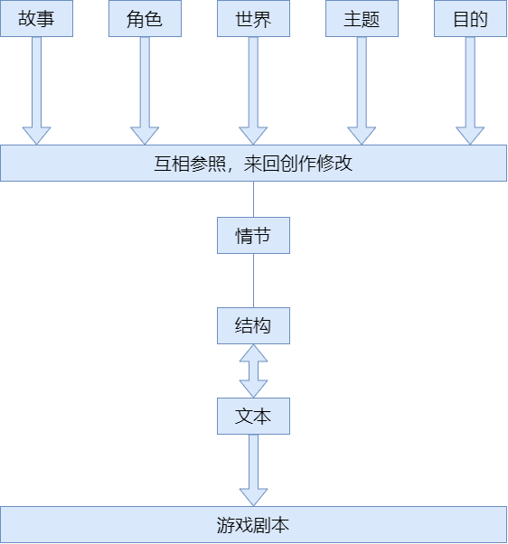

# 创作流程

游戏剧本的成型过程大致分为策划阶段、游戏剧本的制作阶段。

## 策划阶段

确定大致的内容和方向性，是确立游戏的根本与根基的过程，如“什么样的游戏”，“什么样的主人公”，“什么为目标来享受游戏”，预算规模等根本问题

### 主题

根据表达方式不同，主题可以分为下面两种类型

* 用一个词来表达的主题
* 用一个长句来表达的主题

主题分为两种，但总体而言，凡是能使游戏给人一定的印象，并赋予游戏一定方向性的关键词或句子，都可以是主题

## 