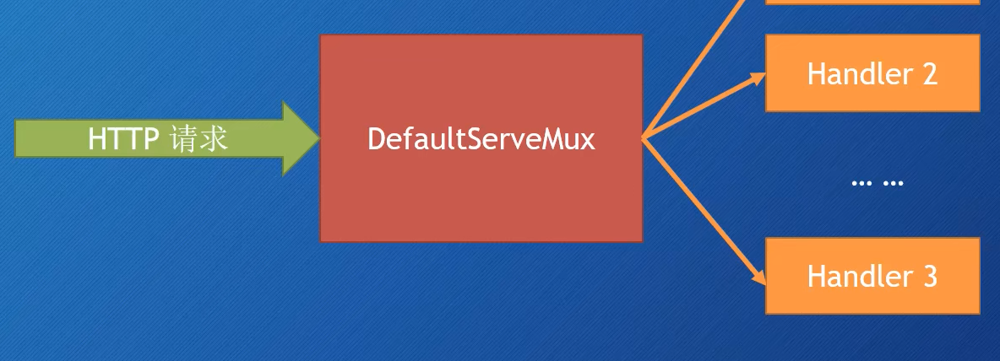

# Go Web基础


## 大致介绍


### go mod管理

```go
go mod init xxx.com/xxx/xxx
```


### 第一个Hello world

```go
package main

import "net/http"

func main() {
        http.HandleFunc("/", func(w http.ResponseWriter, r *http.Request) {
                w.Write([]byte("Hello world"))
        })

        http.ListenAndServe("localhost:8000", nil) // DefaultServeMux
}
```


### 创建`Web Server`

* `http.ListenAndServe()`
  * 第一个参数时网络地址
    * 如果为`""`，那么就是所有网络接口的`80`端口
  * 第二个参数是`handler`
    * 如果为`nil`，那么就是`DefaultServeMux` [`DefaultServeMux`是一个`multiplexer`(可以看作是路由器)]
* `http.Server`这是一个`struct`
  * `Addr`字段表示网络地址
    * 如果为""，那么就是所有网络接口的`80`端口
  * `Handler`字段
    * 如果为`nil`，那么就是`DefaultServeMux`
  * `ListenAndServe()函数`


### Handler

* `handler`是一个接口(`interface`)
* `handler`定义了一个方法`ServeHTTP()`
  * HTTPResponseWriter
  * 指向Request这个`struct`的指针

```go
type Handler interface {
    ServeHTTP(ResponseWriter, *Request)
}
```


### DefaultServeMux

* 他是一个`Multiplexer`(多路复用器)
* 他也是一个`Handler`




### 多个`Handler-http.Handle`

* 不指定`Server struct`里面的`Hnadler`字段值
* 可以使用`http.Handle`将某个`Handler`附加到`DefaultServeMux`
  * `http`包有一个`Handle`函数
  * `ServerMux struct`也有一个`Handle`方法
* 如果你调用`http.Handle`，实际上调用的是`DefaultServeMux`上的`Handle`方法
  * `DefaultServeMux`就是`ServerMux`的指针变量


### `htttp.Handle`

```go
func Handle(pattern string, handler Handler)

type Handler interface {
    ServeHTTP(ResponseWriter, *Request)
}
```


### `Handler`函数-`http.HandleFunc`

* `Handler`函数就是那些行为与`handler`类似的函数
* `Handler`函数的签名与`ServeHttp`方法的签名一样，接收
  * 一个`http.ResponseWriter`
  * 一个指向`http.Request`的指针


### `http.HandleFunc`原理

* `golang`有一个函数类型：`HandlerFunc`。可以将某个具体适当签名的函数`f`，适配称为一个`Hnadler`，而这个`Handler`具有方法`f`。
* 第二个参数是一个`Handler`函数
* 内部调用的还是`http.Handle`函数

* 源码

```go
// HandleFunc registers the handler function for the given pattern(模式)
func (mux *ServeMux) HandleFunc(pattern string, handler func(ResponseWriter, *Request)) {
    if handler == nil {
        panic("http: nil handler")
    }
    mux.Handler(pattern, HandlerFunc(handler))
}
```

* `http.HandlerFunc`可以把`Handler`函数转化为`Handler`

* `http.HandlerFunc`相关源码

```go
// The HandlerFunc type is an adapter to allow the use of
// ordinary functions as HTTP handlers.
type HandlerFunc func(ResponseWriter, *Request)

func (f HandlerFunc) ServeHTTP(w ResponseWriter, r *Request) {
    f(w, r)
}
```


### 内置的`Handlers`


#### `http.NotFoundHandler`

* ```go
  func NotFoundHandler() Handler
  // 返回一个handler，它给每个请求的响应都是"404 page not found"
  ```


#### `http.RedirectHandler`

* ```go
  func RedirectHandler(url string, code int) Handler
  // 返回一个handler，它把每个请求使用给定的状态码转跳到指定的URL
  ```

  * `url`：要跳转到的`URL`
  * `code`：跳转的状态码（`3xx`），常见的：`StatusMovedPermanently`、`StatusFound`或`StatusSeeOther`等


#### `http.StripPrefix`

* ```go
  func StripPrefix(prefix string, h handler) Handler
  // 返回一个handler，它从请求URL中去掉指定的前缀，然后再调用另一个handler
  ```

  * 如果请求的`URL`与提供的前缀不符，那么`404`

* 略像中间件

  * `prefix`，`URL`将要被移除的字符串前缀
  * `h`，是一个`handler`，在移除字符串前缀之后，这个`handler`将会接收到请求
  * 修饰了另一个`Handler`


#### http.TimeoutHandler

* ```go
  func TimeoutHandler(h Handler, dt time.Duration, msg string)
  // 返回一个handler，它用来在指定时间内运行传入的h
  ```

* 也相当于是一个修饰器

  * `h`，将要被修饰的`handler`
  * `dt`，第一个`handler`允许的处理时间
  * `msg`，如果超时，那么把`msg`返回给请求，表示响应时间过长


#### `http.FileServer`

* ```go
  func FileServer(root FileSystem) Handler
  // 返回一个handler，使用基于root的文件系统来响应请求
  ```

* ```go
  type FileSystem interface {
      Open(name string) (File, error)
  }
  ```

* 使用时需要用到操作系统的文件系统，所以还需委托给：

  * `type Dir string`

  * ```go
    func (d Dir) Open(name string) (File, error)
    ```

example.before：

```go
package main

import "net/http"

func main() {
        http.HandleFunc("/", func(w http.ResponseWriter, r *http.Request){
                http.ServeFile(w, r, "rootname" + r.URL.Path)
        })
        http.ListenAndServe(":8000", nil)
}
```

example.after：

```go
package main

import "net/http"

func main() {
    http.ListenAndServe(":8000", http.FileServer(http.Dir("rootname")))
}

```


### `HTTP`消息

* ## `HTTP Request`和`HTTP Response`（请求和响应）
* ## 它们具有相同的结构：
  
  * 请求（响应）行
  * 0个或多个`Header`
  * 空行
  * 可选的消息行（`Body`）
* ## `net/http`包提供了用于表示`HTTP`消息的结构

1. 请求（`Request`）

* ## `Request`（是个`struct`），代表客户端发送的`HTTP`请求消息

* ## 重要字段：

  * ### `URL`

    * 代表了请求行（请求信息第一行）里面的部分内容

    * `URL`字段是指向`url.URL`类型的一个指针，`url.URL`是一个`struct`：

      ```go
      type URL struct {
          Scheme		string
          Opaque		string
          User		*Userinfo
          Host		string
          Path		string
          RawQuery	string
          Fragment	string
      }
      ```

      * 通用格式是：`scheme://[userinfo@]host/path[?query][#fragment]`

      * 不可以斜杠开头的`URL`被解释为：`scheme:opaque[?query][#fragment]`

      * `RawQuery`会提供实际查询的字符串

        example：`http://www.example.com/post?id=1&pw=1`

        * 它的`RawQuery`的值就是`id=1&pw=1`
          * 还有一个简便方法可以得到`Key-Value`对：通过`Request`的`Form`字段

      * 如果从浏览器发出的请求，那么将无法提取出`Fragment`字段的值

        * 浏览器在发送请求时会把`fragment`部分去掉

      * 但不是所有请求都是从浏览器发出的（例如从HTTP客户端包）
      
      * `r.URL.Query()`会提供查询字符串对应的`map[string][]string`
      
        example:
      
        ```go
        url := r.URL
        query := url.Query() // map[string][]string
        id := query["id"] // []string{"123"}
        threadID := query.Get("thread_id") // "456" 重复的话返回的是第一个值
        ```

  * ### `Header`

    * 请求和响应（`Request`、`Response`）的`headers`是通过`Header`类型来描述的，它是一个`map`，用来表述`HTTP Header`里的`Key-Value`对。
    * `Header map`的`key`是`string`类型，`value`是`[]string`
    * 设置`key`的时候会创建一个空的`[]string`作为`value`，`value`里面第一个元素就是新`header`的值
    * 为指定的`key`添加一个新的`header`值，执行`append`操作即可

    example

    * `r.Header`
      * 返回`map`
    * `r.Header["Accept-Encoding"]`
      * 返回：`[gzip, deflate]`(`[]string`类型)
    * `r.Header.Get("Accept-Encoding")`
      * 返回：`gzip, deflate`(`string`类型)

  * ### `Body`

    * 请求和响应的`bodies`都是使用`Body`字段来表示的
    * `Body`是一个`io.ReadCloser`接口
      * 一个`Reader`接口
      * 一个`Closer`接口
    * `Reader`接口定义了一个`Open`方法
      * 参数：`[]byte`
      * 返回：`byte`的数量、可选的错误
    * `Closer`接口定义了一个`Close`方法
      * 没有参数，返回可选的错误
    * 想要读取请求`body`的内容，可以调用`Body`的`Read`方法

  * ### `Form`、`PostForm`、`MultipartForm`

    * 来自表单的Post请求例子

      ```html
      <form action="/porcess" method="post" enctype="application/x-www-form-urlencoded">
          <input type="text" name="first_name" />
          <input type="text" name="last_name" />
          <input type="submit" />
      </form>
      ```

      * 这个`HTML`表单里面的数据会以`name-value`对的形式，通过`POST`请求发送出去
      * 它的数据内容会放到`POST`请求的`Body`里面
      * 通过`POST`发送的`name-value`数据对的格式可以通过表单的`Content Type`来指定，也就是`enctype`属性

    * 表单的`enctype`属性

      * 默认值是：`application/x-www-form-urlencoded`

      * 浏览器被要求至少要支持：`application/x-www-form-urlencoded`和`multipart/form-data`

        * `HTML5`的话，还需要支持`text/plain`

      * 如果`enctype`是`application/x-www-form-urlencoded`，那么浏览器会将表单数据编码到查询字符串里面。例如

        ```javascript
        first_name=sau%20skjkd&last_name=skdjfk
        ```

      * 如果`enctype`是`multipart/form-data`，那么

        * 每一个`name-value`对都会被转换为一个`MME`消息部分
        * 每一个部分都有自己的`Content Type`和`Content Disposition`

      * 选择

        1. 简单文本：表单`URL`编码
        2. 大量数据，例如上传文件：`multipart-MIME`（甚至可以把二进制数据通过选择`Base64`编码，来当作文本进行发送）

      * 表单的`GET`

        * 通过表单的`method`属性，可以设置`POST`还是`GET`

          example:

          ```html
          <form action="/process" method="get">
              <input type="text" name="first_name" />
              <input type="text" name="last_name" />
              <input type="submit" />
          </form>
          ```

        * `GET`请求没有`Body`，所有的数据都通过`URL`的`name-value`对来发送

      * `Form`字段

        * `Request`上的函数允许我们从`URL`或`/`和`Body`中提取数据，通过这些字段：

          * `From`

            源码

            ```go
            Form url.Values
            
            type Values map[string][][string]
            ```

          * `PostForm`
            * 如果表单和`URL`里有同样的`key`，那么它们都会放在一个`slice`里：表单里的值靠前，`URL`的值靠后
            * 如果只想要表单的`key-value`对，不要`URL`的，可以使用`PostForm`字段
            * `PostForm`只支持`application/x-www-form-urlencoded`

          * `MultipartForm`

            * 想要得到`multipart key-value`对，必须使用`MultipartForm`字段

            * 想要使用`MultipartForm`这个字段的话，首先需要调用`ParseMultipartForm`这个方法

              * 该方法会在必要的时候调用`ParseForm`方法
              * 参数是需要读取数据的长度（长度是字节数）

            * `MultipartForm`只包含表单的`key-value`对

            * 返回类型是一个`struct`而不是`map`。这个`struct`里有两个`map`

              * `key`是`string`，`value`是`[]string`

            * `MultipartReader`

              * ```go
                func (r *Request) MultipartReader() (*multipart.Reader, error)
                // 如果是multipart/form-data或multipart混合的POST请求
                	// MultipartReader返回一个MIME multipart reader
                	// 否则返回nil和一个错误
                ```

              * 可以使用该函数代替`ParseMultipartForm`来把请求的`body`作为`stream`进行处理

                * 不是把表单作为一个对象来处理的，不是一次性获得整个`map`
                * 逐个检查来自表单的值，然后每次处理一个

        * `Form`里面的数据是`key-value`对

        * 通常的做法是：

          1. 先调用`ParseForm`或`ParseMultipartForm`来解析`Request`
          2. 然后相应的访问`Form`、`PostForm`或`MultipartForm`字段

        * `FormValue`方法会返回`Form`字段中指定`key`对应的第一个`value`

          * 无需调用`ParseForm`或`ParseMultipartForm`

        * `PostFormValue`方法也一样，但只能读取`PostForm`

        * `FormValue`和`PostFormValue`都会调用`ParseMultipartForm`方法

        * 但如果表单的`enctype`设为`mutipart/form-data`，那么即使你调用`ParseMultipartForm`方法，也无法通过`FormValue`获得想要的值

        * **文件与`JSON`**
          * 上传文件
            * `multipart/form-data`最常见的应用场景就是上传文件
              1. 调用`ParseMultipartForm`方法
              2. 从`File`字段获得`FileHeader`，调用其`Open`方法来获得文件
              3. 可以使用`ioutil.ReadAll`函数把文件内容读取到`byte`切片里
            * `FormFile`方法
              * 无需调用`ParseMultipartForm`方法
              * 返回指定`key`对应的第一个`value`
              * 同时返回`File`和`FileHeader`，以及错误信息
              * 如果只上传一个文件，那么这种方式会快一些
          * `POST`请求-`JSON Body`
            * 不是所有的`POST`请求都来自`Form`
            * 客户端框架（例如**Angular**等）会以不同的方式对`POST`请求编码
              * `jQuery`通常使用`application/x-www-form-urlencoded`
              * `Angular`是`application/json`
            * `parseForm`方法无法处理`application/json`

* ## 也可以通过`Request`的方法访问请求中的`Cookie`、`URL`、`User Agent`等信息


### `ResponseWriter`

源码

```go
type ResponseWriter interface {
    Header() Header
    Write([]byte) (int, error)
    WriteHeader(statusCode int)
}
```

* `Handler`中的`ServeHTTP(w ResponseWriter, r *Request)`两个都是引用传递值
* 从服务器向客户端返回响应需要使用`ResponseWriter`
* `ResponseWrier`是一个接口，`handler`用它来返回响应
* 真正支撑`ResponseWriter`的幕后`struct`是非导出的`http.response`
* 写入到`ResponseWriter`
  * `Write`方法接收一个`byte`切片作为参数，然后把它写入到`HTTP`响应的`Body`里面
  * 如果在`Write`方法被调用时，`header`里面没有设定`content type`，那么数据的前512字节就会被用来检测`content type`
* `WriteHeader`方法
  * `WriteHeader`方法接收一个整数类型（`HTTP`状态码）作为参数，并把它作为`HTTP`响应的状态码返回
  * 如果该方法没有显示调用，那么在第一次调用`Write`方法前，会隐式的调用`WriteHeader(http.StatusOK)`
    * 所以`WriteHeader`主要用来发送错误类的`HTTP`状态码
  * 调用完`WriteHeader`方法之后，仍然可以写入到`ResponseWriter`，但无法再修改`header`
* `Header`方法
  * `Header`方法返回`headers`的`map`，可以进行修改
  * 修改后的`header`将会体现在返回给客户端的`HTTP`响应里
