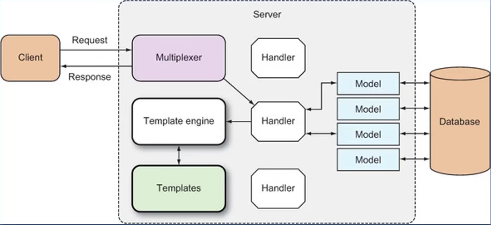

# Go Web基础


## 大致介绍


### go mod管理

```go
go mod init xxx.com/xxx/xxx
```


### 第一个Hello world

```go
package main

import "net/http"

func main() {
        http.HandleFunc("/", func(w http.ResponseWriter, r *http.Request) {
                w.Write([]byte("Hello world"))
        })

        http.ListenAndServe("localhost:8000", nil) // DefaultServeMux
}
```


### 创建`Web Server`

* `http.ListenAndServe()`
  * 第一个参数时网络地址
    * 如果为`""`，那么就是所有网络接口的`80`端口
  * 第二个参数是`handler`
    * 如果为`nil`，那么就是`DefaultServeMux` [`DefaultServeMux`是一个`multiplexer`(可以看作是路由器)]
* `http.Server`这是一个`struct`
  * `Addr`字段表示网络地址
    * 如果为""，那么就是所有网络接口的`80`端口
  * `Handler`字段
    * 如果为`nil`，那么就是`DefaultServeMux`
  * `ListenAndServe()函数`


### Handler

* `handler`是一个接口(`interface`)
* `handler`定义了一个方法`ServeHTTP()`
  * HTTPResponseWriter
  * 指向Request这个`struct`的指针

```go
type Handler interface {
    ServeHTTP(ResponseWriter, *Request)
}
```


### DefaultServeMux

* 他是一个`Multiplexer`(多路复用器)
* 他也是一个`Handler`


### 多个`Handler-http.Handle`

* 不指定`Server struct`里面的`Hnadler`字段值
* 可以使用`http.Handle`将某个`Handler`附加到`DefaultServeMux`
  * `http`包有一个`Handle`函数
  * `ServerMux struct`也有一个`Handle`方法
* 如果你调用`http.Handle`，实际上调用的是`DefaultServeMux`上的`Handle`方法
  * ​	`DefaultServeMux`就是`ServerMux`的指针变量


### `htttp.Handle`

```go
func Handle(pattern string, handler Handler)

type Handler interface {
    ServeHTTP(ResponseWriter, *Request)
}
```


### `Handler`函数-`http.HandleFunc`

* `Handler`函数就是那些行为与`handler`类似的函数
* `Handler`函数的签名与`ServeHttp`方法的签名一样，接收
  * 一个`http.ResponseWriter`
  * 一个指向`http.Request`的指针


### `http.HandleFunc`原理

* `golang`有一个函数类型：`HandlerFunc`。可以将某个具体适当签名的函数`f`，适配称为一个`Hnadler`，而这个`Handler`具有方法`f`。
* 第二个参数是一个`Handler`函数
* 内部调用的还是`http.Handle`函数

* 源码

```go
// HandleFunc registers the handler function for the given pattern(模式)
func (mux *ServeMux) HandleFunc(pattern string, handler func(ResponseWriter, *Request)) {
    if handler == nil {
        panic("http: nil handler")
    }
    mux.Handler(pattern, HandlerFunc(handler))
}
```

* `http.HandlerFunc`可以把`Handler`函数转化为`Handler`

* `http.HandlerFunc`相关源码

```go
// The HandlerFunc type is an adapter to allow the use of
// ordinary functions as HTTP handlers.
type HandlerFunc func(ResponseWriter, *Request)

func (f HandlerFunc) ServeHTTP(w ResponseWriter, r *Request) {
    f(w, r)
}
```


### 内置的`Handlers`


#### `http.NotFoundHandler`

* ```go
  func NotFoundHandler() Handler
  // 返回一个handler，它给每个请求的响应都是"404 page not found"
  ```


#### `http.RedirectHandler`

* ```go
  func RedirectHandler(url string, code int) Handler
  // 返回一个handler，它把每个请求使用给定的状态码转跳到指定的URL
  ```

  * `url`：要跳转到的`URL`
  * `code`：跳转的状态码（`3xx`），常见的：`StatusMovedPermanently`、`StatusFound`或`StatusSeeOther`等


#### `http.StripPrefix`

* ```go
  func StripPrefix(prefix string, h handler) Handler
  // 返回一个handler，它从请求URL中去掉指定的前缀，然后再调用另一个handler
  ```

  * 如果请求的`URL`与提供的前缀不符，那么`404`

* 略像中间件

  * `prefix`，`URL`将要被移除的字符串前缀
  * `h`，是一个`handler`，在移除字符串前缀之后，这个`handler`将会接收到请求
  * 修饰了另一个`Handler`


#### http.TimeoutHandler

* ```go
  func TimeoutHandler(h Handler, dt time.Duration, msg string)
  // 返回一个handler，它用来在指定时间内运行传入的h
  ```

* 也相当于是一个修饰器

  * `h`，将要被修饰的`handler`
  * `dt`，第一个`handler`允许的处理时间
  * `msg`，如果超时，那么把`msg`返回给请求，表示响应时间过长


#### `http.FileServer`

* ```go
  func FileServer(root FileSystem) Handler
  // 返回一个handler，使用基于root的文件系统来响应请求
  ```

* ```go
  type FileSystem interface {
      Open(name string) (File, error)
  }
  ```

* 使用时需要用到操作系统的文件系统，所以还需委托给：

  * `type Dir string`

  * ```go
    func (d Dir) Open(name string) (File, error)
    ```

example.before：

```go
package main

import "net/http"

func main() {
        http.HandleFunc("/", func(w http.ResponseWriter, r *http.Request){
                http.ServeFile(w, r, "rootname" + r.URL.Path)
        })
        http.ListenAndServe(":8000", nil)
}
```

example.after：

```go
package main

import "net/http"

func main() {
    http.ListenAndServe(":8000", http.FileServer(http.Dir("rootname")))
}

```


### `HTTP`消息

* ## `HTTP Request`和`HTTP Response`（请求和响应）
* ## 它们具有相同的结构：
  
  * 请求（响应）行
  * 0个或多个`Header`
  * 空行
  * 可选的消息行（`Body`）
* ## `net/http`包提供了用于表示`HTTP`消息的结构

1. 请求（`Request`）

* ## `Request`（是个`struct`），代表客户端发送的`HTTP`请求消息

* ## 重要字段：

  * ### `URL`

    * 代表了请求行（请求信息第一行）里面的部分内容

    * `URL`字段是指向`url.URL`类型的一个指针，`url.URL`是一个`struct`：

      ```go
      type URL struct {
          Scheme		string
          Opaque		string
          User		*Userinfo
          Host		string
          Path		string
          RawQuery	string
          Fragment	string
      }
      ```

      * 通用格式是：`scheme://[userinfo@]host/path[?query][#fragment]`

      * 不可以斜杠开头的`URL`被解释为：`scheme:opaque[?query][#fragment]`

      * `RawQuery`会提供实际查询的字符串

        example：`http://www.example.com/post?id=1&pw=1`

        * 它的`RawQuery`的值就是`id=1&pw=1`
          * 还有一个简便方法可以得到`Key-Value`对：通过`Request`的`Form`字段

      * 如果从浏览器发出的请求，那么将无法提取出`Fragment`字段的值

        * 浏览器在发送请求时会把`fragment`部分去掉

      * 但不是所有请求都是从浏览器发出的（例如从HTTP客户端包）
      
      * `r.URL.Query()`会提供查询字符串对应的`map[string][]string`
      
        example:
      
        ```go
        url := r.URL
        query := url.Query() // map[string][]string
        id := query["id"] // []string{"123"}
        threadID := query.Get("thread_id") // "456" 重复的话返回的是第一个值
        ```

  * ### `Header`

    * 请求和响应（`Request`、`Response`）的`headers`是通过`Header`类型来描述的，它是一个`map`，用来表述`HTTP Header`里的`Key-Value`对。
    * `Header map`的`key`是`string`类型，`value`是`[]string`
    * 设置`key`的时候会创建一个空的`[]string`作为`value`，`value`里面第一个元素就是新`header`的值
    * 为指定的`key`添加一个新的`header`值，执行`append`操作即可

    example

    * `r.Header`
      * 返回`map`
    * `r.Header["Accept-Encoding"]`
      * 返回：`[gzip, deflate]`(`[]string`类型)
    * `r.Header.Get("Accept-Encoding")`
      * 返回：`gzip, deflate`(`string`类型)

  * ### `Body`

    * 请求和响应的`bodies`都是使用`Body`字段来表示的
    * `Body`是一个`io.ReadCloser`接口
      * 一个`Reader`接口
      * 一个`Closer`接口
    * `Reader`接口定义了一个`Open`方法
      * 参数：`[]byte`
      * 返回：`byte`的数量、可选的错误
    * `Closer`接口定义了一个`Close`方法
      * 没有参数，返回可选的错误
    * 想要读取请求`body`的内容，可以调用`Body`的`Read`方法

  * ### `Form`、`PostForm`、`MultipartForm`

    * 来自表单的Post请求例子

      ```html
      <form action="/porcess" method="post" enctype="application/x-www-form-urlencoded">
          <input type="text" name="first_name" />
          <input type="text" name="last_name" />
          <input type="submit" />
      </form>
      ```

      * 这个`HTML`表单里面的数据会以`name-value`对的形式，通过`POST`请求发送出去
      * 它的数据内容会放到`POST`请求的`Body`里面
      * 通过`POST`发送的`name-value`数据对的格式可以通过表单的`Content Type`来指定，也就是`enctype`属性

    * 表单的`enctype`属性

      * 默认值是：`application/x-www-form-urlencoded`

      * 浏览器被要求至少要支持：`application/x-www-form-urlencoded`和`multipart/form-data`

        * `HTML5`的话，还需要支持`text/plain`

      * 如果`enctype`是`application/x-www-form-urlencoded`，那么浏览器会将表单数据编码到查询字符串里面。例如

        ```javascript
        first_name=sau%20skjkd&last_name=skdjfk
        ```

      * 如果`enctype`是`multipart/form-data`，那么

        * 每一个`name-value`对都会被转换为一个`MME`消息部分
        * 每一个部分都有自己的`Content Type`和`Content Disposition`

      * 选择

        1. 简单文本：表单`URL`编码
        2. 大量数据，例如上传文件：`multipart-MIME`（甚至可以把二进制数据通过选择`Base64`编码，来当作文本进行发送）

      * 表单的`GET`

        * 通过表单的`method`属性，可以设置`POST`还是`GET`

          example:

          ```html
          <form action="/process" method="get">
              <input type="text" name="first_name" />
              <input type="text" name="last_name" />
              <input type="submit" />
          </form>
          ```

        * `GET`请求没有`Body`，所有的数据都通过`URL`的`name-value`对来发送

      * `Form`字段

        * `Request`上的函数允许我们从`URL`或`/`和`Body`中提取数据，通过这些字段：

          * `From`

            源码

            ```go
            Form url.Values
            
            type Values map[string][][string]
            ```

          * `PostForm`
            * 如果表单和`URL`里有同样的`key`，那么它们都会放在一个`slice`里：表单里的值靠前，`URL`的值靠后
            * 如果只想要表单的`key-value`对，不要`URL`的，可以使用`PostForm`字段
            * `PostForm`只支持`application/x-www-form-urlencoded`

          * `MultipartForm`

            * 想要得到`multipart key-value`对，必须使用`MultipartForm`字段

            * 想要使用`MultipartForm`这个字段的话，首先需要调用`ParseMultipartForm`这个方法

              * 该方法会在必要的时候调用`ParseForm`方法
              * 参数是需要读取数据的长度（长度是字节数）

            * `MultipartForm`只包含表单的`key-value`对

            * 返回类型是一个`struct`而不是`map`。这个`struct`里有两个`map`

              * `key`是`string`，`value`是`[]string`

            * `MultipartReader`

              * ```go
                func (r *Request) MultipartReader() (*multipart.Reader, error)
                // 如果是multipart/form-data或multipart混合的POST请求
                	// MultipartReader返回一个MIME multipart reader
                	// 否则返回nil和一个错误
                ```

              * 可以使用该函数代替`ParseMultipartForm`来把请求的`body`作为`stream`进行处理

                * 不是把表单作为一个对象来处理的，不是一次性获得整个`map`
                * 逐个检查来自表单的值，然后每次处理一个

        * `Form`里面的数据是`key-value`对

        * 通常的做法是：

          1. 先调用`ParseForm`或`ParseMultipartForm`来解析`Request`
          2. 然后相应的访问`Form`、`PostForm`或`MultipartForm`字段

        * `FormValue`方法会返回`Form`字段中指定`key`对应的第一个`value`

          * 无需调用`ParseForm`或`ParseMultipartForm`

        * `PostFormValue`方法也一样，但只能读取`PostForm`

        * `FormValue`和`PostFormValue`都会调用`ParseMultipartForm`方法

        * 但如果表单的`enctype`设为`mutipart/form-data`，那么即使你调用`ParseMultipartForm`方法，也无法通过`FormValue`获得想要的值

        * **文件与`JSON`**
          * 上传文件
            * `multipart/form-data`最常见的应用场景就是上传文件
              1. 调用`ParseMultipartForm`方法
              2. 从`File`字段获得`FileHeader`，调用其`Open`方法来获得文件
              3. 可以使用`ioutil.ReadAll`函数把文件内容读取到`byte`切片里
            * `FormFile`方法
              * 无需调用`ParseMultipartForm`方法
              * 返回指定`key`对应的第一个`value`
              * 同时返回`File`和`FileHeader`，以及错误信息
              * 如果只上传一个文件，那么这种方式会快一些
          * `POST`请求-`JSON Body`
            * 不是所有的`POST`请求都来自`Form`
            * 客户端框架（例如**Angular**等）会以不同的方式对`POST`请求编码
              * `jQuery`通常使用`application/x-www-form-urlencoded`
              * `Angular`是`application/json`
            * `parseForm`方法无法处理`application/json`

* ## 也可以通过`Request`的方法访问请求中的`Cookie`、`URL`、`User Agent`等信息


### `ResponseWriter`

源码

```go
type ResponseWriter interface {
    Header() Header
    Write([]byte) (int, error)
    WriteHeader(statusCode int)
}
```

* `Handler`中的`ServeHTTP(w ResponseWriter, r *Request)`两个都是引用传递值
* 从服务器向客户端返回响应需要使用`ResponseWriter`
* `ResponseWrier`是一个接口，`handler`用它来返回响应
* 真正支撑`ResponseWriter`的幕后`struct`是非导出的`http.response`
* 写入到`ResponseWriter`
  * `Write`方法接收一个`byte`切片作为参数，然后把它写入到`HTTP`响应的`Body`里面
  * 如果在`Write`方法被调用时，`header`里面没有设定`content type`，那么数据的前512字节就会被用来检测`content type`
* `WriteHeader`方法
  * `WriteHeader`方法接收一个整数类型（`HTTP`状态码）作为参数，并把它作为`HTTP`响应的状态码返回
  * 如果该方法没有显示调用，那么在第一次调用`Write`方法前，会隐式的调用`WriteHeader(http.StatusOK)`
    * 所以`WriteHeader`主要用来发送错误类的`HTTP`状态码
  * 调用完`WriteHeader`方法之后，仍然可以写入到`ResponseWriter`，但无法再修改`header`
* `Header`方法
  * `Header`方法返回`headers`的`map`，可以进行修改
  * 修改后的`header`将会体现在返回给客户端的`HTTP`响应里


### 内置的`Response`

* `NotFound`函数，包装一个`404`状态码和一个额外的信息
* `ServeFile`函数，从文件系统提供文件，返回给请求者
* `ServeContent`函数，它可以把实现了`io.ReadSeeker`接口的任何东西里面的内容返回给请求者
  * 还可以处理`Range`请求（范围请求），如果只请求了资源的一部分内容，那么`ServeContent`就可以如此响应。而`ServeFile`或`io.Copy`则不行
* `Redirect`函数，告诉客户端重定向到另一个`URL`


### 模板

* `web`模板就是预先设计好的`HTML`页面，它可以被模板引擎反复的使用，来产生`HTML`页面

* `golang`的标准库提供了`text/template`，`html/template`两个模板库

* 模板引擎可以合并模板与上下文数据，产生最终的`HTML`

* 两种理想的模板引擎：

  1. 无逻辑模板引擎
     * 通过占位符，动态数据被替换到模板中
       * 不做任何逻辑处理，只做字符串替换
         * 处理完全由`handler`来完成
       * 目标是展示层和逻辑的完全分离
  2. 逻辑嵌入模板引擎
     * 编程语言被嵌入到模板中
     * 在运行时由模板引擎来执行，也包含替换功能
     * 功能强大
     * 逻辑代码遍布`handler`和模板，难以维护

* `golang`的模板引擎：

  1. 主要使用的是`text/template`，`HTML`相关部分使用了`html/template`，是个混合体
  2. 模板可以完全无逻辑，但又具有足够的嵌入特性
  3. 和大多数模板引擎一样，`Go Web`的模板位于无逻辑和嵌入逻辑之间的某个地方

* `golang`模板引擎的工作原理

  * 在`Web`应用中，通常时由`handler`来触发模板引擎
  * `handler`调用模板引擎，并将使用的模板传递给引擎
    * 通常时一组模板文件和动态数据
  * 模板引擎生成`HTML`，并将其写入到`RespnseWriter`
  * `ResponseWriter`再将它加入到`HTTP`响应中，返回给客户端

  

* 模板必须是可读的文本格式，扩展名任意。对于`Web`应用通常是`HTML`
  * 里面内会内嵌一些命令（叫做`action`）
* `text/template`是通用模板引擎，`html/template`是`HTML`模板引擎
* `action`位于双层花括号之间：`{{.}}`
  * 这里的`.`就是一个`action`
  * 它可以命令模板引擎将其替换成一个值


### 使用模板引擎

1. 解析模板源（可以是字符串或模板文件），从而创建一个解析好的模板的`struct`

2. 执行解析好的模板，并传入`ResponseWriter`和数据

   * 这会触发模板引擎组合解析好的模板和数据，来产生最终的`HTML`，并将它传递给`ResponseWriter`

   example

   ```go
   /*
   import (
   	"fmt"
   	"text/template"
   )
   */
   func porcess(w http.ResponseWriter, r *http.Request) {
       html, _ := template.ParseFiles("test.html")
       html.Execute(w, "test")
   }
   ```


### 解析模板


#### ParseFile

* 解析模板文件，并创建一个解析好的模板`struct`，后续可以被执行
* `ParseFile`函数是`Template struct`上`ParseFile`方法的简单调用
* 调用`ParseFiles`后，会创建一个新的模板，模板的名字是文件名
* `New`函数
* `ParseFiles`的参数数量可变，但只返回一个模板
  * 当解析多个文件时，第一个文件作为返回的模板（名、内容），其余的作为`map`，供后续执行使用

#### `ParseGlob`

* 使用模式匹配来解析特定的文件

#### `Parse`

* 可以解析字符串模板，其他方式最终都会调用`Parse```

#### `Lookup`方法

* 通过模板名来寻找模板，如果没找到就返回`nil`

#### `Must`函数

* 可以包裹一个函数，返回到一个模板的指针和一个错误
  * 如果错误不为`nil`，那么就`panic`


### 执行模板

#### `Execute`

* 参数是`ResponseWriter`、`数据`
  * 单模板：很适用
  * 模板集：只用第一个模板

#### `ExecuteTemplate`

* 参数是：`ResponseWriter`、模板名、数据
* 模板集：很适用


### 模板-`Action`


* `Action`就是`golang`模板中嵌入的命令，位于两组花括号之间`{{xxx}}`

* `.`就是一个`Action`，而且是最重要的一个。它代表了传入模板的数据

* `Action`主要分为五类：

  * 条件类

    * ```go
      {{ if arg }}
      	some content
      {{ end }}
      ```

    * ```go
      {{ if arg }}
      	some content
      {{ else }}
      	some content
      {{ end }}
      ```

  * 迭代/遍历类

    * ```go
      {{ range array }}
      	Dot is set to the element {{.}}
      {{ end }}
      ```

    * 这类`Action`用来遍历数组、`slice`、`map`或`channel`等数据结构

      * `.`用来表示每次迭代循环中的元素

    * 回落机制

  * 设置类

    * ```go
      {{ with arg }}
      	Dot is set to arg
      {{ end }}
      ```

    * 它允许在指定范围内，让`.`来表示其它指定的值（`arg`）

    * 也有回落机制

  * 包含类

    * ```go
      {{ template "name" }}
      ```

    * 它允许你在模板中包含其它的模板

    * ```go
      {{ template "name" arg }}
      ```

    * 给被包含模板传递参数

  * 定义类

    * `define action`


### 模板-参数

* 参数就是模板里面用到的值
  * 可以是`bool`、整数、`string`...
  * 也可以是`struct`、`struct`的字段、数组的`key`等
* 参数可以是变量、方法（返回单个值或返回一个值和一个错误）或函数
* 参数可以是一个点`.`，也就是传入模板引擎的那个值


### 模板-在`Action`中设置变量

* 可以在`action`中设置变量，变量以`$`开头：

  * `$variable := value`

* 一个迭代`action`的例子：

  ```go
  {{ range $key, $value := . }}
  	The key is {{ $key }} and the value is {{ $value }}
  {{ end }}
  ```


### 模板-管道（`pipeline`）

* 管道是按顺序连接到一起的参数、函数和方法

  * 和`Unix`的管道类似

* ```go
  example: {{ p1 | p2 | p3 }}
  	// p1、p2、p3要么是参数，要么是函数
  ```

* 管道允许我们把参数的输出发给下一个参数、下一个参数由管道（`|`）分隔开


### 模板-函数

* 参数可以是一个函数

* `golang`模板引擎提供了一些基本的内置函数，功能比较有限。例如`fmt.Sprint`的各类变体等

* 开发者可以自定义函数

  * 可以接收任意数量的输入参数

  * 返回

    * 一个值
    * 一个值 + 一个错误

  * 如何自定义函数

    * ```go
      tmeplate.Func(funcMap FuncMap) *Template
      ```

    * ```go
      type FuncMap map[string]interface{}
      	// value 是函数
      		// 可以有任意数量的参数
      		// 返回单个值的函数或返回一个值+一个错误的函数
      ```

    1. 创建一个`FuncMap`（`map`类型）
       * `key`是函数名
       * `value`就是函数
    2. 把`FuncMap`附加到模板

    * 常见用法：`template.New("").Func(funcMap).Parse(...)`
      * 调用顺序非常重要
    * 可以在管道中使用
    * 也可以作为正常函数使用
    * 管道更强大且灵活

* 内置函数：

  * `define`、`template`、`block`
  * `html`、`js`、`urlquery`。对字符串进行转义，防止安全问题
    * 如果是`Web`模板，那么不会需要经常使用这些函数
  * `index`
  * `print/printf/println`
  * `len`
  * `with`


### 组合模板


#### `Layout`模板

* `Layout`模板就是网页中固定的部分，它可以被多个网页重复使用


#### `Layout`模板的制作

* `include`（包含）`action`的形式：`{{ template "name" . }}`
  * 以这种方式做`layout`模板是不可行的


#### 使用`block action`定义默认模板

```go
{{ block arg }}
	Dot is set to arg
{{ end }}
```

* `block action`可以定义模板，并同时就使用它
* `template`：模板必须可用
* `block`：模板可以不存在


### 模板-逻辑运算符

* `eq/ne`：相等或者不相等
* `lt/gt`：小于或者大于
* `le/ge`：小于等于或者大于等于
* `and `：逻辑与
* `or`：逻辑或
* `not`：逻辑非

example：

```html
<h1>
    Home
</h1>
<h2>
    {{ if eq . "Hello World" }}
    !!!
    {{ end }}
</h2>
```


### `golang`数据库编程


example:

```go
package main

import (
    "context"
    "database/sql"
    "fmt"
    "log"
    
    _ "github.com/denisenkom/go-mssqldb"
)

var db *sql.DB

const (
	server = "xxx.database.windows.net"
    port = 1234
    user = "xxx"
    password = "xxxxxx"
    database = "go-db"
)

func main() {
    connStr := fmt.Sprintf("server=%s;user id=%s;password=%s;port=%d;database=%s;", server, user, password, port, database)
    
    db, err := sql.Open("sqlserver", connStr)
    if err != nil {
        log.Fatalln(err.Error())
    }
    
    ctx := context.Background()
    
    err = db.PingContext(ctx)
    if err != nil {
        log.Fatalln(err.Error())
    }
    
    fmt.Println("Connected")
    
}
```


#### 准备连接到数据库

* 要想连接到`SQL`数据库，首先需要加载目标数据库驱动，驱动里面包含着与该数据库交互的逻辑
* `sql.Open()`
  * 数据库驱动的名称
  * 数据源名称
  * 得到一个指向`sql.DB`这个`struct`的指针
* `sql.DB`是用来操作数据库的，它代表了0个或者多个底层连接的池，这些连接由`sql`包来维护，`sql`包会自动的创建和释放这些连接
  * 它对于多个`goroutine`并发的使用是安全的

##### NOTE

* `Open()`函数并不会连接数据库，甚至不会验证其参数。它只是把后续连接到数据库所必需的`structs`给设置好了
* 而真正的连接是在被需要的时候才进行懒设置的
* `sql.DB`不需要进行关闭（当然你想关闭也是可以的）
* 它就是用来处理数据库的，而不是实际的连接
* 这个抽象包含了数据库连接的池，而且会对此进行维护
* 在使用`sql.DB`的时候，可以定义它的全局变量进行使用，也可以将它传递函数/方法里

#### 驱动的获取

正常的做法是使用`sql.Register()`函数、数据库驱动的名称和一个实现了`driver.Driver`接口的`struct`，来注册数据库的驱动。例如：

* `sql.Register("sqlserver", &dir{})`

* `Sql Server`的驱动，是在这个包被引入的时候进行了自我注册
* 当`go-mssqldb`包被引入到时候，它的`init`函数将会运行并进行自我注册（在`galang`语言里，每个包的`init`函数都会在自动的调用）
* 在引入`go-mssqldb`包的时候，把该包的名设置为下划线`_`，这是因为不直接使用数据库驱动，只是用`database/sql`
  * 这样如果未来升级驱动，也无需改变代码
* `golang`语言没有提供官方的数据库驱动，所有的数据库驱动都是第三方驱动，但是它们都遵循`sql.driver`包里面定义的接口


#### 安装数据库驱动

* 这是安装`Microsoft SQL Server`数据库驱动的例子：

  ```go
  go get github.com/denisenkom/go-mssqldb
  ```


#### `func (*DB) PingContext`

* 上述例子中的`db.PingContext()`函数是用来验证与数据库的连接是否仍然有效，如有必要则建立一个连接
* 这个函数需要一个`Context`（上下文）类型的参数，这种类型可以携带截止时间，取消信号和其它请求范围的值，并且可以横跨`API`边界和进程
* 上例中，创建`context`使用的是`context。Background()`函数。该函数返回一个非`nil`的空`Context`。它不会被取消，它没有值，没有截止时间
* 它通常用在`main`函数、初始化或测试中，作为传入请求的顶级`Context`


#### 查询

* `sql.DB`类型上用于查询的方法有：

  * `Query`

    ```go
    // example
    func getMany(id int) (apps []app, err error) {
        rows, err := db.Query("SELECT Id, Name, [Order] FROM APP WHERE id>@Id", sql,Named("Id", id))
        for rows.Next() {
            a := app{}
            err = rows.Scan(&a.ID, &a.name, &a.order)
            if err != nil {
                log.Fatalln(err.Error())
            }
            apps = append(apps, a)
        }
        
        return
    }
    ```

    * 返回的类型是：`type Rows struct{}`
    * `Rows`的方法：
      * `func (rs *Rows) Close() error`
      * `func (rs *Rows) ColumnTypes() ([]*ColumnType, error)`
      * `func (rs *Rows) Columns() ([]strubg, error)`
      * `func (rs *Rows) Err() error`
      * `func (rs *Rows) Next() bool`
      * `func (rs *Rows) NextResultSet() bool`
      * `func (rs *Rows) Scan(dest...interface{}) error`

  * `QueryRow`

    ```go
    // example
    func getOne(id int) (a app, err error){
        a = app{}
        log.Println(db == nil)
        err = db.QueryRow("SELECT Id, Name, [Order] FROM APP WHERE Id=@Id", sql.Named("Id", id)).Scan(&a.ID, &a.name, &a.order)
        return
    }
    
    // example for insert
    func (a *app) Insert() (err error) {
        statement := `INSERT INTO APP 
        (Name,
        NickName,
        Status,
        Level,
        [Order],
        Pinyin)
        VALUS
        (@Name,
        'Nick',
        @Status,
        @Level,
        @Order,
        '...');
        SELECT isNull(SCOPE_IDENTITY(), -1);`
        stmt, err := db.Prepare(statement)
        if err != nil {
            log.Fatalln(err.Error())
        }
        defer stmt.Close()
        err = stmt.QueryRow(
            sql.Named("Name", a.Name)
            sql.Named("Status", a.status)
            sql.Named("Level", a.level)
            sql.Named("Order", a.order)).Scan(&a.ID)
        
        if err != nil {
            log.Fatalln(err.Error())
        }
        return 
    }
    ```

    * 返回类型是：`type Row struct{}`
    * `Row`的方法有：
      * `func (r *Row) Err() error`
      * `func (r *Row) Scan(dest...interface{}) error`

  * `QueryContext`

  * `QueryRowContext`


#### 更新

* `sql.DB`类型上用于更新（执行命令）的方法有：

  * `Exec`

    ```go
    // example for update
    func (a *app) Update() (err error) {
        _, err = db,Exec("UPDATE APP SET Name=@Name, [Order]=@Order WHERE Id=@Id", sql.Named("Name", a.name), sql.Named("Order	", a.Order), sql.Named("Id", a.Id))
        if err != nil {
            log.Fatalln(err.Error())
        }
        return
    }
    ```

    ```go
    // example for delete
    func (a *app) Delete() (err error) {
        _, err = db.Exec("DELETE FROM APP WHERE Id=@Id", sql.Named("Id", a.Id))
        if err != nil {
            log.Fatalln(err.Error())
        }
        return 
    }
    ```

  * `ExecContext`

#### 其他

* `Ping`
* `PingContext`
* `Prepare`
* `PrepareContext`
* `Transactions`
  * `Begin`
  * `BeginTx`


### 路由

#### Controller的角色

* `main()`：设置类工作
* `controller`：
  * 静态资源
  * 把不同的请求送到不同的`controller`进行处理

#### 路由参数

* 静态路由：一个路径对于一个页面
  * `/home`
  * `/about`
* 带参数的路由：根据路由参数，创建出一族不同的页面
  * `/companies/google`
  * `/companies/Microsoft`

#### 第三方路由器

* `gorilla/mux`：灵活性高，功能强大，性能相对差一些
* `httprouter`：注重性能，功能简单


### `JSON`

#### `Tags`

example：

```go
type Company struct {
    ID 		int		`json:"id"`
    Name	string	`json:"name"`
    Country	string	`json:"contry"`
}
```

#### 类型映射

* `Go bool`：`JSON boolean`
* `Go float64`：`JSON`数值
* `Go string`：`JSON strings`

#### 对于未知结构的`JSON`

* `map[string]interface{}`可以存储任意`JSON`对象
* `[]interface{}`可以存储任意的`JSON`数组

#### 读取`JSON`

* 需要一个解码器：`dec:=json.NewDecoder(r Body)`
  * 参数需实现`Reader`接口
* 在解码器上进行解码：`dec.Decode(&query)`

#### 写入`JSON`

* 需要一个编码器：`enc := json.NewEncoder(w)`
  * 参数需实现`Writer`接口
* 编码：`enc.Encode(results)`

#### `Marshal`和`Unmarshal`

* `Marshal`（编码）：把`go struct`转化为`json`格式
  * `MarshalIndet`，带缩进
* `Unmarshal`（解码）：把`json`转化为`go struct`

#### 两种方式区别

* 针对`string`或`bytes`：
  * `Marshal`=>`String`
  * `Unmarshal`<=`String`
* 针对`stream`：
  * `Encode`=>`Stream`，把数据写入到`io.Writer`
  * `Decode`<=`Stream`，从`io.Reader`读取数据


### 中间件

#### 创建中间件

* `func ListenAndServe(addr string, handler Handler) error`

  * `handler`如果是`nil`:`DefaultServeMux`

* ```go
  type Handler interface {
      ServeHTTP(ResponseWriter, *Request)
  }
  ```

  example：

  ```go
  type MyMiddleware struct {
      Next http.Handler
  }
  func (m MyMiddleware) ServeHTTP(w http.ResponseWriter, r *http.Request) {
      // 在 next handler 之前做一些事情
      m.Next.ServeHTTP(w, r)
      // 在 next hadnler 之后做一些事情
  }
  ```

#### 中间件的用途

* `Logging`
* 安全
* 请求超时
* 响应压缩

* `...`

example：

```go
package middleware

import "net/http"

// AuthMiddleware ..
type AuthMiddleware struct {
    Next http.Handler
}

func (am *AuthMiddleware) ServeHTTP(w http.ResponseWriter, r *http.Request) {
    if am.Next == nil {
        am.Next = http.DefaultServeMux
    }
    
    auth := r.Header.Get("Authorization")
    if auth != "" {
        am.Next.ServeHTTP(w, r)
    } else {
        w.WriteHeader(http.StatusUnauthorized)
    }
}
```


### 使用请求上下文

#### `Request Context`

* `func (*Request) Context() context.Context`
