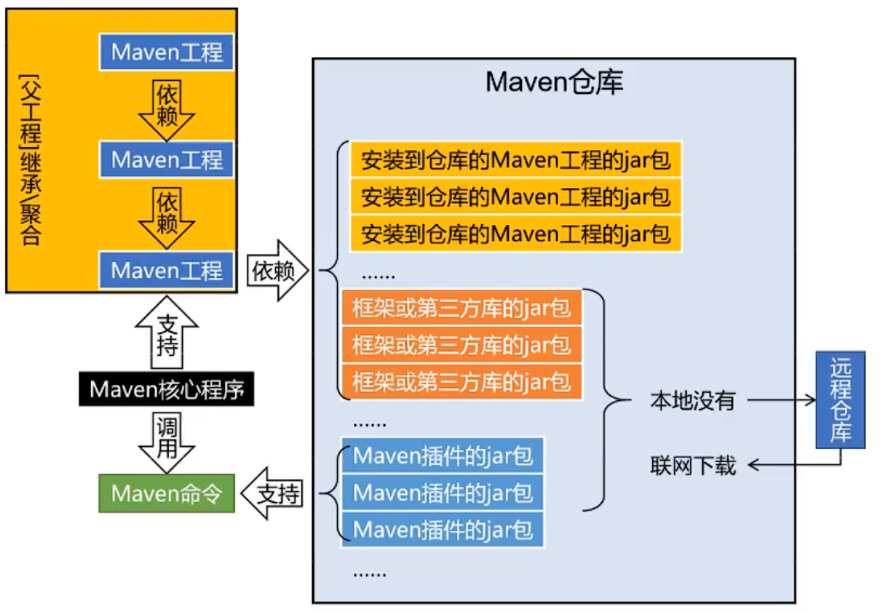

# Maven


### 工作机制




#### setting配置

* 设置本地的Maven仓库

```xml
<localRepository>position</localRepository>
```

* 设置镜像仓库(配置的阿里云镜像仓库)

```xml
<mirrors>
    <mirror>
        <id>nexus-aliyun</id>
        <mirrorOf>central</mirrorOf>
        <name>Nexus aliyun</name>
        <url>http://maven.aliyun.com/nexus/content/groups/public</url>
    </mirror>
</mirrors>
```

* 配置Maven工程的基础JDK版本

```xml
<porfiles>
    <profile>
        <id>jdk-1.8</id>
        <activation>
            <activeByDefault>true</activeByDefault>
            <jdk>1.8</jdk>
        </activation>
        <properties>
            <maven.compiler.source>1.8</maven.compiler.source>
            <maven.compiler.target>1.8</maven.compiler.target>
            <maven.compiler.compilerVersion>1.8</maven.compiler.compilerVersion>
        </properties>
    </profile>
</porfiles>
```


#### 环境变量配置

* 检查JAVA_HOME配置是否正确
* 配置MAVEN_HOME
* 配置PATH

* 验证

```shell
mvn -v
```

