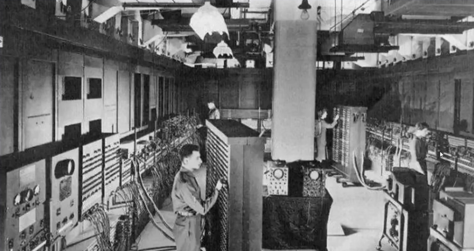
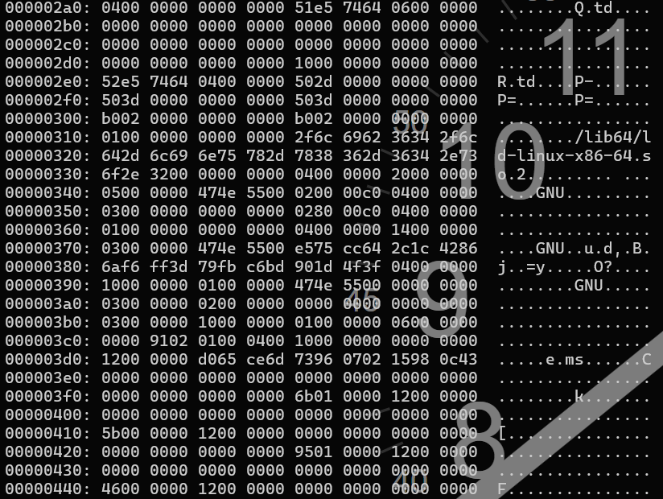
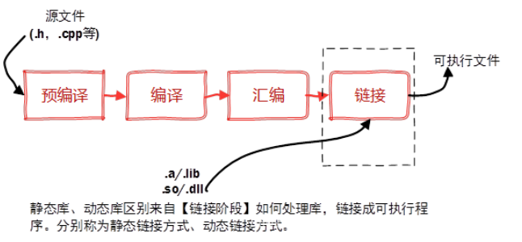

# 信息学前引导

## 计算机进化史

计算机的发展流程大致可以分为：计算工具、机械计算机、电子计算机。

现在计算机基本都是电子计算机。

## 电子计算机

电子计算机的内部组成主要是电子晶体管，在**1946**年诞生了世界第一台电子计算机



### 机器语言

初期的晶体管体积较大，导致电子计算机的体积十分庞大。随着科技发展，晶体管做成纳米级别，大大地缩小了计算机的体积。



机器语言是一种CPU指令系统，也称为CPU的机器语言。CPU是计算机的大脑，通过读懂机器语言的指令并且执行，实现工程师想要实现的效果。

### 汇编语言

机器语言的指令有限，但是因为都是数字十分难记。人们发明了汇编语言，通过英文助记符代替机器指令。汇编也是欧冠难过对寄存器或存储器直接操作，原子性很小，但同时开发效率非常低

示例：https://blog.csdn.net/weixin_52622577/article/details/121308275?spm=1001.2014.3001.5501

### 高级语言

随着时间发展，科学家推出了高级语言，它比汇编语言更加接近自然语言，如c++。

c++之父个人网址:https://www.stroustrup.com/index.html

### 编译过程



## 第一个c++程序 - hello，world

```c++
// 头文件：别人写好的代码
#include <bits/stdc++.h>
// 命名空间：防止名字重复
using namespace std;
// 主函数：main，让计算机知道从哪开始
int main(){
    // 输出字符串， cout 就像一个房间门口， << 就像是把后面的东西推出房门让人看见
    // 如果将""删掉呢
    // 如果变成数字呢
    // 删掉endl会怎么样
    cout << "Hello,world" << endl;
    // 主函数的return让计算机知道在这里结束
    return 0;
}
// 在一行中加入//，//后面的内容计算机不会去尝试读懂，用来写给自己或别人看的
```

在c++中，指令后面都需要加上**；**。

### 练习

1. 尝试下输出**Happy Spring Festival!**
2. 尝试下输出**春眠不觉晓，处处闻啼鸟**的下一句


## 输出类 - cout

**cout** 用于在计算机屏幕输出

**cout**的具体用法是：流运算输出符**<<**和**cout**结合在一起使用，可向显示器屏幕输出数据

* 格式1

  ```cout<<表达式;```

* 格式2

  ```cout<<表达式1<<表达式2<<表达式3...;```

```<<endl```可以让输出换行


# 变量、数据类型

## 变量

变量是一个可以命名的信息。名字是信息，箱子有多少瓶水也是信息。这些信息在程序中需要一个名字，并且信息能够被改变。

变量在c++的语法格式为：**数据类型	变量表;**

```c++
// 名字
string your_name;
// 箱子里的水
int box_water_number;
```

### 变量的赋值

有了变量，我们可以往里面存储我们想要的信息。

在c++中给变量赋值的语法格式是：**变量=表达式;**

```c++
// 赋值
int a = 123
```

#### 练习

1. 尝试定义变量test为int类型，并输出到屏幕上
1. 已经知道两个数**a=1,b=2**，将这两个数交换并且打印到屏幕上来也就是打印出**a=2,b=1**

### 通过输入类 cin 获取变量的值

**cin**结合**>>**获取变量值，**>>**被称为流读取运算符

* 格式一：

  **cin>>变量:**

* 格式二：

  **cin>>变量1>>变量2>>变量3...**

```c++
// 例子
int a, b;
cin >> a >> b;
cout << a << b;
/*
Input:
	1 2
Output:
	1 2
*/
```

#### 练习

1. 实现一个程序，输入一个数字，屏幕打印出来年龄。例如，输入18，打印出："im 18 years old"
1. id1000
1. id1001
1. id1011
1. id1107
1. id1155


## 加减乘

|      | 数学 | 编程 |
| ---- | ---- | ---- |
| 加   | +    | +    |
| 减   | -    | -    |
| 乘   | X    | *    |

```c++
// example
# include <iostream>
int main(void){
    int a, b;
    cin >> a >> b;
    int c = a + b;
    cout << c << endl;
    return 0;
}
```

### 练习

1. id1002
2. id1012
3. id1005


## 浮点类型

### 常量

我们经常会用到一些不会改变的数字，比如一周有7天，一年有12个月，或者一个苹果的重量是100克（这里假设我们知道这个重量是为了说明）。这些不会变的数字或值，我们可以称之为“常量”。在计算机中，常量也是这样的东西，但是它们被用来帮助计算机程序记住一些不会改变的信息。

* 语法格式

  ``````
  const 类型 符号常量=常量字串
  ``````

### 实型

| 数据类型     | 定义标识符  | 数值范围             | 有效位数 |
| ------------ | ----------- | -------------------- | -------- |
| 单精度实型   | float       | -3.4e+38~3.4e+38     | 6~7位    |
| 双精度实型   | double      | -1.7e+308~1.7e+308   | 15~16位  |
| 长双精度实型 | long double | -3.4e+4932~1.1e+4932 | 18~19位  |

```c++
// example
float a = 1.1;
```

### 保留小数

对于保留小数位数需求，可以使用**\<iomanip>**库里面的**fixed**以及**setprecision()**结合使用

```c++
// example
// 保留三位小数
// 同时 <bit/stdc++.h> 也可以
#include <bit/stdc++.h>
cout << fixed << setprecision(3) << value << endl;
```

### 练习

1. id1012
2. id1070
3. id1103
4. id1106
5. id1131
6. id1563
7. id1564


# 求商、求余和除法

加减乘除等算术运算都在**CPU**中的**ALU**（算术逻辑单元）里完成的。其实计算机只会做加法，而减法、乘法和出发等都是最终转化为加法实现

## 模运算符

模运算符用于求整数类型相除后的余数

$a \div b = c ... d$ ----------------------(1)

即求$d$

符号是$\%$

$a \% b = d$

## 除法运算符

在整数型除法运算符求的是公式(1)中的$c$，浮点数（小数）除法没有余数，相除会得到一个小数

### 练习

1. id1009
2. id1010
3. id1006
4. id1005


# 字符类型 char

到P41
