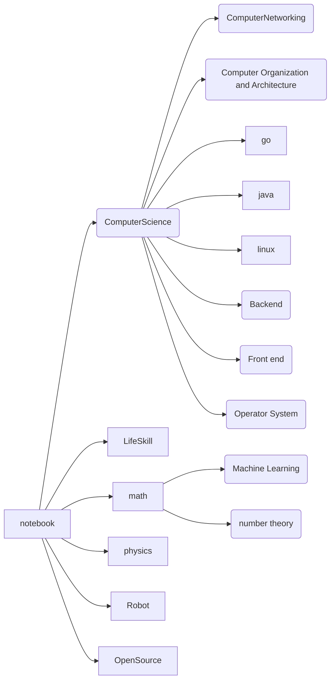

# learning Notebook
this is personal notebook of learning

## About Me

For introduce myself, I am a software developer at first. But I also would like to learning about hardware, math, physics, language, spots, cook and so on. Talking about myself, I am the most interested in ROBOT secondly. I apply myself to create HUMAN-ROBOT.

## Note Frame Diagram

