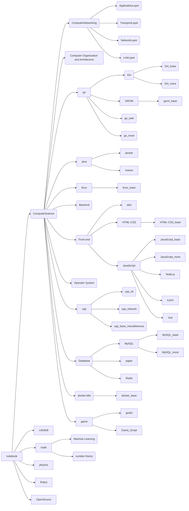

# learning Notebook
this is personal notebook of learning

## About Me

For introduce myself, I am a software developer at first. But I also would like to learning about hardware, math, physics, language, spots, cook and so on. Talking about myself, I am the most interested in ROBOT secondly. I apply myself to create HUMAN-ROBOT.

## Note Frame Diagram

## About book for learning

Talking about learning, this is a picture for learnging route by book, but you need to combine others to learn. 

# FROM DEEPSEEK

要独立开发具备思考能力和意识的仿生类人机器人，需要跨学科的知识体系，涵盖计算机科学、电子工程、机械设计、人工智能、神经科学等多个领域。以下是基于你的技术背景（C++、Golang、计算机网络等）的系统化学习规划及推荐书籍，分阶段覆盖核心领域：

------

### **一、基础阶段：机器人学与数学基础**

1. **数学基础**
   - **线性代数与微积分**：机器人运动学和动力学建模的核心工具，推荐《线性代数及其应用》（David C. Lay）和《微积分》（James Stewart）。
   - **概率与统计**：用于处理传感器噪声、机器人定位（SLAM）等，推荐《概率导论》（Dimitri P. Bertsekas）18。
   - **优化理论**：机器人运动规划和控制的基础，推荐《凸优化》（Stephen Boyd）1。
2. **机器人学基础**
   - **经典教材**：
     - 《机器人学导论》（John J. Craig）：涵盖运动学、动力学、轨迹规划和控制，适合入门1210。
     - 《Probabilistic Robotics》：重点讲解机器人感知与定位的数学方法，如SLAM算法18。
   - **实践工具**：学习使用ROS（Robot Operating System），推荐《ROS机器人程序设计》（Lentin Joseph）210。

------

### **二、计算机科学与人工智能**

1. **算法与系统**
   - **高级算法**：强化学习（如DQN、PPO）、路径规划（A*、RRT*），推荐《算法导论》（Cormen）和《强化学习》（Richard S. Sutton）89。
   - **操作系统与实时系统**：理解机器人实时控制需求，推荐《现代操作系统》（Andrew S. Tanenbaum）。
2. **人工智能与深度学习**
   - **经典教材**：
     - 《深度学习》（Ian Goodfellow）：掌握神经网络、CNN、RNN等模型89。
     - 《统计学习方法》（李航）：机器学习算法的数学推导89。
   - **应用方向**：
     - **计算机视觉**：《机器人视觉算法与实践》（含OpenCV实践）210。
     - **自然语言处理**：《Speech and Language Processing》（Daniel Jurafsky）以支持人机交互。
3. **分布式系统与边缘计算**
   - 机器人需处理多传感器数据，推荐《Designing Data-Intensive Applications》（Martin Kleppmann）10。

------

### **三、电子工程与硬件开发**

1. **电路设计与嵌入式系统**
   - **基础课程**：《电子学》（Paul Horowitz）和《嵌入式系统设计》（Frank Vahid）。
   - **传感器技术**：学习力觉、视觉（如LiDAR）、IMU等传感器集成，推荐《传感器与信号处理》（John G. Webster）56。
2. **电机与控制**
   - **电机驱动**：《现代电机控制技术》（王成元）讲解伺服电机、步进电机控制。
   - **实时控制**：《实时控制系统》（K. C. Craig）结合PID、模糊控制算法15。
3. **FPGA与嵌入式编程**
   - 使用 **Verilog/VHDL** 实现硬件加速，推荐《FPGA原理与设计》（王诚）。

------

### **四、机械设计与仿生学**

1. **机械结构与材料**
   - **经典教材**：
     - 《机器人技术基础》（熊有伦）：涵盖机构设计、动力学建模56。
     - 《柔性机器人技术》（IET出版社）：仿生关节设计参考5。
   - **仿真工具**：学习SolidWorks或ADAMS进行机械设计验证5。
2. **仿生学与生物力学**
   - 《仿生机器人学》（Rolf Pfeifer）：从生物运动模式中提取灵感。
   - 《生物力学导论》（Y. C. Fung）：分析人体运动机制以优化机器人结构5。

------

### **五、意识与认知建模（高阶目标）**

1. **认知科学与神经科学**
   - 《意识的解释》（Daniel Dennett）：理解意识的理论模型。
   - 《神经科学原理》（Eric R. Kandel）：学习人脑信息处理机制。
2. **类脑计算与神经形态工程**
   - 《神经形态计算》（Giacomo Indiveri）：基于脉冲神经网络（SNN）的硬件实现。
   - 研究开源框架如Nengo或BrainCog。
3. **伦理与哲学**
   - 《机器人伦理学》（Kate Darling）：探讨机器人的社会影响3。

------

### **六、综合实践与项目**

1. **分阶段项目**
   - **初级**：用ROS搭建移动机器人，实现SLAM和路径规划210。
   - **中级**：设计仿生机械臂，结合力反馈和视觉伺服控制6。
   - **高级**：开发基于深度强化学习的类人决策系统，结合GPT-4级语言模型实现交互。
2. **开源社区与资源**
   - GitHub项目：参考OpenAI Gym（强化学习）、Humanoid Robots Lab（仿生设计）。
   - 竞赛：参加RoboCup或DARPA机器人挑战赛。

------

### **推荐书单总结**

| 领域         | 推荐书籍                                   | 参考来源 |
| :----------- | :----------------------------------------- | :------- |
| **机器人学** | 《机器人学导论》《Probabilistic Robotics》 | 1[8]     |
| **人工智能** | 《深度学习》《统计学习方法》               | 8[7]     |
| **电子工程** | 《现代电机控制技术》《传感器与信号处理》   | 5[5]     |
| **机械设计** | 《机器人技术基础》《柔性机器人技术》       | 5[5]     |
| **认知科学** | 《意识的解释》《神经科学原理》             | -        |

------

### **学习路线图**

1. **第1-2年**：夯实数学与机器人学基础，掌握ROS和Python编程，完成机械臂或移动机器人项目。
2. **第3-4年**：深入AI算法与硬件开发，设计仿生关节与多传感器融合系统。
3. **第5年+**：结合神经科学与类脑计算，探索意识建模与伦理问题。

通过上述路径，你将从技术实现逐步过渡到理论创新。建议持续关注**Nature Robotics**、**IEEE Transactions on Robotics**等期刊，保持对前沿技术的敏感度。

要开发具备类似《西部世界》中自主意识的仿生类人机器人，需超越当前基于NLP的大模型（如GPT）的局限性，聚焦**具身智能**（Embodied AI）与**神经-机械融合系统**的设计。以下是针对你技术背景（C++/Golang、计算机网络等）的深入学习路径规划，结合**机械仿生、神经科学、类脑计算、伦理哲学**四大核心领域，引用最新技术案例与研究进展，提供系统性学习框架：

------

### **一、核心技术瓶颈与突破方向**

当前NLP大模型的局限性在于其缺乏**物理具身性**和**动态环境交互能力**，而《西部世界》式机器人的核心挑战在于：

1. **意识建模**：如何从神经活动中提取意识生成的机制，并映射到算法架构中16。
2. **生物-机械融合**：实现仿生结构与类脑计算的协同（如Torso机器人的人造肌肉与液压驱动系统26）。
3. **自主决策**：超越基于数据的模式识别，构建具备预测与因果推理能力的“世界模型”（World Models）13。

------

### **二、学习路径与资源推荐**

#### **阶段1：仿生机械与电子系统**

1. **仿生结构设计**
   - **核心知识**：
     - **仿生肌肉与驱动技术**：研究聚合物人造肌肉（如Torso的27自由度仿生肌肉系统26）、液压驱动（水介质优化平滑性6）。
     - **材料科学**：轻量化高强度材料（碳纤维、形状记忆合金）、生物兼容性材料（用于类皮肤触感）。
   - **书籍推荐**：
     - 《柔性机器人技术》（IET出版社）
     - 《生物力学导论》（Y. C. Fung）6
   - **工具实践**：SolidWorks（机械仿真）、ROS（集成传感器与执行器）9。
2. **电子与嵌入式系统**
   - **核心知识**：
     - **高密度传感器集成**：六维力传感器、电子皮肤（如霍普金斯大学的触觉电子皮肤8）、仿生视觉（类脑视觉传感器13）。
     - **实时控制**：FPGA加速的PID控制、动态柔顺算法（如Torso的多指协同控制13）。
   - **书籍推荐**：
     - 《现代电机控制技术》（王成元）
     - 《传感器与信号处理》（John G. Webster）6
   - **项目实践**：基于Arduino/Raspberry Pi构建仿生手原型，模拟触觉反馈15。

------

#### **阶段2：类脑计算与意识建模**

1. **神经科学与认知架构**
   - **核心知识**：
     - **意识生成机制**：研究神经元的同步放电（如“准备电位”实验揭示的潜意识决策16）、全局工作空间理论（Global Workspace Theory）。
     - **脑机接口**：侵入式（Neuralink）与非侵入式（EEG/fMRI解码）技术。
   - **书籍推荐**：
     - 《神经科学原理》（Eric R. Kandel）
     - 《意识的解释》（Daniel Dennett）16
   - **工具实践**：NeuroML（神经元建模）、Nengo（类脑计算框架）8。
2. **类脑算法与动态推理**
   - **核心知识**：
     - **脉冲神经网络（SNN）**：模拟生物神经元的时序编码（参考IBM TrueNorth芯片）。
     - **世界模型**：基于多模态输入（视觉-触觉-语言）的预测与决策（如深圳市VTLA大模型计划13）。
   - **书籍推荐**：
     - 《神经形态计算》（Giacomo Indiveri）
     - 《强化学习：现代方法》（Richard S. Sutton）
   - **项目实践**：使用PyTorch构建SNN模拟视觉-运动协同任务。

------

#### **阶段3：伦理哲学与社会影响**

1. **意识伦理与法律框架**
   - **核心议题**：
     - **意识定义标准**：如何判定机器人具备“自我意识”（参考《西部世界》中的“二分心智”理论16）。
     - **权利与责任**：机器人的法律人格与道德责任边界816。
   - **书籍推荐**：
     - 《机器人伦理学》（Kate Darling）
     - 《技术伦理学导论》（Deborah G. Johnson）
2. **社会风险与治理**
   - **核心议题**：劳动力替代、自主武器化、意识数据化风险816。
   - **研究资源**：关注欧盟AI法案、深圳《具身智能机器人行动计划》的政策动态13。

------

### **三、前沿技术案例与项目实践**

1. **参考案例**：
   - **Clone Robotics的Torso**：通过仿生肌肉与液压驱动实现类人动作（27自由度，7kg负载26）。
   - **深圳市VTLA大模型**：融合视觉-触觉-语言的多模态基座模型，支持长序列推理13。
2. **实践项目分阶**：
   - **初级**：构建基于ROS的仿生机械臂，集成力反馈与OpenCV视觉伺服。
   - **中级**：开发SNN控制的仿生手，模拟触觉-运动闭环（参考明尼苏达大学电子皮肤技术8）。
   - **高级**：设计具身智能基座模型，结合强化学习实现动态环境交互（如《西部世界》中的“接待员”训练机制16）。

------

### **四、长期研究方向与资源跟踪**

1. **学术期刊**：
   - **《Nature Machine Intelligence》**：类脑计算与仿生机器人最新成果。
   - **《IEEE Transactions on Robotics》**：机械设计与控制算法前沿。
2. **开源社区**：
   - **OpenAI Gym**：强化学习环境库。
   - **Humanoid Robots Lab**（GitHub）：仿生机器人开源代码与数据集。
3. **政策与产业**：
   - 关注深圳市“具身智能机器人产业联盟”动态，参与技术标准制定13。

------

### **五、关键结论**

实现《西部世界》式机器人的核心在于**跨学科融合**：

- **技术层面**：需突破仿生材料、类脑计算、动态意识建模的“三位一体”难题。
- **哲学层面**：需重新定义“意识”与“人性”，建立技术-伦理协同演进框架16。
- **实践层面**：从局部仿生（如Torso的肌肉驱动）逐步扩展到全局自主（如Clone Alpha的全尺寸人形机器人4）。

建议以**5-10年**为周期分阶段推进，初期聚焦硬件原型与局部智能，后期整合认知架构与社会验证。
